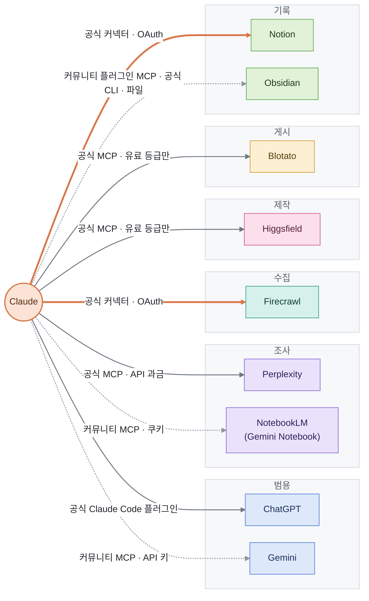
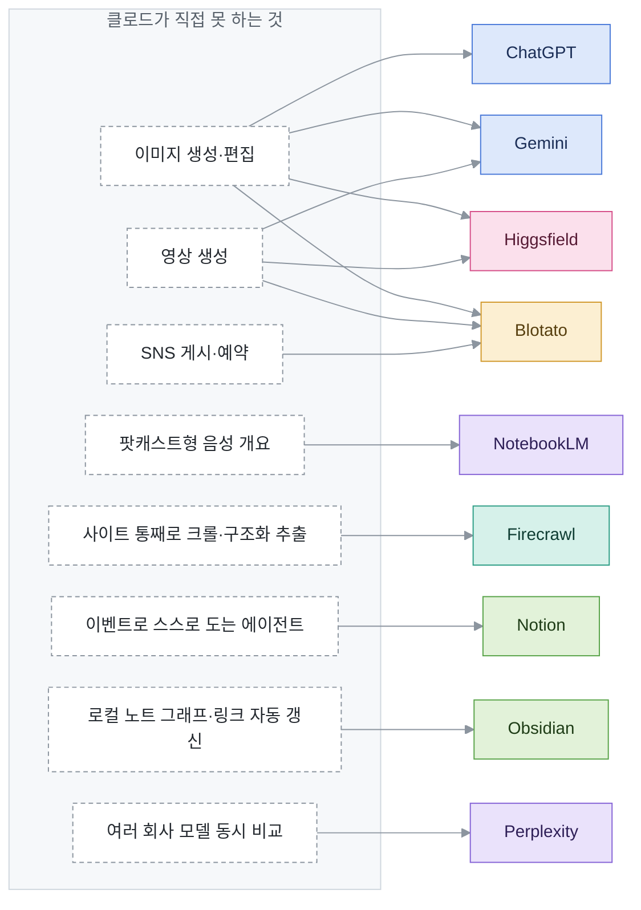
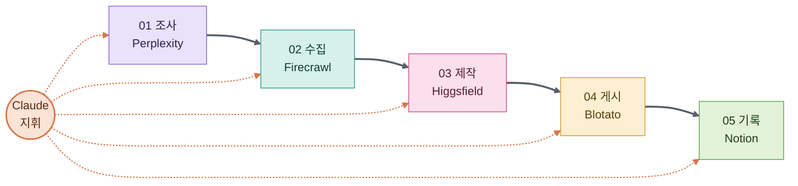

# AI · 도구 사전

클로드를 가운데 두고, 클로드가 직접 못 하는 일을 메워 주는 AI·도구를 모은 사전임. 도구마다 **무료·유료와 이용 조건(개인·상업)**, **등급별 요금과 권한**, **클로드로는 못 하는 것**, **라이선스**를 적음. 조사·갱신 규칙은 [`CLAUDE.md`](CLAUDE.md) 에 있음.

## 목차
- [읽는 법](#읽는-법)
- [관계도](#관계도) — [클로드와 어떻게 잇나](#클로드와-어떻게-잇나) · [빈자리를 누가 메우나](#클로드의-빈자리를-누가-메우나) · [조합 예: 마케팅팀](#조합-예-클로드--5개--마케팅팀)
- [한눈에 보기](#한눈에-보기)
- [도구](#도구)
  - 기준선: [Claude](#claude)
  - 범용: [ChatGPT](#chatgpt) · [Gemini](#gemini)
  - 조사: [Perplexity](#perplexity) · [NotebookLM](#notebooklm-2026-07-16-부터-gemini-notebook)
  - 수집: [Firecrawl](#firecrawl)
  - 제작: [Higgsfield](#higgsfield)
  - 게시: [Blotato](#blotato)
  - 기록: [Notion](#notion) · [Obsidian](#obsidian)

각 항목 제목 아래의 단추로 목차 · 한눈에 보기 · 앞뒤 도구로 넘어감. GitHub 파일 화면의 `Outline` 단추로 모든 제목을 펼쳐 볼 수도 있음.

## 읽는 법
[<kbd>↑ 목차</kbd>](#목차)

- **`확인 못 함 — <이유>`** 는 빈칸을 추측으로 메우지 않았다는 표시임. 요금이 비어 있으면 결제 전에 공식 가격표를 직접 볼 것
- **출처 등급**: `공식`(가격표·약관·도움말) · `자사 홍보`(회사 블로그·랜딩의 성능 주장) · `제3자`(리뷰·기사). `(검색 요약)` 은 원문 페이지가 조사 환경에서 막혀 검색 결과 요약으로만 봤다는 뜻임
- 통화는 표시된 그대로(대개 USD)이고 환산하지 않음. 가격은 세금 별도임
- **확인한 날짜**는 값이 바뀐 날이 아니라 맞는지 본 날임. 90일이 넘은 항목은 요금부터 의심할 것

## 관계도
[<kbd>↑ 목차</kbd>](#목차)

### 클로드와 어떻게 잇나
굵은 주황 선은 claude.ai 커넥터 디렉터리의 공식 커넥터, 회색 실선은 도구 회사가 낸 공식 MCP·플러그인(대개 "사용자 지정 커넥터"로 URL 을 넣음), 점선은 커뮤니티 부품이나 파일 직접 편집임. 칸 색은 세 관계도 모두 역할을 뜻함 — 파랑 범용 · 보라 조사 · 청록 수집 · 분홍 제작 · 노랑 게시 · 초록 기록.

### 클로드의 빈자리를 누가 메우나
왼쪽은 `Claude` 항목의 기준선에서 뽑은 "클로드가 직접 못 하는 것"이고, 오른쪽은 그걸 하는 도구임. 실시간 웹 검색은 클로드도 하므로 여기 없음.

### 조합 예: 클로드 + 5개 = 마케팅팀
유튜브 영상([x-iEypjYD3w](https://www.youtube.com/watch?v=x-iEypjYD3w))이 보여 준 구성임. 영상 본문은 조사 환경에서 열지 못했고, 영상 속 도식의 캡처로만 확인함 — 각 단계에서 무엇을 주고받는지는 도식에 적힌 역할 이름까지만 옮김.

- 다섯 개를 다 붙이면 **돈이 드는 자리가 셋**임: Higgsfield·Blotato 는 유료 등급이어야 MCP 가 열리고, Perplexity MCP 는 구독이 아니라 API 사용량으로 과금됨. Firecrawl 은 무료 등급(월 1,000 크레딧)으로도 붙음. Notion 커넥터에 유료 등급 조건이 붙는지는 확인 못 함 — 조사에서 조건이 나오지 않았음
- 가장 싸게 다 붙이는 값(월 결제 기준): Higgsfield Basic $9 + Blotato Starter $29 + Perplexity API 사용량 + 클로드 요금제. Higgsfield 등급 체계는 확인 못 함이 섞여 있어 아래 항목을 볼 것

## 한눈에 보기
[<kbd>↑ 목차</kbd>](#목차)

| 도구 | 역할 | 무료·유료 | 최저 유료가 (월) | 클로드와 잇는 법 | 라이선스 | 확인한 날짜 |
|---|---|---|---|---|---|---|
| [Claude](#claude) | 범용 · 기준선 | 부분 무료 · 개인·업무 모두 무료 등급 가능 · 생성물 상업 이용 가능 | Pro $20 (연 결제 $17) | 해당 없음 | 독점 | 2026-09-29 |
| [ChatGPT](#chatgpt) | 범용 | 부분 무료 · 개인 무료 · 무료 등급 업무 이용 조항 확인 못 함 · 생성물 상업 이용 가능(음성 예외 서술) | Go $8 (미국) | 공식 Claude Code 플러그인 | 독점 (Codex CLI·플러그인 Apache-2.0) | 2026-09-29 |
| [Gemini](#gemini) | 범용 | 부분 무료 · 개인 무료 · 무료 등급 업무 이용 조항 확인 못 함 · 생성물 상업 이용 가능(무료·Pro 이미지는 워터마크) | AI Plus $4.99 | 커뮤니티 MCP · API 키 | 독점 (Gemini CLI Apache-2.0) | 2026-09-29 |
| [Perplexity](#perplexity) | 조사 | 부분 무료 · **개인 무료 + 상업 유료** — Free·Pro 도 비상업 전용, 업무는 Enterprise (제3자 서술, 원문 확인 못 함) | Pro $20 (학생 $10) | 공식 MCP · API 과금 | 독점 (MCP 서버 MIT) | 2026-09-29 |
| [NotebookLM](#notebooklm-2026-07-16-부터-gemini-notebook) | 조사 | 부분 무료 · 개인 무료 · 업무 이용 조항·생성물 권리 확인 못 함 | Google AI Plus $4.99 | 커뮤니티 MCP · 쿠키 | 독점 (커뮤니티 MCP MIT) | 2026-09-29 |
| [Firecrawl](#firecrawl) | 수집 | 부분 무료 + 자체 호스팅 무료 · 자체 호스팅은 AGPL-3.0 조건으로 상업 이용 가능 · 클라우드 무료 등급 제한 확인 못 함 | Hobby $19 (연 결제 $16) | 공식 커넥터 + 공식 MCP | 본체 AGPL-3.0 · 클라우드 독점 · MCP 서버 MIT | 2026-09-29 |
| [Higgsfield](#higgsfield) | 제작 | 부분 무료 · **개인 무료 + 상업 유료**(가격표 표기) — 약관·도움말과 어긋남 | Basic $9 (등급 체계 확인 못 함) | 공식 MCP · 유료 등급만 | 독점 | 2026-09-29 |
| [Blotato](#blotato) | 게시 | 체험만 무료(7일) · 업무 이용은 유료 등급 · 생성물 권리 확인 못 함 | Starter $29 | 공식 MCP · 유료 등급만 | 독점 | 2026-09-29 |
| [Notion](#notion) | 기록 | 부분 무료 · 개인 무료 · 업무는 조직용 약관(MSA), Free 로 되는지 확인 못 함 | Plus 약 $12/멤버 (연 결제 $10) | 공식 커넥터 · OAuth | 독점 (로컬 MCP 서버 MIT) | 2026-09-29 |
| [Obsidian](#obsidian) | 기록 | 부분 무료 · 앱은 개인·업무 모두 무료(2025-02-20 부터) · Sync·Publish 만 유료 | Sync Standard $5 (연 결제 $4) — 앱은 무료 | 커뮤니티 플러그인 MCP · 공식 CLI · 파일 | 독점 소프트웨어 (플러그인 MIT) | 2026-09-29 |

## 도구
[<kbd>↑ 목차</kbd>](#목차)

### Claude
[<kbd>↑ 목차</kbd>](#목차) [<kbd>☰ 한눈에 보기</kbd>](#한눈에-보기) [<kbd>ChatGPT →</kbd>](#chatgpt)

- **역할**: 범용
- **한 줄**: Anthropic 의 대화형 AI. 웹·데스크톱·모바일 앱(claude.ai), 터미널·IDE 코딩 에이전트(Claude Code), 작업 위임(Cowork)을 한 구독으로 씀
- **클로드와 잇는 법**: 해당 없음 — 기준선 항목임. 밖의 도구는 클로드 쪽에서 커넥터(원격 MCP, OAuth)와 Claude Code 의 MCP 서버·플러그인으로 붙임
- **확인한 날짜**: 2026-09-29

#### 무료·유료와 이용 조건

| 구분 | 조건 |
|---|---|
| 분류 | 부분 무료 |
| 개인 이용 | Free 로 가능함 |
| 상업·업무 이용 | 무료 등급으로도 가능함. 소비자 약관(2025-10-08 발효)에 업무 이용을 막는 조항이 없고, 상업 약관 서문이 "this does not include Claude.ai or Claude Pro use for individuals or entities" 라고 적어 개인·법인의 claude.ai 이용을 소비자 약관 쪽에 둠. "personal, non-commercial" 문장은 **평가(evaluation) 목적 이용**에만 걸림. 조직 계약·관리가 필요하면 Team·Enterprise(상업 약관)로 감 |
| 생성물의 상업적 이용 | 가능함. 약관 원문: "Subject to your compliance with our Terms, we assign to you all of our right, title, and interest—if any—in Outputs." 등급으로 나누는 문구 없음 |

- 특이점: 소비자 약관과 상업 약관(Team·Enterprise·API)이 따로 있음. 2025-08-28 공지 이후 Free·Pro·Max 대화는 **끄지 않으면 학습에 쓰이고**, 학습을 허용하면 보존 기간이 5년임(끄면 30일). 상업 약관 쪽 요금제에는 적용 안 됨
- 이 절의 출처: [Consumer Terms of Service](https://www.anthropic.com/legal/consumer-terms) — 공식 (원문 문장 확인) · [Updates to Consumer Terms and Privacy Policy](https://www.anthropic.com/news/updates-to-our-consumer-terms) — 공식

#### 요금과 등급별 권한
| 등급 | 월 요금 | 연 결제 시 | 할 수 있는 것 · 한도 |
|---|---|---|---|
| Free | $0 | – | 웹·데스크톱·모바일 채팅, 웹 검색, 파일 생성, 코드 실행, 대화 간 메모리, 앱·도구 연결(커넥터), Artifacts. 사용량 한도는 5시간마다 재설정. 음성 모드(베타) 됨 — 음성 중 연결 도구는 1개. **Claude Code 는 포함 안 됨** |
| Pro | $20 | $17/월 ($200 선결제) | Free 전부 + 더 많은 사용량(가격표 1차 요약은 "Free 의 5배 이상", 도움말은 배수 없이 "more usage per session"이라고만 씀), 작업 위임·예약, Claude Design·Slides·Docs, Claude Science, Projects, 더 많은 모델, Claude in Chrome·Microsoft 365, **Claude Code 포함**. 5시간 세션 한도 + 모든 모델에 걸리는 주간 한도. API(Console) 사용은 포함 안 됨 |
| Max 5x | $100 | 없음 (월 결제만) | Pro 전부 + Pro 의 5배 사용량, 더 높은 출력 한도, 새 기능 먼저, 혼잡 시간 우선 접근. Claude Code 포함 |
| Max 20x | $200 | 없음 (월 결제만) | Max 5x 와 같고 사용량이 Pro 의 20배 |
| Team Standard 좌석 | $25/좌석 | $20/좌석/월 | 2–150명. Pro 보다 많은 사용량, Claude Code·Cowork, Claude Design·Slides·Docs, 조직 전체 검색, 중앙 관리·SSO. 웹 검색·커넥터는 Owner 가 조직 단위로 켜야 함 |
| Team Premium 좌석 | $125/좌석 | $100/좌석/월 | Standard 좌석의 5배 사용량. 나머지는 Standard 와 같음 |
| Enterprise | $20/좌석/월 + 사용량 과금 | 연 결제만 | 가격표 문구: "$20/seat/month, billed annually. Usage cost scales with model and task." Team 전부 + 역할 기반 권한, SCIM, 감사 로그, Compliance API, 데이터 보존 설정, HIPAA 대응 |

- 가격은 세금 별도이고 웹 구독 기준임. 모바일 앱 결제가는 다를 수 있다고 도움말에 적혀 있음
- Max 가격표 요약은 "$100+" 로만 나와서 Max 도움말(5x $100 · 20x $200)로 채웠음. 두 출처가 서로 어긋나지는 않음

#### 기준선 — 클로드가 직접 못 하는 것
- **이미지 생성·편집 못 함.** 도움말 원문: "Claude doesn't generate photos or illustrations the way image-generation tools do." 대신 HTML·SVG 로 도표·차트·인터랙티브 시각물을 대화 안에 만들고(웹·데스크톱 베타), 올린 이미지를 읽고 분석함
- **영상·음악(오디오) 생성은 확인 못 함 — 기능이 있다는 공식 근거를 못 찾음.** 가격표와 2026-02–09 릴리스 노트에 영상·음악 생성 항목이 없음. "없다"고 적은 공식 문서를 찾은 것은 아니라서 부재를 근거로 한 추정임
- **실시간 웹 검색은 됨 — "실시간 검색을 못 한다"는 말은 지금 틀림.** 웹 검색은 Free 포함 모든 등급에서 됨(Team·Enterprise 는 Owner 가 켜야 함). 웹 검색을 켜면 사용자가 준 URL 의 본문을 직접 가져오는 web fetch 도 됨. Free 에서 긴 글을 통째로 가져오면 사용량 한도를 많이 먹는다고 도움말이 경고함
- **외부 게시·발송은 조건부로 됨 — 스스로는 못 하고 커넥터가 있어야 함.** Google Workspace 커넥터(모든 등급)로 Gmail 발송·답장·전달(기본은 사용자 승인 필요), Calendar 일정 생성·수정·삭제, Drive 업로드·공유가 됨. Microsoft 365 커넥터는 2026-07-07 에 쓰기 도구가 붙음. SNS 게시처럼 커넥터가 없는 곳에는 직접 못 올림
- **Claude Code 는 Free 에서 못 씀** — Pro 이상 또는 API 과금이 필요함
- **구독으로 API 를 쓰지 못함** — Pro 도움말: "The Pro plan does not include API usage through the Claude Console."

#### 라이선스
- 독점 서비스임. Claude Code 저장소(`anthropics/claude-code`)의 LICENSE.md 도 오픈소스가 아니고 "© Anthropic PBC. All rights reserved. Use is subject to Anthropic's Commercial Terms of Service." 임

#### 출처
- [Plans & Pricing | Claude](https://claude.com/pricing) — 공식
- [What is the Max plan? | Claude Help Center](https://support.claude.com/en/articles/11049741-what-is-the-max-plan) — 공식
- [What is the Pro plan? | Claude Help Center](https://support.claude.com/en/articles/8325606-what-is-the-pro-plan) — 공식
- [Use Claude Code with your Pro or Max plan | Claude Help Center](https://support.claude.com/en/articles/11145838-use-claude-code-with-your-pro-or-max-plan) — 공식
- [Enabling and using web search | Claude Help Center](https://support.claude.com/en/articles/10684626-enabling-and-using-web-search) — 공식
- [Can Claude produce images? | Claude Help Center](https://support.claude.com/en/articles/9002504-can-claude-produce-images) — 공식
- [Use voice mode | Claude Help Center](https://support.claude.com/en/articles/11101966-use-voice-mode) — 공식
- [Use Google Workspace connectors | Claude Help Center](https://support.claude.com/en/articles/10166901-use-google-workspace-connectors) — 공식
- [Release notes | Claude Help Center](https://support.claude.com/en/articles/12138966-release-notes) — 공식
- [anthropics/claude-code LICENSE.md](https://github.com/anthropics/claude-code/blob/main/LICENSE.md) — 공식

### ChatGPT
[<kbd>↑ 목차</kbd>](#목차) [<kbd>☰ 한눈에 보기</kbd>](#한눈에-보기) [<kbd>← Claude</kbd>](#claude) [<kbd>Gemini →</kbd>](#gemini)

- **역할**: 범용
- **한 줄**: OpenAI 의 대화형 AI. 채팅·이미지 생성(ChatGPT Images)·음성·딥 리서치·에이전트 모드·코딩 에이전트(Codex)를 한 구독으로 씀
- **클로드와 잇는 법**: 공식 Claude Code 플러그인 `openai/codex-plugin-cc` (설치: `/plugin marketplace add openai/codex-plugin-cc` → `/plugin install codex@openai-codex` → `/codex:setup`). `/codex:review`·`/codex:rescue` 등으로 Codex 에게 리뷰·작업을 넘김. 인증은 로컬 Codex CLI 로그인을 그대로 씀 — ChatGPT 계정(Free 포함) 또는 OpenAI API 키. 쓴 양은 Codex 사용 한도에서 빠짐. Codex CLI 를 MCP 서버로 띄우던 `codex mcp-server` 는 2026-08-24 폐기 예고 후 Codex CLI 0.154.0(2026-09-09)에서 없어졌음 — 그걸 쓰는 옛 글·커뮤니티 설정은 지금 안 돎. claude.ai 앱용 공식 커넥터는 확인 못 함 — 커넥터 디렉터리에서 찾아보지 않았음. API 키(`OPENAI_API_KEY`)로 모델을 부르는 커뮤니티 MCP 서버는 여럿 있음
- **확인한 날짜**: 2026-09-29

#### 무료·유료와 이용 조건

| 구분 | 조건 |
|---|---|
| 분류 | 부분 무료 |
| 개인 이용 | Free 로 가능함 |
| 상업·업무 이용 | 개인용 Terms of Use 와 기업용 Services Agreement(API·Business·Enterprise)가 나뉨. 개인용 약관에 무료 등급의 업무 이용을 금지하는 조항이 있는지는 확인 못 함 — openai.com 이 막혀 원문을 못 열었고, 검색 요약에도 그런 조항이 안 나옴 |
| 생성물의 상업적 이용 | 가능하다는 서술임. 개인용 약관 "OpenAI assigns to you all its right, title, and interest, if any, in and to Output" (공식, 검색 요약). 무료·유료가 같다는 것은 제3자 서술임. 예외로 **음성 출력(ChatGPT Voice)은 비상업 용도로만**이라는 서술이 있음 — 확인 못 함, 제3자 검색 요약뿐임 |

- 특이점: 개인용 요금제는 끄지 않으면 대화가 학습에 쓰임. Business·Enterprise·API 는 동의하지 않으면 학습에 안 씀 (검색 요약)
- 이 절의 출처: [Terms of Use](https://openai.com/policies/row-terms-of-use/) — 공식(검색 요약) · [OpenAI Services Agreement](https://openai.com/policies/services-agreement/) — 공식(검색 요약) · [ChatGPT Commercial Use 2026 — glbgpt](https://www.glbgpt.com/hub/chatgpt-commercial-use-2026/) — 제3자(검색 요약)

#### 요금과 등급별 권한
| 등급 | 월 요금 | 연 결제 시 | 할 수 있는 것 · 한도 |
|---|---|---|---|
| Free | $0 | – | 일상 텍스트 채팅 무제한(2026 변경). 이미지 생성(ChatGPT Images 2.0)·파일 업로드·음성·데이터 분석은 따로 좁은 한도. 음성은 GPT-Live-1 mini. 일부 국가에서 광고 붙음. 정확한 횟수 한도는 확인 못 함 — 공식 페이지가 막혀 있음 |
| Go | $8 (미국) | 없음 — 공식 요약상 월 결제만 | Free 대비 메시지·파일 업로드·이미지 생성 10배. 광고 붙음. 2025 년 인도에서 시작해 2026-01 에 전 세계로 풀림(제3자) |
| Plus | $20 | 없음 — 공식 요약상 월 결제만 | 광고 없음. 상위 모델·추론, Thinking 이미지 생성, 확장된 메모리, 딥 리서치(제한), 에이전트 모드, Codex, Projects, 커스텀 GPT. 음성은 GPT-Live-1 |
| Pro $100 (5x) | $100 | 확인 못 함 — 연 결제 언급을 못 찾음 | Plus 의 5배 사용량(특히 Codex). 2026-09 신설 Codex 모델도 사용 한도 안에서 씀 |
| Pro $200 (20x) | $200 | 확인 못 함 | Plus 의 20배 사용량, 최상위 Pro 모델, 딥 리서치·에이전트 모드·Codex 최대 한도, 신기능 우선. **2026-09-10 부터 신규 가입·업그레이드 일시 중단** (기존 구독자는 영향 없음) |
| Business Standard 좌석 | $25/좌석 | $20/좌석/월 | 워크스페이스 최소 2좌석. 관리 기능·광고 없음. 5시간 사용 한도 있음 |
| Business Premium 좌석 | $125/좌석 | $100/좌석/월 | 2026-08 신설. Standard 의 5배 사용량, 5시간 한도 없음. 좌석 종류를 섞어 배정 가능 |
| Enterprise / Edu | 견적 | 연 결제 | 맞춤 가격, 보안·지원·SLA. 광고 없음 |

- 모델 이름은 출처마다 달라서(GPT-5.2 Instant, GPT-5.6 Luna·Terra·Sol, GPT-6 Pro·Astra 등) 표에 적지 않았음. 등급별로 어느 모델이 붙는지는 확인 못 함 — 공식 페이지 원문을 못 열어 검색 요약끼리 어긋나는 것을 가를 수 없었음
- Pro 등급은 제3자 글 중 "$200 하나"로 적은 2025 기준 글이 섞여 있음. 공식 도움말 요약은 $100·$200 두 단계라서 그쪽을 따름

**영상(Sora)**: 지금은 **어느 등급에서도 영상 생성이 안 됨.** Sora 앱·웹이 2026-04-26 에 닫혔고 Sora 2 API 는 2026-09-24 제거 예정이었음. 공식 검색 요약도 "As of April 26, 2026, the Sora product is no longer available" 라고 함. ChatGPT 안의 영상 생성 버튼도 같이 빠졌다는 것은 제3자 글에서만 봤음. 예전 한도(Plus 480p 월 50개 등)는 Sora 1 시절 공식 글 기준이라 지금은 맞지 않음

#### 클로드로는 못 하는 것
- **이미지 생성·편집**: ChatGPT Images 2.0 으로 대화 안에서 이미지를 만들고 고침. Free 에서도 됨(좁은 한도). 클로드는 이미지를 만들지 못하고 SVG·HTML 도표만 그림
- 음성 대화·웹 검색·딥 리서치·에이전트·코딩 에이전트는 클로드에도 해당 기능이 있어서 이 칸에서 뺐음. 등급별 한도는 서로 다름
- 영상 생성은 2026-04-26 이후 ChatGPT 에서도 안 되므로 차이가 아님
- 그 밖에 ChatGPT 에만 있는 기능은 확인 못 함 — 공식 기능 비교 페이지(chatgpt.com/pricing)가 이 컨테이너에서 막혀 있음

#### 라이선스
- ChatGPT 는 독점 서비스임
- Codex CLI(`openai/codex`)와 Claude Code 플러그인(`openai/codex-plugin-cc`)은 둘 다 Apache-2.0 오픈소스임

#### 출처
원문을 연 것은 GitHub 두 곳뿐임. openai.com·chatgpt.com·help.openai.com·developers.openai.com 은 전부 이 컨테이너에서 막혀서 **검색 결과 요약으로만 확인**했음 — 아래 `공식(검색 요약)` 은 공식 페이지지만 원문을 읽지 못했다는 뜻임.
- [Pricing | ChatGPT](https://chatgpt.com/pricing/) — 공식(검색 요약)
- [What is ChatGPT Go? | OpenAI Help Center](https://help.openai.com/en/articles/11989085-what-is-chatgpt-go) — 공식(검색 요약)
- [Introducing ChatGPT Go, now available worldwide | OpenAI](https://openai.com/index/introducing-chatgpt-go/) — 자사 홍보(검색 요약)
- [About ChatGPT Pro tiers | OpenAI Help Center](https://help.openai.com/en/articles/9793128-about-chatgpt-pro-tiers) — 공식(검색 요약)
- [ChatGPT Plan | Plus](https://chatgpt.com/plans/plus/) · [Pro](https://chatgpt.com/plans/pro/) — 공식(검색 요약)
- [ChatGPT Free Tier FAQ | OpenAI Help Center](https://help.openai.com/en/articles/9275245-chatgpt-free-tier-faq) — 공식(검색 요약)
- [Ads in ChatGPT | OpenAI Help Center](https://help.openai.com/en/articles/20001047-ads-in-chatgpt) — 공식(검색 요약)
- [Premium seats are coming to ChatGPT Business | OpenAI](https://openai.com/index/premium-seats-chatgpt-business/) — 공식(검색 요약)
- [ChatGPT Business - Overview | OpenAI Help Center](https://help.openai.com/en/articles/8792828-chatgpt-business-overview) — 공식(검색 요약)
- [Sora 2 is here | OpenAI](https://openai.com/index/sora-2/) — 자사 홍보(검색 요약, 2025 글)
- [Sora is here | OpenAI](https://openai.com/index/sora-is-here/) — 자사 홍보(검색 요약, 2024 글 — Plus 월 50개 한도의 출처라 지금은 무효)
- [OpenAI sets two-stage Sora shutdown… | The Decoder](https://the-decoder.com/openai-sets-two-stage-sora-shutdown-with-app-closing-april-2026-and-api-following-in-september/) — 제3자(검색 요약)
- [Why Sora Disappeared from ChatGPT | GlobalGPT](https://www.glbgpt.com/hub/why-sora-disappeared-from-chatgpt/) — 제3자(검색 요약)
- [OpenAI has paused its $200 ChatGPT sign-ups | Fortune](https://fortune.com/2026/09/11/openai-astra-chatgpt-pro-pause/) — 제3자(검색 요약)
- [ChatGPT Plans Compared (Sept 2026) | The AI Career Lab](https://theaicareerlab.com/blog/chatgpt-pricing-plans-explained) — 제3자(검색 요약)
- [openai/codex-plugin-cc](https://github.com/openai/codex-plugin-cc) — 공식
- [openai/codex](https://github.com/openai/codex) — 공식
- [trailofbits/skills issue #301 — codex mcp-server removed in 0.154.0](https://github.com/trailofbits/skills/issues/301) — 제3자(Codex 릴리스 노트 인용)

### Gemini
[<kbd>↑ 목차</kbd>](#목차) [<kbd>☰ 한눈에 보기</kbd>](#한눈에-보기) [<kbd>← ChatGPT</kbd>](#chatgpt) [<kbd>Perplexity →</kbd>](#perplexity)

- **역할**: 범용
- **한 줄**: Google 의 대화형 AI. Gemini 앱과 Gmail·Docs·Sheets 안의 Gemini, 이미지(Nano Banana)·영상(Veo·Gemini Omni·Flow) 생성, 딥 리서치, 상시 에이전트(Gemini Spark)를 Google AI 요금제(Google One)로 묶어 팜
- **클로드와 잇는 법**: 모델을 부르는 공식 MCP 서버·커넥터는 확인 못 함. 공식으로 있는 것은 **Gemini API Docs MCP** (`https://gemini-api-docs-mcp.dev`, 원격 HTTP) 하나인데 **Gemini 문서를 검색해 주는 것뿐이고 Gemini 모델을 부르지는 않음**. 인증 방식은 확인 못 함 — ai.google.dev 가 막혀 있음. 모델을 부르려면 커뮤니티 MCP 서버(`GEMINI_API_KEY` API 키 인증)나 커뮤니티 Claude Code 플러그인(`gemini-plugin-cc` 류, Google 과 무관하다고 스스로 밝힘)을 씀. 주의: 구독 계정으로 로그인하던 Gemini CLI 는 **2026-06-18 에 소비자 등급(무료·AI Pro·AI Ultra) 서비스를 끝내고** Antigravity CLI 로 넘어갔음 — Gemini CLI 를 감싼 옛 플러그인은 API 키 없이는 안 돌 가능성이 큼(추정). 참고로 클로드의 Google Workspace 커넥터(Gmail·Calendar·Drive, OAuth)는 Google 앱에 붙는 것이지 Gemini 에 붙는 것이 아님
- **확인한 날짜**: 2026-09-29

#### 무료·유료와 이용 조건

| 구분 | 조건 |
|---|---|
| 분류 | 부분 무료 |
| 개인 이용 | 무료 등급으로 가능함 |
| 상업·업무 이용 | 개인 계정은 Google 서비스 약관을 따르고, 무료 등급의 업무 이용을 금지한다는 서술은 못 찾음. 다만 약관 원문은 확인 못 함 — policies.google.com 이 막힘. 조직용은 Workspace(Google Cloud 약관)로 따로 감 |
| 생성물의 상업적 이용 | 가능하다는 서술임. 생성형 AI 추가 약관 "Google won't claim ownership over that content" (공식, 검색 요약). 모든 등급에서 된다는 것은 제3자 서술임. 이미지는 무료·Pro 에 **눈에 보이는 워터마크**가 붙고 Ultra·API 는 안 붙음. 보이지 않는 SynthID 는 모든 등급에 있음 (제3자, 검색 요약) |

- 특이점: 소비자 등급은 대화가 학습·사람 검토에 쓰일 수 있음(끌 수 있음). 유료 API·Workspace 는 학습에 안 씀 (공식, 검색 요약)
- 이 절의 출처: [Gemini API Additional Terms of Service](https://ai.google.dev/gemini-api/terms) — 공식(검색 요약) · [Gemini Apps Privacy Hub](https://support.google.com/gemini/answer/13594961?hl=en) — 공식(검색 요약) · [Gemini Watermark Policy by tier](https://www.removegeminiwatermarkai.com/blogs/gemini-watermark-policy-free-pro-ultra-api) — 제3자(검색 요약)

#### 요금과 등급별 권한
| 등급 | 월 요금 | 연 결제 시 | 할 수 있는 것 · 한도 |
|---|---|---|---|
| 무료 | $0 | – | 연산량 기준 한도가 5시간마다 차오르고 주간 상한이 있음. 딥 리서치는 월 몇 번 체험, 혼잡하면 막힘. Nano Banana Pro 는 적은 무료 한도를 쓰고 나면 기본 Nano Banana 로 내려감. Gemini 앱 안 영상 생성은 안 됨(제3자). Flow 는 구독과 상관없이 하루 50크레딧 |
| AI Plus | $4.99 (2026-06-08 인하, 다음 갱신부터) — 전에는 $7.99 | 확인 못 함 | 400GB 저장공간(전 200GB, 가족 5명 공유). 사용 한도는 무료의 2배(The Decoder, 2026-05) — 인하 전 공식 블로그는 "4x" 라고 해서 어긋남. 2026-05 이후 글인 Decoder 쪽이 더 새것이라 그쪽을 믿음. Gemini Omni(영상) 되고 한도가 제일 낮음. Flow 월 200크레딧(제3자) |
| AI Pro | $19.99 | $199.99/년 — **2025 글 기준**(당시 2TB 요금제). 지금 5TB 요금제의 연 결제가는 확인 못 함 | 무료의 4배 한도, Gemini 3.1 Pro·딥 리서치 확장, **Gmail·Docs·Sheets 안의 Gemini**, NotebookLM 상향 한도, Veo 3.1 Lite 제한 체험, Flow 월 1,000크레딧 추가, 5TB 저장공간(2026-04 에 2TB→5TB), YouTube Premium Lite 포함(I/O 2026, 일부 국가). Workspace 안 Google Pics(포스터·SNS 이미지)도 됨 |
| AI Ultra (5x) | $99.99 | 확인 못 함 — 2025 글은 Ultra 가 월 결제만 된다고 했음 | 2026-05 I/O 신설. AI Pro 의 5배 Gemini·Antigravity 한도, Flow 월 10,000크레딧 추가, 20TB 저장공간, YouTube Premium(전체), Google Cloud 크레딧 월 $40, Gemini Spark 베타 |
| AI Ultra (20x) | $199.99 (I/O 2026 에 $249.99 에서 인하) | 확인 못 함 | AI Pro 의 20배 한도, Deep Think(Ultra 전용), Spark 등 신기능 먼저, Antigravity 에이전트 최고 한도, Veo 3.1 최고 접근, Flow 월 25,000크레딧 추가. 저장공간·Cloud 크레딧은 확인 못 함 — $249.99 시절 값(30TB·월 $100)만 찾았고 인하 뒤에도 같은지 모름 |

- **Gemini Spark 가 어느 등급까지 되는지 출처가 갈림.** I/O 2026 당시 글은 Ultra 전용·미국 한정 베타, 다른 제3자 글은 "2026 3분기 기준 AI Pro·Ultra, EEA·영국·스위스·나이지리아 제외"라고 함. 공식 원문을 못 열어 가르지 못함
- **Workspace(회사 계정)**: Gemini 가 Business·Enterprise 요금제에 기본 포함됨(별도 애드온 폐지). Business Standard 가 $14/사용자/월이라는 검색 요약을 봤으나 원문을 못 열었고 연·월 결제 구분도 모름 — 확인 못 함으로 둠
- **2026 가을 업데이트(공식 블로그 요약)**: Gmail·Docs·Keep 에서 음성으로 초안 쓰기, Sheets canvas(스프레드시트를 작은 앱으로), Spark 가 Chrome·Google Photos 와 연결됨

#### 클로드로는 못 하는 것
- **이미지 생성·편집**: Nano Banana·Nano Banana Pro 로 대화 안에서 이미지를 만들고 고침(무료 포함, 한도 차이). Workspace 의 Google Pics 로 포스터·SNS 이미지 디자인(AI Pro 이상). 클로드는 이미지를 만들지 못함
- **영상 생성**: Gemini Omni(AI Plus 이상), Veo 3.1 Lite(AI Pro 제한 체험)·Veo 3.1(Ultra), Flow 영상 제작 도구. 클로드는 영상을 만들지 못함
- **Gmail·Docs·Sheets 화면 안에 내장된 AI**: 문서·메일을 쓰는 그 자리에서 교정·초안·음성 입력. 클로드는 Google 앱 안에 들어가지 않고 커넥터로 밖에서 읽고 씀(Gmail 발송·Drive 업로드 등)
- 딥 리서치·음성·장시간 에이전트는 클로드에도 비슷한 기능(Research·음성 모드·Cowork 예약 작업)이 있어 이 칸에서 뺐음

#### 라이선스
- Gemini 앱과 Google AI 요금제는 독점 서비스임
- Gemini CLI(`google-gemini/gemini-cli`)는 Apache-2.0 이지만 위에 적은 대로 소비자 등급 로그인은 2026-06-18 에 끊겼음. Antigravity CLI 의 라이선스는 확인 못 함

#### 출처
원문을 연 것은 GitHub 한 곳뿐임. blog.google·gemini.google·one.google.com·support.google.com·ai.google.dev 와 대부분의 제3자 기사 도메인이 이 컨테이너에서 막혀서 **검색 결과 요약으로만 확인**했음 — `(검색 요약)` 은 원문을 읽지 못했다는 뜻임.
- [Everything new in our Google AI subscriptions, fresh from I/O 2026](https://blog.google/products-and-platforms/products/google-one/google-ai-subscriptions/) — 공식(검색 요약)
- [Get more done with the latest Google AI plan updates (fall 2026)](https://blog.google/products-and-platforms/products/google-one/fall-2026-ai-plan-updates/) — 자사 홍보(검색 요약)
- [Google AI Plus is now available … including the U.S.](https://blog.google/products-and-platforms/products/google-one/google-ai-plus-availability/) — 공식(검색 요약, $7.99·"4x" 시절 글)
- [Google AI Pro & Ultra | gemini.google](https://gemini.google/subscriptions/) — 공식(검색 요약)
- [Google AI plans | Google One](https://one.google.com/about/google-ai-plans/) — 공식(검색 요약)
- [Gemini Apps limits & upgrades for Google AI subscribers](https://support.google.com/gemini/answer/16275805?hl=en) — 공식(검색 요약)
- [Manage your Google Flow credits](https://support.google.com/flow/answer/16526234?hl=en) — 공식(검색 요약)
- [Use Google AI Pro benefits - Google One Help](https://support.google.com/googleone/answer/14534406?hl=en) — 공식(검색 요약)
- [Gemini Spark](https://gemini.google/overview/agent/spark/) — 자사 홍보(검색 요약)
- [An important update: Transitioning Gemini CLI to Antigravity CLI](https://developers.googleblog.com/an-important-update-transitioning-gemini-cli-to-antigravity-cli/) — 공식(검색 요약)
- [Set up your coding assistant with Gemini MCP and Skills](https://ai.google.dev/gemini-api/docs/coding-agents) — 공식(검색 요약)
- [Google overhauls its AI subscriptions at I/O 2026… | The Decoder](https://the-decoder.com/google-overhauls-its-ai-subscriptions-at-i-o-2026-with-three-tiers-starting-at-10-a-month/) — 제3자(검색 요약, 2026-05-19)
- [Google AI Plus gets price drop to $4.99 | 9to5Google](https://9to5google.com/2026/06/08/google-ai-plus-price-drop/) — 제3자(검색 요약, 2026-06-08)
- [Google's AI Pro subscription now includes YouTube Premium Lite | Android Authority](https://www.androidauthority.com/google-ai-pro-youtube-premium-lite-3668508/) — 제3자(검색 요약)
- [Google AI Pro annual billing | Android Authority](https://www.androidauthority.com/google-ai-pro-annual-billing-3571224/) — 제3자(검색 요약, 2025 글)
- [Google AI Ultra explained | eesel AI](https://www.eesel.ai/blog/google-ai-ultra) — 제3자(검색 요약)
- [Gemini Omni pricing and access | geotoolbox](https://geotoolbox.ai/blog/gemini-omni) — 제3자(검색 요약)
- [Google's 24/7 AI agent Spark rolls out to Ultra subscribers | Android Police](https://www.androidpolice.com/gemini-spark-starts-landing-for-ai-ultra-subscribers/) — 제3자(검색 요약)
- [Compare Flexible Pricing Plan Options | Google Workspace](https://workspace.google.com/pricing) — 공식(검색 요약)
- [google-gemini/gemini-cli](https://github.com/google-gemini/gemini-cli) — 공식

### Perplexity
[<kbd>↑ 목차</kbd>](#목차) [<kbd>☰ 한눈에 보기</kbd>](#한눈에-보기) [<kbd>← Gemini</kbd>](#gemini) [<kbd>NotebookLM →</kbd>](#notebooklm-2026-07-16-부터-gemini-notebook)

- **역할**: 조사
- **한 줄**: 질문마다 웹을 검색해 출처 번호가 달린 답을 내는 검색형 AI 서비스. 웹·앱·Comet 브라우저로 쓰고, 개발자용으로 Sonar·Search·Agent API 를 팜
- **클로드와 잇는 법**: 공식 MCP 서버 — 원격 `https://api.perplexity.ai/mcp`(Streamable HTTP) 또는 로컬 npm `@perplexity-ai/mcp-server`(v1.3.0, 저장소 `perplexityai/modelcontextprotocol`). 인증은 API 키(`Authorization: Bearer` 헤더 또는 `PERPLEXITY_API_KEY`) 또는 원격 서버의 OAuth 로그인. claude.ai 에는 공식 디렉터리 커넥터가 아니라 "사용자 지정 커넥터"로 URL 을 넣어 붙임(검색 요약 기준. `claude.com/connectors/perplexity` 는 404 였음 — 다른 이름으로 등재됐을 가능성까지는 확인 못 함). 별도로 Perplexity Computer 용 MCP 서버도 있음(OAuth, 구독 크레딧 차감)
- **확인한 날짜**: 2026-09-29

#### 무료·유료와 이용 조건

| 구분 | 조건 |
|---|---|
| 분류 | 부분 무료 |
| 개인 이용 | Free 로 가능함 |
| 상업·업무 이용 | **개인 무료 + 상업 유료(Enterprise) 구조**라는 서술임. 소비자 약관이 "personal, non-commercial use only" 로 제한하고 **유료 Pro·Education Pro 에도 적용**되며, 업무 이용은 Enterprise Pro·Enterprise Max(Enterprise 약관)로 가야 함. 바뀐 날짜는 **2026-01-23 약관 개정**이라는 서술임. 원문은 확인 못 함 — perplexity.ai 가 막혀 제3자·SNS 검색 요약으로만 봄 |
| 생성물의 상업적 이용 | 소비자 등급(Free·Pro)은 상업적 이용 불가라는 서술임(제3자, 검색 요약). Enterprise·API 는 "Customer ... owns all Output" (공식, 검색 요약) |

- 특이점: 같은 개정에서 자동화·봇·스크래퍼 이용을 금지하고 공개 공유 시 출처 표기를 요구한다는 서술이 있음 (제3자, 검색 요약). MCP 서버는 API 약관 쪽이라 이 제한과 별개인지는 확인 못 함
- 이 절의 출처: [Terms of Service](https://www.perplexity.ai/hub/legal/terms-of-service) — 공식(검색 요약) · [Enterprise Terms](https://www.perplexity.ai/hub/legal/enterprise-terms-of-service) — 공식(검색 요약) · [Perplexity Just Nuked Alot of Goodwill — Jaglion Press, 2026-02-19](https://jaglionpress.com/2026/02/19/perplexity-just-nuked-alot-of-goodwill/) — 제3자(검색 요약) · [Perplexity Automation Ban — Geeky Gadgets](https://www.geeky-gadgets.com/perplexity-bot-scraper-ban/) — 제3자(검색 요약)

#### 요금과 등급별 권한
소비자 요금제 (perplexity.ai 가 이 컨테이너에서 막혀 가격표 원문은 못 열었음. 아래는 검색 결과 요약과 제3자 2026년 글 기준)

| 등급 | 월 요금 | 연 결제 시 | 할 수 있는 것 · 한도 |
|---|---|---|---|
| Free | $0 | — | 기본 검색은 사실상 무제한. Pro Search 는 하루 3회라는 글(2026-09-11 확인이라고 적힘)과 5회라는 글(2026-05 기준)이 갈림 — 날짜가 더 최근인 3회 쪽이 더 믿을 만함. 파일 업로드는 이미지 위주·하루 소수. Comet 브라우저 무료 |
| Education Pro | $10 | 확인 못 함 — 원문 가격표 차단 | 인증된 학생용 Pro (제3자) |
| Pro | $20 | $200/년 | 확장된 Pro Search·Deep Research, GPT·Claude·Gemini 등 외부 모델 선택, 이미지·영상 생성, 파일 업로드, Spaces(Space 당 파일 50개), Comet Plus 포함. 2026-03-13 부터 Perplexity Computer 를 Pro 에도 엶(공식 changelog 제목). 제3자는 Computer 크레딧 $40 포함이라 함 — 공식 수치는 확인 못 함. 정확한 일일 한도 숫자는 확인 못 함 — 도움말이 숫자를 안 적음 |
| Max | $200 | $2,000/년 | 전 모델 최고 한도, Labs 무제한, Model Council(한 질문을 여러 최상위 모델에 동시에 돌림), Perplexity Computer, 신기능 선공개, 우선 지원. Computer 크레딧 월 10,000 + 1회 보너스 20,000(도움말, 검색 요약). 크레딧 지출 한도 기본 $200, 최대 $2,000 까지 조정(제3자) |
| Enterprise Pro | $40/석 | $400/석/년 | 통합 청구·좌석 관리, 조직 파일 저장소, 사내 지식 검색, SOC 2. 교육기관·비영리 $30/석/월($300/년) |
| Enterprise Max | $325/석 | $3,250/석/년 | SCIM, 감사 로그, 보존 기간 설정, Model Council, Pro 의 30배 Computer 크레딧, 더 높은 파일 한도 |

부가 상품
- **Comet 브라우저**: 무료. 2025-07 에 Max 전용($200/월)으로 나왔다가 2025-10-02 무료 전환(TechCrunch). "2026-03-18 에 유료벽을 내렸다"는 글도 있음 — 날짜가 기사와 안 맞아 TechCrunch 쪽이 더 믿을 만함
- **Comet Plus**: $5/월, 언론사 기사 묶음. Pro·Max 에 포함
- **Pro 구독자 API 크레딧 월 $5**: 2026년 초 조용히 없어졌다는 제3자 보고와 아직 있다는 글이 갈림. 확인 못 함 — 공식 도움말(`API Payment and billing`)이 막혀 못 열었음

API (공식 문서 docs.perplexity.ai 가 막혀 WebSearch 요약으로만 봄 — 등급은 공식이지만 원문 대조는 못 함)

| 상품 | 입력 / 출력 (1M 토큰) | 요청 요금 (1,000건) | 비고 |
|---|---|---|---|
| Sonar | $1 / $1 | $5 · $8 · $12 (검색 문맥 low·medium·high) | |
| Sonar Pro (Fast Search) | $3 / $15 | $6 – $14 | |
| Sonar Pro (Pro Search) | $3 / $15 | $14 – $22 | `search_type: "auto"` 면 복잡도 분류에 따라 둘 중 하나로 과금 |
| Sonar Reasoning Pro | $2 / $8 | $6 · $10 · $14 | |
| Sonar Deep Research | $2 / $8 | 검색 $5 | 인용 토큰 $2/1M, 추론 토큰 $3/1M 추가 |
| Search API | 토큰 요금 없음 | $5 | 합성 없이 순위 매긴 검색 결과만 |
| Agent API | 외부 모델(OpenAI·Anthropic·Google·xAI 등)을 제공사 가격 그대로 | 도구 호출당: 웹 검색 $0.005, URL 가져오기 $0.0005 | 제3자 글 기준. 공식 원문 확인 못 함 |

MCP 서버가 무엇으로 과금되는지
- **API 키로 붙이면 API 사용량으로 과금됨.** v1.3.0 의 네 도구 중 `perplexity_search` 는 Search API, `perplexity_ask`·`perplexity_reason`·`perplexity_research` 는 Agent API 의 `fast`·`medium`·`high` 프리셋을 부름(README 원문). 옛 버전은 `sonar-pro`·`sonar-reasoning-pro`·`sonar-deep-research` 를 불렀음 — 즉 지금 MCP 비용은 위 Sonar 표가 아니라 Search API·Agent API 요금임
- **OAuth 로 붙여도 구독이 아니라 API 조직으로 과금됨.** 첫 연결 때 브라우저에서 로그인하고 "청구할 API 조직"을 고름. 결제 가능한 API 조직의 관리자여야 하고, 없으면 콘솔에서 만들라는 링크가 뜸(공식 MCP 문서, 검색 요약). Pro/Max 구독 한도에서 빠지는 것이 아님
- 예외: **Perplexity Computer MCP 서버**는 OAuth 로 Perplexity 계정에 붙고 구독의 크레딧 잔액에서 차감됨(공식 문서, 검색 요약)

#### 클로드로는 못 하는 것
- **Comet 브라우저의 에이전트 조작**: 사용자의 실제 브라우저(로그인된 탭) 안에서 페이지를 읽고 클릭·입력·쇼핑 등을 대신 함. 클로드 앱의 웹 검색은 서버에서 페이지를 가져올 뿐 사용자의 로그인 세션을 쓰지 않음 (Claude in Chrome 확장은 별도 제품이라 여기서는 비교 안 함)
- **Model Council**: 한 질문을 GPT·Claude·Gemini 계열 최상위 모델 셋에 동시에 돌려 나란히 비교함(Max·Enterprise Max). 클로드는 자기 모델만 씀
- **Perplexity Computer**: 19개 모델을 하위 에이전트로 부리는 오케스트레이터(제3자 설명)
- **검색 전용 색인과 요청 단위 필터**: Search API 가 순위 매긴 결과를 건당 $0.005 로 돌려주고 `search_recency_filter`·`search_domain_filter` 로 기간·도메인을 걸 수 있음. MCP 로 붙이면 클로드가 이 색인을 쓰게 되는 것이지, 클로드 자체 검색에는 이런 도메인·기간 필터 인자가 사용자에게 노출되지 않음
- **Spaces·Discover·금융 검색**: 파일을 모아 둔 공간 위에서 검색하는 Spaces, 뉴스 피드 Discover, Agent API 의 people search·finance search 도구(제3자 글에 도구 요금으로 나옴)

#### 라이선스
- 서비스(검색·앱·Comet·API)는 독점 SaaS
- MCP 서버 `perplexityai/modelcontextprotocol` / npm `@perplexity-ai/mcp-server` 는 MIT (npm 레지스트리 `license` 필드와 README 로 확인)

#### 출처
- [perplexityai/modelcontextprotocol README](https://github.com/perplexityai/modelcontextprotocol) — 공식 (원문 열어 봄)
- [npm @perplexity-ai/mcp-server](https://www.npmjs.com/package/@perplexity-ai/mcp-server) — 공식 (레지스트리 API 로 버전·라이선스 확인)
- [Perplexity API MCP Server 문서](https://docs.perplexity.ai/docs/getting-started/integrations/mcp-server) — 공식 (도메인 차단, 검색 요약으로만 봄)
- [Perplexity Computer MCP Server 문서](https://docs.perplexity.ai/docs/getting-started/integrations/computer-mcp-server) — 공식 (검색 요약으로만 봄)
- [Pricing — Perplexity API 문서](https://docs.perplexity.ai/docs/getting-started/pricing) — 공식 (검색 요약으로만 봄)
- [Sonar / Sonar Pro / Sonar Reasoning Pro / Sonar Deep Research 모델 문서](https://docs.perplexity.ai/docs/sonar/models/sonar) — 공식 (검색 요약으로만 봄)
- [How Credits Work on Perplexity — 도움말](https://www.perplexity.ai/help-center/en/articles/13838041-how-credits-work-on-perplexity) — 공식 (검색 요약으로만 봄)
- [Enterprise Pricing and Billing FAQ — 도움말](https://www.perplexity.ai/help-center/en/articles/10352986-enterprise-pricing-and-billing-frequently-asked-questions) — 공식 (검색 요약으로만 봄)
- [What we shipped — March 13, 2026 (Computer for Pro subscribers)](https://www.perplexity.ai/changelog/what-we-shipped---march-13-2026) — 공식 (제목만 봄)
- [Perplexity launches a $200 monthly subscription plan — TechCrunch, 2025-07-02](https://techcrunch.com/2025/07/02/perplexity-launches-a-200-monthly-subscription-plan/) — 제3자 (2025년 글)
- [Perplexity's Comet AI browser now free — TechCrunch, 2025-10-02](https://techcrunch.com/2025/10/02/perplexitys-comet-ai-browser-now-free-max-users-get-new-background-assistant/) — 제3자 (2025년 글)
- [Perplexity Pricing in 2026 — Finout](https://www.finout.io/blog/perplexity-pricing-in-2026) — 제3자
- [Perplexity pricing in 2026 — eesel AI](https://www.eesel.ai/blog/perplexity-pricing) — 제3자
- [Perplexity Pricing 2026: Pro, Max, Comet & Sonar API — Suprmind](https://suprmind.ai/hub/perplexity/pricing/) — 제3자
- [Perplexity Enterprise Pro and Max Price (2026) — GlobalGPT](https://www.glbgpt.com/hub/perplexity-enterprise-pro-and-max-price-plans-costs-and-value-2026-guide/) — 제3자
- [Perplexity Comet pricing in 2026 — eesel AI](https://www.eesel.ai/blog/perplexity-comet-pricing) — 제3자

### NotebookLM (2026-07-16 부터 Gemini Notebook)
[<kbd>↑ 목차</kbd>](#목차) [<kbd>☰ 한눈에 보기</kbd>](#한눈에-보기) [<kbd>← Perplexity</kbd>](#perplexity) [<kbd>Firecrawl →</kbd>](#firecrawl)

- **역할**: 조사
- **한 줄**: 사용자가 넣은 자료(PDF·웹페이지·유튜브·구글 문서 등)만 근거로 답하고, 그 자료로 오디오·비디오 개요·마인드맵·슬라이드·퀴즈 등을 만들어 주는 구글의 노트북형 AI 서비스
- **이름**: 2026-07-16 Google 공식 블로그 "NotebookLM is now Gemini Notebook" 로 이름이 바뀜. 같은 제품이고 노트북·링크는 자동 리디렉트됨. 도움말 주소도 `support.google.com/gemininotebook` 으로 옮겨졌고, 기업판도 "Gemini Notebook Enterprise" 로 바뀌었으나 API 엔드포인트는 그대로임(Google Cloud 문서). 이름 변경과 함께 노트북마다 코드를 쓰고 돌리는 "secure cloud computer" 가 붙었음 — 공식 블로그·Workspace Updates 는 도메인 차단으로 원문을 못 열고 검색 요약으로 확인함
- **클로드와 잇는 법**: 공식 커넥터 없음(`claude.com/connectors/notebooklm`·`/gemini-notebook` 둘 다 404), 공식 MCP 서버 없음(`google/mcp` 저장소에 "Official NotebookLM MCP Server" 요청 이슈 #19 가 열려 있다는 검색 결과까지만 봄). 커뮤니티 MCP 가 여럿 있음 — `PleasePrompto/notebooklm-mcp`(npm `notebooklm-mcp`, MIT): Patchright 로 실제 Chrome 을 띄워 구글 계정에 한 번 로그인하고 쿠키를 로컬 Chrome 프로필에 저장함. `jacob-bd/notebooklm-mcp-cli`(PyPI `notebooklm-mcp-cli`, MIT, `nlm login`): 브라우저 쿠키를 뽑아 **문서화 안 된 내부 API** 를 부름 — README 가 "언제든 바뀔 수 있으니 개인·실험용으로만"이라고 적음. 인증은 둘 다 구글 계정 쿠키이고 API 키·OAuth 가 아님. 공식 프로그램 접근은 Google Cloud 의 **Gemini Notebook Enterprise API**(`discoveryengine.googleapis.com`, `notebooks.create`·`notebooks.audioOverviews.create` 등, Google Cloud 인증)뿐임
- **확인한 날짜**: 2026-09-29

#### 무료·유료와 이용 조건

| 구분 | 조건 |
|---|---|
| 분류 | 부분 무료 — 무료 등급에 기한 없음. 상위 한도는 Google AI 구독이나 Workspace 에 묶여 팔리고 단독 판매 없음 |
| 개인 이용 | 무료로 가능함 |
| 상업·업무 이용 | 개인 계정은 Google 서비스 약관, 업무 계정(자격 있는 Workspace)은 Google Cloud 약관을 따름 (공식, 검색 요약). 개인 계정 무료 등급의 업무 이용을 금지하는지는 확인 못 함 — Google 약관 원문을 못 엶 |
| 생성물의 상업적 이용 | 확인 못 함 — Google 생성형 AI 약관의 "won't claim ownership" 이 적용된다는 제3자 서술은 있으나, 오디오·비디오 개요의 상업적 이용을 명시한 공식 문서는 못 찾음. 올린 소스의 저작권 책임은 이용자에게 있음 |

- 특이점: 개인 계정은 소스가 모델 학습에 직접 쓰이지 않지만, 👍/👎 피드백을 주면 그 대화(프롬프트·소스·답)가 사람 검토로 가고 최대 3년 보존됨. Workspace·Education 계정은 사람 검토·학습 없음 (공식, 검색 요약)
- 이 절의 출처: [Privacy and Terms of Use in Gemini Notebook](https://support.google.com/gemininotebook/answer/17004255?hl=en) — 공식(검색 요약)

#### 요금과 등급별 권한
NotebookLM 은 따로 파는 요금제가 없고 Google AI 구독(Google One)에 딸려 옴. 공식 가격표(one.google.com·gemini.google)와 도움말(support.google.com)은 이 컨테이너에서 막혀 원문을 못 열었음 — 아래는 검색 요약·기사 기준.

| 등급 | 월 요금 | 연 결제 시 | 할 수 있는 것 · 한도 |
|---|---|---|---|
| 무료 (Standard) | $0 | — | 노트북 100개, 노트북당 소스 50개(도움말, 검색 요약). 소스 하나당 500,000 단어 또는 업로드 200MB. 오디오·비디오 개요·Deep Research·슬라이드 등 Studio 기능은 전 등급에 있음(제3자) |
| Google AI Plus | $4.99 (2026-06-08 인하, 400GB). 그 전 $7.99·200GB | 확인 못 함 — 공식 가격표 차단 | 노트북 200개, 노트북당 소스 100개(제3자). Gemini 앱 사용량 무료의 2배, "NotebookLM 한도 확대"(기사) |
| Google AI Pro | $19.99 | $199.99/년 (제3자. 2026-01-15 까지 첫해 $99.99 할인 행사) | 노트북 500개, 노트북당 소스 300개(도움말 "Upgrade NotebookLM", 검색 요약). 저장공간은 2TB·5TB 로 출처가 갈림 — 2026-04 에 5TB 로 늘었다는 글이 있어 5TB 쪽이 더 새것임([Gemini](#gemini) 항목 참고) |
| Google AI Ultra (5×) | $99.99 (I/O 2026 신설. 기사 제목은 "$100" 으로 반올림) | 확인 못 함 — 공식 가격표 차단 | 노트북당 소스 500개(제3자). 노트북 개수는 확인 못 함 |
| Google AI Ultra (20×) | $199.99 (I/O 2026 에 $249.99 에서 인하) | 확인 못 함 — 공식 가격표 차단 | 노트북당 소스 600개(제3자. 도움말은 "플랜에 따라 최대 600개"라고만 적음) |
| Gemini Notebook Enterprise | $9/라이선스 (최소 15개, 30일 체험) | 연 구독 가능, 금액은 확인 못 함 | Google Cloud 콘솔로 구입, 최대 5,000 라이선스. 공식 API 는 이 판에만 있음 |
| Workspace 포함분 | 확인 못 함 | — | 자격 되는 Workspace 플랜에 포함된다는 도움말 문구까지만 봄 |

사용량 한도 (2026-09-02 부터 바뀜)
- **2026-09-02 이전**: 하루 고정 한도. 오디오 개요 하루 3(무료)·6(Plus)·20(Pro)·100(Ultra 20TB)·200(Ultra 30TB), 비디오 개요도 같은 수. 채팅 질문 무료 하루 50, Deep Research Pro 하루 20(제3자 여러 곳이 같은 수를 적음)
- **2026-09-02 이후**: 계산량 기준 한도로 바뀜. 질문 난이도·모델·기능·대화 길이·소스 수에 따라 깎이고, **5시간마다 차오르되 주간 상한**이 있음. 한도에 닿으면 "나중에 생성"으로 미뤄 둘 수 있음(웹만). 여기까지는 공식 블로그(2026-08-28)와 도움말 "Manage your Gemini Notebook usage limits" 의 검색 요약으로 확인함
- 등급별 배수(무료 1× · Plus 2× · Pro 4× · Ultra 5–20×)는 **제3자 글에만 있음** — Gemini 앱 한도 배수를 옮겨 적은 것일 수 있어 NotebookLM 에 그대로 적용되는지 확인 못 함. 새 체계에서 오디오·비디오 개요를 하루 몇 개 만들 수 있는지는 숫자로 확인 못 함 — 공식이 숫자를 안 냄

#### 클로드로는 못 하는 것
- **오디오 개요**: 넣은 자료를 두 진행자가 대화하는 팟캐스트 형식 음성으로 만들고, 중간에 끼어들어 질문하는 대화형 모드가 있음. 클로드는 음성 파일을 만들지 않음
- **비디오 개요**: 자료로 내레이션이 붙은 슬라이드 영상(시네마틱 비디오 개요 포함)을 만들어 줌. 클로드는 영상을 만들지 않음
- **노트북 단위 공유와 동기화**: 노트북을 링크로 남과 공유하고, Gemini 앱·Google 검색 AI 모드의 노트북과 양방향 동기화함. 구글 문서·슬라이드 소스를 넣으면 원본과 다시 맞출 수 있음
- **유튜브 영상을 소스로 바로 넣기**: 링크만 주면 영상 내용을 근거로 답함. 클로드는 유튜브 링크의 영상 내용을 직접 읽지 못함
- **노트북당 최대 300–600개 소스를 한꺼번에 근거로 삼기**: 소스 하나 500,000 단어까지. 클로드 프로젝트는 컨텍스트 창에 들어가는 만큼(넘으면 검색 방식) 다룸
- 참고: 마인드맵·퀴즈·플래시카드·보고서는 클로드도 글이나 아티팩트로 만들 수 있으므로 "못 하는 것"이 아니라 "버튼 하나로 되는 것" 차이임

#### 라이선스
- 서비스는 Google 의 독점 SaaS
- 공식 오픈소스 부분 없음. 커뮤니티 MCP `PleasePrompto/notebooklm-mcp`·`jacob-bd/notebooklm-mcp-cli` 는 MIT(LICENSE 원문 확인). 이들은 내부 API·브라우저 자동화를 쓰므로 Google 약관상 허용되는지는 확인 못 함

#### 출처
- [NotebookLM is now Gemini Notebook — Google 블로그](https://blog.google/innovation-and-ai/products/gemini-notebook/notebooklm-gemini-notebook/) — 공식 (도메인 차단, 검색 요약으로만 봄)
- [Google Workspace Updates: NotebookLM is now Gemini Notebook (2026-07)](https://workspaceupdates.googleblog.com/2026/07/notebooklm-now-gemini-notebook.html) — 공식 (검색 요약으로만 봄)
- [We're introducing flexible usage limits for Gemini Notebook — Google 블로그, 2026-08-28](https://blog.google/innovation-and-ai/products/gemini-notebook/new-flexible-usage-limits/) — 공식 (검색 요약으로만 봄)
- [Manage your Gemini Notebook usage limits — 도움말](https://support.google.com/gemininotebook/answer/17670842?hl=en&co=GENIE.Platform%3DDesktop) — 공식 (검색 요약으로만 봄)
- [Upgrade Gemini Notebook — 도움말](https://support.google.com/gemininotebook/answer/16213268?hl=en) — 공식 (검색 요약으로만 봄)
- [Frequently asked questions — Gemini Notebook 도움말](https://support.google.com/gemininotebook/answer/16269187?hl=en) — 공식 (검색 요약으로만 봄)
- [Everything new in our Google AI subscriptions, fresh from I/O 2026 — Google 블로그](https://blog.google/products-and-platforms/products/google-one/google-ai-subscriptions/) — 공식 (검색 요약으로만 봄)
- [Get licenses for Gemini Notebook Enterprise — Google Cloud 문서](https://docs.cloud.google.com/gemini/enterprise/notebooklm-enterprise/docs/set-up-licensing) — 공식 (검색 요약으로만 봄)
- [Create and manage notebooks (API) — Gemini Notebook Enterprise](https://docs.cloud.google.com/gemini/enterprise/notebooklm-enterprise/docs/api-notebooks) — 공식 (검색 요약으로만 봄)
- [Official NotebookLM MCP Server · Issue #19 · google/mcp](https://github.com/google/mcp/issues/19) — 제3자 (요청 이슈, 제목만 봄)
- [PleasePrompto/notebooklm-mcp](https://github.com/PleasePrompto/notebooklm-mcp) — 제3자 (README·LICENSE 원문 봄)
- [jacob-bd/notebooklm-mcp-cli](https://github.com/jacob-bd/notebooklm-mcp-cli) — 제3자 (README·LICENSE 원문 봄)
- [Google AI Plus gets price drop to $4.99 — 9to5Google, 2026-06-08](https://9to5google.com/2026/06/08/google-ai-plus-price-drop/) — 제3자 (검색 요약)
- [Gemini app now has compute-based usage limits as AI Ultra now starts at $100 — 9to5Google, 2026-05-19](https://9to5google.com/2026/05/19/google-ai-ultra-100/) — 제3자 (검색 요약)
- [Google One 50% discount ends January 15 — 9to5Google, 2026-01-15](https://9to5google.com/2026/01/15/google-one-2026-offer/) — 제3자 (검색 요약)
- [NotebookLM & Gemini Notebook Limits (2026) — Gemini Omni Prompts](https://geminiomniprompts.org/blog/notebooklm-limits/) — 제3자
- [NotebookLM (Gemini Notebook) Limits: Sources & Notebooks by Plan — Elephas](https://elephas.app/blog/notebooklm-source-limits) — 제3자
- [Gemini Notebook is ditching its simple daily limits — Android Police](https://www.androidpolice.com/gemini-notebook-ditching-daily-limits-more-complicated/) — 제3자

### Firecrawl
[<kbd>↑ 목차</kbd>](#목차) [<kbd>☰ 한눈에 보기</kbd>](#한눈에-보기) [<kbd>← NotebookLM</kbd>](#notebooklm-2026-07-16-부터-gemini-notebook) [<kbd>Higgsfield →</kbd>](#higgsfield)

- **역할**: 수집
- **한 줄**: 웹페이지·사이트 전체를 긁어 LLM 이 읽기 좋은 마크다운이나 스키마에 맞춘 JSON 으로 돌려주는 웹 데이터 API. 검색·크롤·사이트맵·브라우저 조작·변경 감시까지 한 API 로 함
- **클로드와 잇는 법**: 두 갈래 다 공식임
  - **claude.ai 공식 커넥터** — Anthropic 디렉터리 등재(페이지에 "Anthropic verified", 2026-07 추가). 로그인(OAuth)으로 붙이고 팀을 골라 승인함. 도구는 8개로 고정: `firecrawl_search`·`firecrawl_developer_search`·`firecrawl_research_*` 4개(논문 검색·읽기·인용 추적)·`firecrawl_find_tools`·`firecrawl_scrape`. 검색 전용 엔드포인트 `https://mcp.firecrawl.dev/v2/mcp-search` 가 이 목록을 받침(README). 크롤·맵·에이전트 도구는 이 커넥터에 없음
  - **공식 MCP 서버** `firecrawl/firecrawl-mcp-server`(npm `firecrawl-mcp` v3.25.5). 원격 `https://mcp.firecrawl.dev/v2/mcp` — 키 없이도 `scrape`·`search`·`parse` 3개는 속도 제한을 걸고 무료로 됨. 전체 도구(기본 26개)는 `https://mcp.firecrawl.dev/v2/mcp-oauth` 로 OAuth 로그인(`fco_…` 액세스 토큰)하거나 `Authorization: Bearer <FIRECRAWL_API_KEY>` 헤더로 붙임. 로컬은 `env FIRECRAWL_API_KEY=… npx -y firecrawl-mcp`, 자체 호스팅 본체를 쓰면 `FIRECRAWL_API_URL` 을 주고 키는 생략 가능
  - Claude Code 용 공식 플러그인 `firecrawl/firecrawl-claude-plugin` 도 있음(claude.com 플러그인 페이지 200 확인)
- **확인한 날짜**: 2026-09-29

#### 무료·유료와 이용 조건

| 구분 | 조건 |
|---|---|
| 분류 | 부분 무료 + 자체 호스팅 무료 |
| 개인 이용 | 클라우드 Free(월 1,000 크레딧) 또는 자체 호스팅으로 가능함 |
| 상업·업무 이용 | 자체 호스팅은 AGPL-3.0 이라 상업 이용이 되지만, **고쳐서 네트워크 서비스로 내놓으면 수정본 소스를 공개할 의무**가 있음 (공식, LICENSE 원문 확인). 클라우드 Free 의 상업 이용 제한 여부는 확인 못 함 — firecrawl.dev 약관이 막혔고 검색 요약은 일반론뿐임 |
| 생성물의 상업적 이용 | 확인 못 함 — 출력은 긁어 온 웹 데이터라 권리는 원 사이트의 저작권·약관에 달림. Firecrawl 약관이 출력 이용을 어떻게 정하는지는 원문을 못 열어 모름 |

- 특이점: 클라우드판이 오픈소스판보다 기능이 많고, 스텔스 프록시 같은 봇 우회 계층은 오픈소스에 없음 (README, 공식)
- 이 절의 출처: [firecrawl/firecrawl LICENSE · README](https://github.com/firecrawl/firecrawl) — 공식 (원문 확인) · [Firecrawl Pricing Teardown 2026 — DEV](https://dev.to/beton/firecrawl-pricing-teardown-2026-2eh8) — 제3자(검색 요약)

#### 요금과 등급별 권한
firecrawl.dev·docs.firecrawl.dev 가 이 컨테이너에서 막혀 가격표 원문은 못 열었음. 아래 가격은 firecrawl.dev 가격 페이지를 가리킨 검색 요약과 제3자 2026년 글이 서로 같은 값을 낸 것.

| 등급 | 월 요금 | 연 결제 시 | 할 수 있는 것 · 한도 |
|---|---|---|---|
| Free | $0 | — | **매달 1,000 크레딧**(카드 불필요). 2026년 초까지는 평생 500 크레딧 1회였다가 바뀌었다는 제3자 글이 있음 — 공식 가격표 요약도 "매달 1,000"이라 지금은 1,000/월 쪽이 맞음. 동시 실행 2(제3자) |
| Hobby | $19 | $16/월 | 5,000 크레딧/월. 동시 실행 5(제3자) |
| Standard | $99 | $83/월 | 100,000 크레딧/월. 동시 브라우저 50 |
| Growth | $399 | $333/월 | 500,000 크레딧/월. 동시 브라우저 100 |
| Scale | $749 | $599/월 | 1,000,000 크레딧/월. 동시 150(제3자) |
| Enterprise | 협의 | 협의 | 확인 못 함 — 공식 페이지 차단 |

- 크레딧은 다음 달로 안 넘어감(제3자). 추가 충전은 $5 단위로 Hobby 1,000 · Standard 2,000 · Growth 2,500 · Scale 5,000 크레딧(검색 요약, 공식 가격 페이지)
- 동시 실행 수 Standard 50·Growth 100 은 공식 rate-limits 문서를 가리킨 검색 요약. Free 2·Hobby 5·Scale 150 은 제3자에만 있음. 분당 요청 한도는 확인 못 함 — 공식 문서 차단

크레딧 단가 (공식 billing 문서 검색 요약 + 제3자)
- Scrape·Crawl·Map·Monitor: 페이지당 1
- Search: 결과 10개당 2
- 추가 옵션은 겹쳐 붙음: JSON 형식 +4, Enhanced(스텔스) 프록시 +4, 데이터 무보존(ZDR) +1, PII 가리기 +4. 예: JSON + ZDR = 6, JSON + PII = 9 (공식 billing 문서 예시)
- Browser·Interact: 브라우저 1분당 2(코드로만 조작) 또는 7(프롬프트로 조작), 최소 1분
- Agent: Spark-1 Fast 로 병렬 실행하면 칸당 10 크레딧. 그 밖의 에이전트 실행은 작업량에 따라 달라짐 — 정확한 단가는 확인 못 함

Extract 별도 과금 여부
- **예전**: Extract 는 크레딧이 아니라 토큰으로 따로 구독했음 — Starter $89/월(150만 토큰/월), Explorer $359/월(연 8,400만 토큰), Pro $719/월(1,600만 토큰/월). 이 값은 제3자 글에만 있고 글 날짜가 2026년이라도 옛 요금을 옮긴 것일 수 있음
- **지금**: 공식 Token Usage 문서가 "Extract 도 이제 다른 엔드포인트처럼 크레딧을 쓰고, 1 크레딧 = 15 토큰"이라고 적음(검색 요약). 한 제3자 글도 "별도 Extract 토큰 구독은 더 이상 공개 가격표에 없다"고 함. → **지금은 별도 구독이 아니라 같은 크레딧에서 빠짐** 쪽이 공식 출처라 더 믿을 만함. 바뀐 날짜는 확인 못 함

MCP·커넥터가 무엇으로 과금되는지
- API 키든 OAuth 든 Firecrawl 계정(OAuth 는 승인 때 고른 팀)의 크레딧에서 빠짐. 키 없는 원격 엔드포인트의 3개 도구만 무료(속도 제한). claude.ai 커넥터 페이지는 가격을 안 적음

#### 클로드로는 못 하는 것
- **사이트 통째로 크롤**: 시작 URL 하나로 하위 페이지 수백–수천 개를 비동기 작업으로 긁어 마크다운으로 모아 줌. 클로드의 웹 가져오기는 한 번에 URL 하나씩이고 대화 컨텍스트에 쌓임
- **Map**: 사이트의 URL 목록을 한 번에 뽑음
- **스키마 기반 구조화 추출(JSON 형식·Extract)**: 여러 페이지에서 정해 둔 JSON 스키마대로 값을 뽑아 API 응답으로 돌려줌 — 결과가 파이프라인에 바로 들어감
- **봇 차단 우회용 프록시**: Enhanced/스텔스 프록시와 회전 프록시로 막힌 사이트를 긁음(자사 홍보 문구 "We handle the hard stuff: Rotating proxies… JS-blocked content")
- **Browser·Interact**: 원격 브라우저 세션에서 클릭·입력·스크롤 뒤의 페이지를 가져옴. Playwright 코드로도 조작 가능
- **Monitor**: 페이지 변경을 주기적으로 감시함
- **자체 호스팅**: 본체가 오픈소스라 자기 서버에 띄워 크레딧 없이 돌릴 수 있음(클라우드 전용 기능은 빠짐)
- **논문·코드 저장소 전용 색인**: 커넥터가 논문을 의미 검색하고 인용을 따라가며, 연구 저장소의 이슈·PR·README 를 검색함. "SimpleQA 94.7%"는 자사 홍보 수치임

#### 라이선스
- 본체 `firecrawl/firecrawl`: **AGPL-3.0**(LICENSE 원문 확인). README 는 "주로 AGPL-3.0 이고 SDK 와 일부 UI 구성요소는 MIT"라고 적음. 클라우드판(firecrawl.dev)은 오픈소스판에 없는 기능이 더 있는 독점 SaaS
- 공식 MCP 서버 `firecrawl/firecrawl-mcp-server` / npm `firecrawl-mcp`: **MIT**(LICENSE 원문과 npm 레지스트리 `license` 필드로 확인. 저작권자 표기는 `vrknetha`)
- 둘은 라이선스가 다름 — MCP 서버를 가져다 써도 AGPL 의무가 따라오지 않음. 본체를 고쳐 네트워크 서비스로 내놓을 때만 AGPL 의 소스 공개 의무가 걸림

#### 출처
- [Firecrawl connector — Claude 디렉터리](https://claude.com/connectors/firecrawl) — 공식 (원문 열어 봄)
- [Firecrawl 플러그인 — Claude 디렉터리](https://claude.com/plugins/firecrawl) — 공식 (페이지 존재만 확인)
- [firecrawl/firecrawl-mcp-server README](https://github.com/firecrawl/firecrawl-mcp-server) — 공식 (원문 열어 봄)
- [npm firecrawl-mcp](https://www.npmjs.com/package/firecrawl-mcp) — 공식 (레지스트리 API 로 버전·라이선스 확인)
- [firecrawl/firecrawl README · LICENSE](https://github.com/firecrawl/firecrawl) — 공식 (원문 열어 봄)
- [Pricing — Firecrawl](https://www.firecrawl.dev/pricing) — 공식 (도메인 차단, 검색 요약으로만 봄)
- [Billing — Firecrawl Docs](https://docs.firecrawl.dev/billing) — 공식 (검색 요약으로만 봄)
- [Token Usage — Firecrawl Docs](https://docs.firecrawl.dev/api-reference/endpoint/token-usage) — 공식 (검색 요약으로만 봄)
- [Rate Limits — Firecrawl Docs](https://docs.firecrawl.dev/rate-limits) — 공식 (검색 요약으로만 봄)
- [Firecrawl is Now an Official Claude Plugin — Firecrawl 블로그](https://www.firecrawl.dev/blog/firecrawl-official-claude-plugin) — 자사 홍보 (제목만 봄)
- [Firecrawl launches official Claude connector — AlternativeTo, 2026-08](https://alternativeto.net/news/2026/8/firecrawl-launches-official-claude-connector-for-advanced-web-search/) — 제3자
- [Firecrawl Pricing 2026 — ScrapeGraphAI](https://scrapegraphai.com/blog/firecrawl-pricing) — 제3자
- [Firecrawl pricing in 2026 — eesel AI](https://www.eesel.ai/blog/firecrawl-pricing) — 제3자
- [Firecrawl Pricing Explained (2026): the Hidden Extract Bill — fastCRW](https://fastcrw.com/blog/firecrawl-pricing-explained) — 제3자 (경쟁사 글)
- [Is Firecrawl Free? (2026) — Costbench](https://costbench.com/software/web-scraping/firecrawl/free-plan/) — 제3자

### Higgsfield
[<kbd>↑ 목차</kbd>](#목차) [<kbd>☰ 한눈에 보기</kbd>](#한눈에-보기) [<kbd>← Firecrawl</kbd>](#firecrawl) [<kbd>Blotato →</kbd>](#blotato)

- **역할**: 제작
- **한 줄**: Kling·Veo·Sora·Seedance·Nano Banana 등 여러 회사의 영상·이미지 생성 모델을 크레딧 하나로 묶어 쓰게 하는 모음형 생성 플랫폼임. 자체 모델(Soul 등)과 캐릭터 학습 기능도 있음
- **클로드와 잇는 법**: 공식 MCP 서버 `https://mcp.higgsfield.ai/mcp` — claude.ai·데스크톱에서 설정 › 커넥터 › "사용자 지정 커넥터 추가"로 URL 을 넣는 방식(디렉터리 등록 여부는 확인 못 함). 인증은 OAuth(API 키 불필요). Claude Code 에서도 같은 주소로 붙음. **유료 구독이 있어야 쓸 수 있음** — Free 는 크레딧이 0이라 MCP 불가(공식 도움말·제3자 일치). 2026-08-22 변경 기록 기준으로 신규 사용자에게 3일 MCP 체험(카드 인증, MCP 전용 100크레딧, 해지 안 하면 월 결제 Plus 로 전환)이 있다는 제3자 서술이 있음 — 원문(변경 기록)은 못 열어 봄. 8월 22일에 Plus 라는 이름이 쓰였다는 것은 "8월까지 Basic/Pro/Max 로 바뀌었다"는 서술과 어긋나서, 개편 시점과 현재 어느 등급으로 전환되는지는 확인 못 함. 자사 블로그 요약에도 "Starter $9/120크레딧"처럼 옛 이름과 새 값이 섞여 나옴
- **확인한 날짜**: 2026-09-29

#### 무료·유료와 이용 조건

| 구분 | 조건 |
|---|---|
| 분류 | 부분 무료 — 다만 Free 크레딧이 **하루 10(누적 안 됨)** 이라는 서술과 **0·영상 생성 불가** 라는 서술이 갈려 확인 못 함. 0 이면 사실상 `체험만 무료` 도 아님 |
| 개인 이용 | Free 로 제한적으로 가능함 (위 크레딧 문제 있음) |
| 상업·업무 이용 | 가격표상 **Free 는 "Commercial use: Not included", 유료는 포함** — 개인 무료 + 상업 유료 구조로 표시됨 (제3자가 전한 가격표, 검색 요약) |
| 생성물의 상업적 이용 | **출처끼리 어긋남.** 가격표는 Free 상업 이용 불가 + 모든 생성물에 워터마크(유료는 워터마크 없음). 반면 도움말 "Who owns my generations" 는 출력의 상업적 이용을 제한하지 않는다고 하고, 약관 4.4조는 출력이 이용자 소유이나 독점은 아니라고(비슷한 출력이 남에게도 나올 수 있음) 함 (공식, 검색 요약). 제3자도 이 불일치를 짚으며 상업 이용은 유료로 하라고 권함 — **상업용이면 유료 등급으로 쓰는 쪽이 안전함** |

- 특이점: 해지·계정 삭제 뒤에도 이미 뽑은 출력의 권리는 남는다는 서술 (공식 도움말, 검색 요약)
- 이 절의 출처: [Who Owns Your Higgsfield Generations](https://higgsfield.ai/creator-hub/help-center/account/who-owns-my-generations-and-can-i-use-them-commercially) — 공식(검색 요약) · [Why Is There a Watermark on Higgsfield](https://higgsfield.ai/creator-hub/help-center/credits/watermark-and-how-to-remove) — 공식(검색 요약) · [Is Higgsfield AI Free? — Krea](https://www.krea.ai/blog/what-is-higgsfield-ai-pricing-free-plan-and-alternatives-in-2026) — 제3자, 경쟁사 블로그(검색 요약)

#### 요금과 등급별 권한
> 주의: 공식 가격표(higgsfield.ai/pricing)는 이 컨테이너에서 막혀 못 열었음. 아래는 검색 결과 요약에 나온 값이고, 2026년에만 등급 이름이 두 번 바뀌어 출처마다 값이 다름.
> 흐름(제3자): 1–4월에 Basic/Pro/Ultimate/Creator → Starter/Plus/Ultra/Business, 8월까지 다시 Basic/Pro/Max + 좌석제 Team/Scale 로 바뀜. "Unlimited 플랜이 없어지고 신규 사용자는 Max 로 대체됐다"는 공식 블로그 서술도 검색 결과에 있어, **현재는 Basic/Pro/Max 체계일 가능성이 높다고 판단함(추정)**.

**현재(2026년 8–9월 기준, 제3자 출처)**

| 등급 | 월 요금 | 연 결제 시 | 할 수 있는 것 · 한도 |
|---|---|---|---|
| Free | $0 | — | 월 0크레딧, 워터마크, 상업적 이용 불가(가격표 표기, 아래 라이선스 참고). MCP 불가 |
| Basic | $9 | 확인 못 함 — 연 결제가 따로 있는지 검색 결과에 없음 | 월 120크레딧, "일부 모델만" 사용 가능하다는 서술만 있고 목록은 확인 못 함 |
| Pro | $29 | $23/월 | 월 300크레딧. 모델 범위·동시 생성 수 확인 못 함 |
| Max | $79 | $59/월 | 월 900크레딧. 모델 범위·동시 생성 수 확인 못 함 |
| Team (좌석제) | $79/좌석 | $65/좌석/월 | 좌석당 1,000크레딧이 공용 잔액으로 합쳐짐, 공유 작업 공간·에셋. 좌석 수는 출처가 갈림 — 제3자 "최소 5좌석", 공식 도움말 "최대 9좌석". 둘 다 사실일 수 있음 |
| Scale (좌석제) | $215/좌석 | $150/좌석/월 | 좌석당 2,500크레딧 공용, 우선 대기열, SSO, 멤버별 사용 한도, 최대 15좌석(공식 도움말) |
| Enterprise | 영업 문의 | 영업 문의 | 규정 준수·전용 용량·고급 관리 기능(공식 도움말) |

**2026년 상반기 체계(참고, 제3자 여럿 일치)**

| 등급 | 월 요금 | 연 결제 시 | 할 수 있는 것 · 한도 |
|---|---|---|---|
| Starter | $19 | 확인 못 함 | 월 270크레딧 |
| Plus | $59 | $47/월 | 월 1,200크레딧, 영상 동시 생성 6개 |
| Ultra | $129 | $99/월 | 월 3,000크레딧, 영상 동시 생성 8개, Supercomputer 이용 |

- 또 다른 제3자(2026년 5월 기준이라고 적음)는 연 결제 Starter $15(200크레딧)·Plus $39(1,000)·Ultra $99(3,000)으로 적어 값이 또 다름. 할인 행사가를 정가로 옮긴 것으로 보이나 추정임
- 공식 도움말(검색 요약): 등급마다 **쓸 수 있는 모델 · 월 크레딧 · 동시 생성 수**가 다름. 월 크레딧은 갱신 때 초기화되고 남은 것은 사라짐
- 크레딧 팩: 80크레딧 $5 – 1,700크레딧 $80, 활성 구독이 있어야 살 수 있음(제3자)
- "Unlimited 모델"(특정 모델을 기간 동안 크레딧 차감 없이 쓰는 혜택)은 중간 이상 등급에 붙음. **웹(higgsfield.ai)에서 손으로 만들 때만 적용되고 MCP·CLI·Canvas·Supercomputer 로 만든 것은 항상 정가로 크레딧이 빠짐**(공식 도움말). 최근 별도 상품 "Unlimited MCP"가 나와 MCP 에서도 무제한이 된다고 함(자사 홍보) — 가격·조건은 확인 못 함

**크레딧당 생성량 대표 예시** (모델·길이·해상도마다 다르고, 실제 값은 생성 버튼에 표시됨 — 공식)

| 모델 | 크레딧 | 출처 등급 · 비고 |
|---|---|---|
| Nano Banana Pro (이미지) | 표준 약 2 / 4K 약 4 | 제3자·자사 블로그 요약. "20크레딧 ≈ $1" 기준 이미지 1장 ≈ $0.10 |
| Seedance 2.0 (영상) | 5초 720p 22 / 1080p 45 | 제3자 |
| Seedance 2.0 (영상) | 8초 720p 52 | 자사 블로그 |
| Kling 3.0 (영상) | 약 6 또는 8초 약 14 | 제3자끼리 값이 갈림, 어느 쪽이 맞는지 확인 못 함 |
| Sora 2 · Veo 3.1 (영상) | 40–70 | 제3자, 길이·해상도 조건 불명 |

- 환산 예(자사 블로그): 1,000크레딧 플랜으로 Seedance 2.0 720p 8초 클립 약 19개, 3,000크레딧으로 약 83개
- 제3자 추정: 한 번에 쓸 만한 결과가 안 나와 3–5번 다시 뽑는 것을 치면 Kling 3.0 쓸 만한 영상 1개 $0.82–$1.38, Veo 3.1·Sora 2 Pro 1개 $3–$8

#### 클로드로는 못 하는 것
- 영상 생성 자체. 클로드는 영상을 만들지 못함 — Higgsfield 는 Veo·Kling·Sora·Seedance 등으로 텍스트·이미지에서 영상을 만듦(최대 4K 라고 자사 홍보)
- 사진 수준 이미지 생성(Nano Banana·Soul 등). 클로드는 이미지를 그려 내지 않고 SVG·코드로 그리는 것까지만 됨
- 캐릭터(인물) 학습으로 여러 컷에 같은 인물을 유지하는 것
- 오디오 모델(자사 홍보: Unlimited MCP 에 오디오 모델 5종 포함)
- 이 기능들은 MCP 로 붙이면 클로드 대화 안에서 부를 수 있지만, 생성은 Higgsfield 서버가 하고 크레딧이 빠짐

#### 라이선스
- 독점 SaaS 서비스임
- 생성물 권리: 이용 약관 4.4조가 "입력·출력의 소유권을 주장하지 않고 출력의 상업적 이용을 제한하지 않는다"고 적었다는 제3자 인용이 있음(약관 원문은 못 열어 봄). 반면 가격표는 Free 를 "상업적 이용 불포함"으로 표시한다고 함 — 두 문서가 어긋남. 유료 등급은 상업적 이용 포함·워터마크 없음으로 여러 출처가 일치
- 생성에 쓰는 개별 모델(Veo·Sora·Kling 등)의 제공사 약관이 따로 걸리는지는 확인 못 함

#### 출처
- [Pricing plans — Higgsfield](https://higgsfield.ai/pricing) — 공식 (컨테이너에서 막혀 원문 못 봄, 검색 요약만)
- [How Do Higgsfield Plans Work?](https://higgsfield.ai/creator-hub/help-center/plans/how-do-higgsfield-plans-work) — 공식 (검색 요약)
- [What team and business plans does Higgsfield offer?](https://higgsfield.ai/creator-hub/help-center/business/team-and-business-higgsfield) — 공식 (검색 요약)
- [How Do Higgsfield Credits Work](https://higgsfield.ai/creator-hub/help-center/credits/how-credits-work) — 공식 (검색 요약)
- [What Is Higgsfield MCP and How It Differs](https://higgsfield.ai/creator-hub/help-center/integrations/what-is-higgsfield-mcp) — 공식 (검색 요약)
- [How to Connect Higgsfield to Claude or ChatGPT](https://higgsfield.ai/creator-hub/help-center/integrations/how-do-i-connect-higgsfield-to-ai-agent) — 공식 (검색 요약)
- [What are Unlimited models and which plans include them?](https://higgsfield.ai/creator-hub/help-center/credits/what-are-unlimited-models-and-which-plans-include-them) — 공식 (검색 요약)
- [Who Owns Your Higgsfield Generations](https://higgsfield.ai/creator-hub/help-center/account/who-owns-my-generations-and-can-i-use-them-commercially) — 공식 (제목만 확인, 본문 못 봄)
- [Terms of Use Agreement](https://higgsfield.ai/terms-of-use-agreement) — 공식 (원문 못 봄, 제3자 인용으로만)
- [Higgsfield MCP](https://higgsfield.ai/mcp) — 자사 홍보
- [Meet Higgsfield Unlimited MCP](https://higgsfield.ai/blog/unlimited-mcp) — 자사 홍보
- [Seedance 2.0 Pricing in 2026](https://higgsfield.ai/blog/seedance-2-0-pricing-2026) — 자사 홍보
- [Higgsfield AI Pricing in 2026: Plans, Credits, and What Changed | VdoBloom](https://vdobloom.com/blog/higgsfield-pricing/) — 제3자 (검색 요약, Basic/Pro/Max·개편 이력)
- [Higgsfield Pricing 2026 | PromptsRush](https://promptsrush.com/blog/higgsfield-pricing) — 제3자 (검색 요약)
- [Higgsfield AI Pricing (2026) | Victor Writes](https://intercom.help/insideverdict/en/articles/16922799-higgsfield-ai-pricing-2026-every-plan-credit-cost-30-off) — 제3자 (검색 요약, Team·Scale 좌석가)
- [Higgsfield pricing plans 2026 | Creatify](https://creatify.ai/blog/higgsfield-pricing-(2026)-plans-and-what-you-ll-actually-pay) — 제3자, 경쟁사 블로그 (검색 요약, Starter/Plus/Ultra)
- [Higgsfield Pricing 2026 | Flowith](https://flowith.io/blog/higgsfield-pricing-2026-free-vs-creator-vs-studio/) — 제3자, 경쟁사 블로그 (검색 요약)
- [Higgsfield AI Pricing 2026: $15, $39, $99 | Layer3Labs](https://www.layer3labs.io/guides/higgsfield-ai-pricing) — 제3자 (검색 요약, 2026년 5월 기준 값)
- [Higgsfield MCP: Setup, Credits and the Claude Code Trap | MeltflexAI](https://www.meltflexai.com/blog/higgsfield-mcp) — 제3자 (검색 요약, MCP 체험·Free 불가)
- [Higgsfield Pricing 2026 | Scopeful](https://www.scopeful.org/blog/higgsfield-pricing-2026) — 제3자 (검색 요약, 약관 4.4조 인용)

### Blotato
[<kbd>↑ 목차</kbd>](#목차) [<kbd>☰ 한눈에 보기</kbd>](#한눈에-보기) [<kbd>← Higgsfield</kbd>](#higgsfield) [<kbd>Notion →</kbd>](#notion)

- **역할**: 게시
- **한 줄**: 글·이미지·영상을 AI 로 만들고 9개 SNS 에 예약·게시하는 소셜 미디어 자동화 도구임. API·MCP 로 AI 에이전트가 직접 게시하게 하는 쪽을 앞세움
- **클로드와 잇는 법**: 공식 MCP 서버 `https://mcp.blotato.com/mcp`(원격 호스팅, 로컬 프로세스 없음) — claude.ai·Claude 데스크톱·Cowork 는 "사용자 지정 커넥터 추가"로 URL 을 넣고 **OAuth** 로 인증(브라우저에 Blotato 로그인 상태여야 함). Claude Code 등 나머지는 **API 키**를 `blotato-api-key` 헤더로 넣음(키는 Settings › API 에서 복사, 끝의 `=` 까지 포함). 클로드 공식 커넥터 디렉터리에는 없고 URL 로 추가하는 방식이라는 서술이 있음(자사 블로그). **유료 구독이 있어야 API·MCP 를 쓸 수 있음** — 무료 체험 중에는 API 가 막히고, API 키를 만드는 순간 체험이 끝나고 Starter 유료 구독이 시작됨(공식 도움말). Blotato 가 따로 두는 MCP 호출 한도는 확인 못 함 — 검색 결과에는 각 SNS 쪽 한도만 나옴
- **확인한 날짜**: 2026-09-29

#### 무료·유료와 이용 조건

| 구분 | 조건 |
|---|---|
| 분류 | 체험만 무료 — 7일 체험 뒤 유료, 무료 등급 없음 |
| 개인 이용 | 체험 7일만 무료임 |
| 상업·업무 이용 | 유료 등급에서 됨. 제품 자체가 크리에이터·마케터·에이전시의 브랜드·고객 계정 운영용임 (제3자, 검색 요약). 등급별로 상업 이용을 나누는 조항은 확인 못 함 — blotato.com 약관이 막힘 |
| 생성물의 상업적 이용 | 확인 못 함 — 약관 검색 요약은 "User Content 는 이용자 소유, Blotato 에 전 세계·영구·취소 불가·재허락 가능한 이용권 부여" 만 보여 주고, AI 생성물의 권리를 정한 문장은 못 찾음 |

- 이 절의 출처: [Terms of Service](https://www.blotato.com/terms-of-service) — 공식(검색 요약)

#### 요금과 등급별 권한
> 공식 가격표(blotato.com/pricing)는 이 컨테이너에서 막혀 못 열었음. 아래는 공식 페이지의 검색 요약과 제3자(G2·Upload-Post·aifunnelinsider·TMB 등)가 같은 값을 적은 것을 맞춰 본 것임. 세 등급 값은 출처끼리 어긋나는 것이 없었음.

| 등급 | 월 요금 | 연 결제 시 | 할 수 있는 것 · 한도 |
|---|---|---|---|
| 무료 체험 | $0 (7일) | — | 카드 없이 시작(제3자). AI 크레딧 소량 — 2026년 봄 기준 60크레딧이라는 제3자 서술. API·MCP 불가 |
| Starter | $29 | 약 17% 할인(공식 가격표 요약). 정확한 연간 금액은 확인 못 함 | 연결 계정 20개, AI 크레딧 월 1,250, AI 글쓰기 무제한, API·MCP 포함 |
| Creator | $97 | 약 17% 할인. 정확한 연간 금액은 확인 못 함 | 연결 계정 40개, AI 크레딧 월 5,000, AI 글쓰기 무제한 |
| Agency | $499 | 약 17% 할인인지 확인 못 함 | 연결 계정 100개, AI 크레딧 월 28,000, 전용 영상 처리, 전용 지원 채널 |

- **월 게시 수**: 등급별 한도는 없고 "무제한 예약, 공정 사용 정책상 채널당 5,000게시까지"라는 가격표 FAQ 인용이 있음(제3자가 인용). 5,000 이 월 단위인지는 확인 못 함
- **AI 크레딧**: 이미지·영상·음성 생성에만 쓰이고 API 호출·게시에는 안 빠짐(공식 도움말·제3자 일치). 크레딧 1개 ≈ 이미지 1장 또는 영상 몇 초라는 대략의 환산만 있음(자사 요약) — 모델별 정확한 차감표는 확인 못 함. ElevenLabs 음성은 Starter 에서 크레딧을 안 쓴다는 제3자 서술이 있음
- **연 결제 행사**: 지금 연 결제 시 AI 크레딧 +5,000($30 상당)과 "Claude Skills 5개"를 준다고 함(자사 가격표 요약, 행사라 기간 한정)
- **지원 플랫폼 9곳**: Instagram · TikTok · LinkedIn · Facebook · X(Twitter) · Threads · Bluesky · Pinterest · YouTube (공식)
- MCP 는 도구 36개를 한 엔드포인트로 준다고 함(자사 홍보)

#### 클로드로는 못 하는 것
- SNS 계정에 실제로 게시·예약하는 것. 클로드는 글을 써 줄 수만 있고 Instagram·TikTok 등에 올리지 못함 — Blotato 가 9개 플랫폼의 게시 API 를 대신 들고 있음
- 여러 계정(최대 20·40·100개)을 한곳에 연결해 두고 예약 일정으로 돌리는 것. 클로드에는 예약 게시 큐가 없음
- AI 이미지·영상 생성(flux·ideogram·recraft·luma·kling·minimax·veo2·runway 등 여러 제공사 모델, 제3자 리뷰 기준 목록이라 최신인지 확인 못 함)과 ElevenLabs 음성을 붙인 얼굴 없는 영상(대본·보이스오버·자막) 만들기
- 영상·글을 받아 플랫폼마다 형식에 맞게 다시 가공(리퍼포징)하는 것
- 위 게시 기능은 MCP 로 붙이면 클로드 대화 안에서 부를 수 있지만, 실제 게시는 Blotato 가 함

#### 라이선스
- 독점 SaaS 서비스임
- 이용 약관(검색 요약): 사용자 콘텐츠의 소유권은 사용자에게 남지만, 올린 순간 Blotato 에 전 세계·비독점·무상·영구·취소 불가·재허락 가능한 이용 허락을 주는 구조임. 서비스 운영 목적 한정("in connection with the Service")으로 적혀 있음
- AI 생성물의 상업적 이용 권리를 등급별로 다르게 두는지는 확인 못 함 — 약관 원문을 못 열었고, 검색 요약에 등급별 조항이 없었음. 생성에 쓰는 외부 모델(Kling·Runway 등) 제공사 약관이 따로 걸리는지도 확인 못 함

#### 출처
- [Blotato Pricing: Plans, Credits & Free Trial](https://www.blotato.com/pricing) — 공식 (컨테이너에서 막혀 원문 못 봄, 검색 요약만)
- [Billing & Credits | Blotato Help](https://help.blotato.com/settings/billing-and-credits) — 공식 (검색 요약)
- [MCP Setup Guide | Blotato Help](https://help.blotato.com/api/mcp/setup) — 공식 (검색 요약)
- [MCP FAQs | Blotato Help](https://help.blotato.com/api/mcp/faqs) — 공식 (검색 요약)
- [API keys | Blotato Help](https://help.blotato.com/settings/api-keys) — 공식 (검색 요약)
- [Terms of Service - Blotato](https://www.blotato.com/terms-of-service) — 공식 (검색 요약)
- [Social Media MCP Server | Blotato](https://www.blotato.com/mcp) — 자사 홍보
- [AI Info: Blotato Facts for AI Assistants](https://www.blotato.com/ai-info) — 자사 홍보
- [How to Post to Social Media with Claude - Blotato](https://www.blotato.com/blog/post-to-social-media-with-claude) — 자사 홍보
- [Blotato AI Pricing 2026 | G2](https://www.g2.com/products/blotato-ai/pricing) — 제3자 (검색 요약)
- [Blotato Pricing 2026 | Upload-Post](https://www.upload-post.com/blotato-pricing/) — 제3자, 경쟁사 블로그 (검색 요약)
- [Blotato Review 2026: Pricing, Free Plan, and the Credit Catch | aifunnelinsider](https://aifunnelinsider.com/blotato-review/) — 제3자 (검색 요약)
- [Blotato Pricing 2026 | That Marketing Buddy](https://thatmarketingbuddy.com/pricing/blotato) — 제3자 (검색 요약)
- [Blotato Review: My Favorite AI Tool for Social Media (2026) | Ryan Doser](https://ryandoser.com/blotato-review/) — 제3자 (검색 요약, 제휴 링크 가능성 있음 — 확인 못 함)

### Notion
[<kbd>↑ 목차</kbd>](#목차) [<kbd>☰ 한눈에 보기</kbd>](#한눈에-보기) [<kbd>← Blotato</kbd>](#blotato) [<kbd>Obsidian →</kbd>](#obsidian)

- **역할**: 기록
- **한 줄**: 문서·위키·데이터베이스·프로젝트 관리를 한 워크스페이스에 담는 협업 SaaS. Business 등급부터 Notion AI(Notion Agent, AI Meeting Notes, Enterprise Search)와 트리거로 스스로 도는 Custom Agents 가 붙음
- **클로드와 잇는 법**: **공식 커넥터** — claude.ai 커넥터 디렉터리의 Notion(Notion 이 직접 냄, "Anthropic verified", 2025-11 등록). 실체는 Notion 이 호스팅하는 **공식 원격 MCP 서버** `https://mcp.notion.com/mcp`(SSE 는 `https://mcp.notion.com/sse` — 제3자 검색 요약). 인증은 **OAuth**(브라우저에서 Notion 로그인, 사용자의 기존 Notion 권한을 그대로 따름). 따로 자체 호스팅용 공식 로컬 서버 `@notionhq/notion-mcp-server`(v2.5.2, MIT)가 있으나 Notion 이 "더 이상 적극 유지·지원하지 않음, 원격 MCP 를 쓰라"고 README 에 적음 — 이쪽은 Notion 통합 토큰(`NOTION_TOKEN`)과 페이지마다 연결 추가가 필요함. 반대 방향으로 Notion 3.6(2026-07-01)의 **External Agents**(API 는 Alpha)로 Claude 를 Notion 안의 에이전트로 불러 작업을 맡길 수 있음(Notion 릴리스 노트 검색 요약)
- **확인한 날짜**: 2026-09-29

#### 무료·유료와 이용 조건

| 구분 | 조건 |
|---|---|
| 분류 | 부분 무료 |
| 개인 이용 | Free 로 가능함 |
| 상업·업무 이용 | 개인용 약관(Personal Use Terms)은 개인 이용에만 걸리고, **조직·회사를 대신해 쓰면 Master Subscription Agreement(MSA)** 가 걸림 (공식, 검색 요약). MSA 아래에서 Free 등급을 업무에 써도 되는지는 확인 못 함 — 검색 요약이 "유료 필요"라고 추론했으나 근거 문장이 없었고 notion.so 가 막힘 |
| 생성물의 상업적 이용 | MSA 상 고객이 Customer Data 를 소유하고 Notion AI 입력·출력에 소유권을 주장하지 않는다는 서술임 (검색 요약). Notion AI 전체는 Business 이상에만 있음 |

- 이 절의 출처: [Personal Use Terms of Service](https://www.notion.so/Personal-Use-Terms-of-Service-00e4e5d0f2b9411cbee6493f15779500) — 공식(검색 요약) · [Master Subscription Agreement](https://www.notion.so/Master-Subscription-Agreement-4e1c5dd3e3de45dfa4a8ed60f1a43da0) — 공식(검색 요약)

#### 요금과 등급별 권한
| 등급 | 월 요금 | 연 결제 시 | 할 수 있는 것 · 한도 |
|---|---|---|---|
| Free | $0 | — | 페이지 무제한(혼자 쓸 때). 멤버가 둘 이상인 워크스페이스는 블록 한도 있음(1,000 블록 체험 한도 — 공식 도움말 검색 요약). 파일당 업로드 5 MB(공식 도움말 검색 요약). 페이지 기록 7일. 게스트 10명(제3자) — 5명이라는 검색 요약도 있음, 아래 참고. **Notion AI 는 체험 수준의 제한된 사용량만** |
| Plus | 약 $12 / 멤버 | $10 / 멤버 / 월 | 블록·업로드 무제한, 페이지 기록 30일, 게스트 무제한(제3자) 또는 100명(아래 참고). **Notion AI 는 Free 와 같은 체험 수준** |
| Business | 약 $24 / 멤버 | $20 / 멤버 / 월 | **Notion AI 전체 포함** — Notion Agent, AI Meeting Notes, Enterprise Search(연결 앱 검색). 페이지 기록 90일(제3자). 비공개 팀스페이스(제3자). **Custom Agents** 는 2026-05-04 부터 Notion credits 로 과금 — 1,000 크레딧당 $10, 워크스페이스 관리자가 추가 구매, 매달 초기화·이월 없음. Custom Agents 의 MCP 연결은 Business·Enterprise 만 |
| Enterprise | 문의 | 문의 | Business 의 AI 전부 + credits 추가 구매 가능(공식 도움말 검색 요약). 그 밖의 한도(기록 기간·보안 기능)는 확인 못 함 — 가격표 원문 차단 |

- **Notion AI 가 어디에 들어 있는지**: 지금은 **따로 사는 애드온이 아니라 Business·Enterprise 에 포함**되고, Free·Plus 는 체험 사용량만 받음 (공식 도움말·가격 페이지 검색 요약). Custom Agents 만 등급 요금과 별도로 credits 를 삼
- **2025–2026 사이 바뀐 점**:
  - 2025-05-13 에 별도 AI 애드온(멤버당 월 $8, 연 결제 기준)을 신규 판매 중단하고 AI 전체를 Business 로 옮김. 그때 Business 가 $15 → $20(연 결제)으로 오름. 기존 애드온 가입자는 유지되지만 해지하면 다시 못 삼 (제3자 여러 곳의 검색 요약, 공식 공지 원문 못 봄)
  - 2026-02-24 Notion 3.3 에서 Custom Agents 정식 출시, 2026-05-03 까지 Business·Enterprise 에서 무료 체험, 2026-05-04 부터 credits 과금 (공식 릴리스 노트·도움말 검색 요약 + 제3자)
  - 2026-07-01 Notion 3.6 에서 External Agents(Claude·Cursor·Codex 등), Notion CLI, Agent SDK, Markdown API, Notion MCP 개선("데이터베이스 작업 토큰 91% 절감" — 자사 홍보) 발표 (공식 릴리스 노트 검색 요약)
- **Notion AI 에이전트 기능**: 개인용 **Notion Agent** 는 사용자가 부를 때만 움직이고 그 사용자가 볼 수 있는 것 전체에 접근함. **Custom Agents** 는 일정·Slack 메시지·메일·캘린더 이벤트·데이터베이스 변경 같은 트리거로 스스로 돌고, 허락한 범위만 보고, 팀과 공유됨. Slack(읽기 / 읽고 답하기 / 읽고 쓰기), Mail(읽기·초안·발송), Calendar(일정 보기·만들기·고치기)와 커스텀 MCP 서버에 붙음 (제3자 검색 요약 + 공식 도움말 제목)
- **월 결제가(약 $12 · 약 $24)는 제3자 값임** — 한 글이 "roughly" 로 적었고, 공식 가격표 원문은 이 컨테이너에서 막혀 못 열었음. 연 결제가 $10 · $20 은 제3자 여러 곳과 notion.com 한정 검색 요약(Business $20)이 맞음
- **어긋나는 값**:
  - notion.com 한정 검색 요약 한 번이 "Plus 연 $4 · 월 $5" 라고 냈으나 다른 모든 출처($10)와 어긋남. 요약기가 다른 도움말 페이지(예: Notion Sites 요금)의 값을 섞은 것으로 추정함 — 채택 안 함
  - Free 게스트: 제3자 2026 글은 10명, notion.com 한정 검색 요약 한 번은 5명. 가격표 원문을 못 봐 못 가림 — **10명 쪽이 더 믿을 만함**(2026 글 여러 곳이 같은 값이고, 5명 요약은 어느 페이지의 문장인지 불분명함)
  - Plus 게스트: 제3자 2026 글은 무제한, 공식 도움말 검색 요약의 "100명" 은 Plus 가 아니라 학생 단체용 Education 플랜 문장이었음. Plus 의 정확한 값은 확인 못 함

#### 클로드로는 못 하는 것
- Notion 안에서 이벤트를 받아 스스로 도는 Custom Agents — 데이터베이스 항목이 바뀌거나 Slack·메일·캘린더 이벤트가 오면 깨어나 일하는 것. Claude 커넥터의 도구(아래 목록)는 모두 Claude 가 부를 때만 도는 요청형이라 Notion 이벤트를 구독하는 도구가 없음
- AI Meeting Notes — Notion 이 회의를 받아 적고 화자를 나눠 요약하는 기능. Claude 커넥터로는 회의 녹음을 받지 못함
- claude.com 커넥터 페이지가 밝힌 도구는 search · fetch · create-pages · update-page · move-pages · duplicate-page · create-database · update-database · create-comment · get-comments · get-users · get-self · get-user 임(페이지는 "12 tools" 라고 적었는데 나열은 13개 — 요약기 표기 차이로 보임). 이 목록에 **페이지 삭제, 페이지 기록 되돌리기, 파일 업로드, 공유·권한 설정, Notion Sites 게시가 없음** — 이것들은 Notion 앱에서 해야 함
- 데이터베이스 뷰(보드·타임라인·차트)를 커넥터로 만들 수 있는지는 확인 못 함 — 도구 스키마 원문(developers.notion.com)이 막혀 있음
- 여러 사람이 같은 페이지를 실시간으로 같이 편집하는 화면, 알림·멘션 흐름은 Notion 앱의 것임

#### 라이선스
- **독점 SaaS** 임 (Notion Labs, Inc.). 이용 조건은 Notion 약관을 따름
- 로컬 공식 MCP 서버 `@notionhq/notion-mcp-server` 만 MIT(© 2025 Notion Labs, Inc. — 저장소 LICENSE 원문으로 확인). 원격 MCP(`mcp.notion.com`)는 호스팅 서비스라 코드 라이선스 해당 없음

#### 출처
- [Notion connector — Claude](https://claude.com/connectors/notion) — 공식 (원문 열어 봄: 도구 목록, 등록일, URL)
- [makenotion/notion-mcp-server README · LICENSE · package.json](https://github.com/makenotion/notion-mcp-server) — 공식 (원문 열어 봄)
- [Notion Pricing Plans](https://www.notion.com/pricing) — 공식 (원문 차단, 검색 요약으로만 봄)
- [Notion credits & pricing for Custom Agents — Notion Help](https://www.notion.com/help/buy-and-track-notion-credits-for-custom-agents) — 공식 (원문 차단, 검색 요약)
- [MCP connections for Notion Custom Agents — Notion Help](https://www.notion.com/help/mcp-connections-for-custom-agents) — 공식 (원문 차단, 검색 요약: Business·Enterprise 만)
- [Get the most out of your Business trial with Notion AI — Notion Help](https://www.notion.com/help/guides/get-the-most-out-of-your-business-trial-with-notion-ai) · [What is Notion AI? FAQs](https://www.notion.com/help/notion-ai-faqs) — 공식 (원문 차단, 검색 요약: Free·Plus 체험 수준, Business·Enterprise 포함)
- [Images, files & media — Notion Help](https://www.notion.com/help/images-files-and-media) · [Understanding block usage](https://www.notion.com/help/understanding-block-usage) — 공식 (원문 차단, 검색 요약: Free 5 MB, 블록 한도)
- [Connect AI tools with Notion MCP — Notion Help](https://www.notion.com/help/notion-mcp) · [Notion MCP — Notion Docs](https://developers.notion.com/guides/mcp/overview) — 공식 (원문 차단, 검색 요약)
- [February 24, 2026 – Notion 3.3: Custom Agents](https://www.notion.com/releases/2026-02-24) · [July 1, 2026 – Notion 3.6: External Agents](https://www.notion.com/releases/2026-07-01) — 공식 (원문 차단, 검색 요약. "토큰 91% 절감" 같은 수치는 자사 홍보)
- [Notion pricing 2026 — eesel AI](https://www.eesel.ai/blog/notion-pricing) — 제3자 (검색 요약: 애드온 폐지, Custom Agents credits)
- [Notion Pricing 2026 — costbench](https://costbench.com/software/project-management/notion/) · [TinyCommand](https://tinycommand.com/blogs/notion-pricing-explained) · [Lifestack](https://lifestack.ai/blog/notion-pricing) — 제3자 (검색 요약: $10/$20 연, 약 $12/$24 월, 기록 7/30/90일)
- [What Happened to the Notion AI Add-On? — usecarly](https://www.usecarly.com/blog/notion-ai-pricing-change/) · [Notion AI Pricing 2026 — felloai](https://felloai.com/notion-ai-pricing/) — 제3자 (검색 요약: 2025-05-13 애드온 판매 중단, 기존 가입자 유지)
- [Notion Custom Agents: Full Tutorial & Pricing Changes — Matthias Frank](https://matthiasfrank.de/en/notion-custom-agents-full-tutorial-use-cases-pricing-changes/) · [techresolve](https://techresolve.blog/2026/03/04/notion-credits-to-cost-10-per-1000-for-notions/) — 제3자 (검색 요약: 2026-05-04 credits 과금)

### Obsidian
[<kbd>↑ 목차</kbd>](#목차) [<kbd>☰ 한눈에 보기</kbd>](#한눈에-보기) [<kbd>← Notion</kbd>](#notion)

- **역할**: 기록
- **한 줄**: 내 컴퓨터 폴더(볼트)에 든 마크다운 파일을 링크·그래프·플러그인으로 엮어 쓰는 로컬 우선 노트 앱. 동기화(Sync)와 웹 게시(Publish)는 유료 부가 서비스임
- **클로드와 잇는 법**: 공식 커넥터 없음(`claude.com/connectors/obsidian` 이 404, 제3자 글도 디렉터리에 없다고 적음), Obsidian 이 내는 MCP 서버 없음(공식 도움말에 MCP 언급 없음) — 경로는 셋임 (공식 도구를 CLI·Headless 로 나눠 아래 `클로드와 잇는 경로` 표에 네 줄로 적음)
  1. 커뮤니티 플러그인 **Local REST API with MCP**(coddingtonbear, MIT, v5.3.1, 데스크톱 전용) — 플러그인이 MCP 서버를 내장함. `https://127.0.0.1:27124/mcp/`(자체 발급 인증서) 또는 `http://127.0.0.1:27123/mcp/`(설정에서 켜야 함). 인증은 플러그인 설정의 API 키를 `Authorization: Bearer` 헤더로 보냄. 별도 파이썬 서버 `mcp-obsidian`(MarkusPfundstein, MIT, `uvx mcp-obsidian`, 환경 변수 `OBSIDIAN_API_KEY`)도 같은 플러그인에 붙음
  2. 공식 **Obsidian CLI**(`obsidian`, 앱 1.12 설치본 이상 · 1.12.7+ 권장) — 인증 없음, 대신 데스크톱 앱이 떠 있어야 함. 공식 **Obsidian Headless**(`npm install -g obsidian-headless`, 명령 `ob`, 오픈 베타, Node.js 22+) — Obsidian 계정 로그인(`ob login`, 2FA 지원)과 Sync/Publish 구독이 필요함
  3. Claude Code 가 볼트 폴더의 `.md` 파일을 직접 읽고 고침 — 인증 없음(파일 시스템 권한만)
- **확인한 날짜**: 2026-09-29

#### 무료·유료와 이용 조건

| 구분 | 조건 |
|---|---|
| 분류 | 부분 무료 — 앱 본체는 모든 기능·용도가 무료이고 Sync·Publish 만 유료 부가 서비스임. 앱만 쓰면 `무료` 와 같음 |
| 개인 이용 | 무료로 가능함 |
| 상업·업무 이용 | 무료로 가능함. **2025-02-20 부터 Commercial license 가 선택 사항**이 됨. 그 전에는 직원 2명 이상 회사에서 업무용으로 쓰면 Commercial license($50/사용자/년) 구입이 필수였음 — **옛 글의 "업무용은 유료"는 지금 틀림**. 지금 도움말: 직원 수만큼 사야 하느냐는 물음에 "No. Obsidian is 100% free to use" |
| 생성물의 상업적 이용 | 해당 없음 |

- 이 절의 출처: [Commercial license — Obsidian Help 원문](https://github.com/obsidianmd/obsidian-help/blob/master/en/Teams/Commercial%20license.md) — 공식 (원문 확인) · [Obsidian is now free for work](https://obsidian.md/blog/free-for-work/) — 자사 홍보(검색 요약)

#### 요금과 등급별 권한
| 등급 | 월 요금 | 연 결제 시 | 할 수 있는 것 · 한도 |
|---|---|---|---|
| 앱 (개인·업무) | $0 | — | 개인·업무·비영리 모두 무료. 계정 없이 설치해 씀. 2025-02-20 부터 업무용 Commercial license 가 선택 사항이 됨 (공식 도움말) |
| Commercial license (선택) | 월 결제 없음 | $50 / 사용자 / 년 | 앱 기능 차이 없음(공식 도움말: "does not provide any functional benefits"). 좌석 단위, 기기 수 무관. 25석 이상이면 Enterprise 페이지에 후원 조직으로 실림. Sync·Publish·Catalyst 는 포함 안 됨. 환불 불가. 가격은 obsidian.md 한정 검색 요약으로만 봤음 |
| Catalyst (개인 후원, 선택) | 일회 결제 | $25 / $50 / $100 (Insider / Supporter / VIP) | 조기 접근 버전, 내부 채널, 배지. 기능 차이는 조기 접근뿐 (공식 도움말) |
| Sync Standard | $5 | $4 / 월 | 볼트 1개, 총 1 GB, 파일당 5 MB, 버전 기록 1개월, 기기 무제한, 공유 볼트 됨, 종단간 암호화 |
| Sync Plus | $10 | $8 / 월 | 볼트 10개, 10 GB (계정 대시보드에서 100 GB 까지 증설, 100 GB 는 연 결제 시 월 $16), 파일당 200 MB, 버전 기록 12개월, 기기 무제한 |
| Publish | $10 / 사이트 | $8 / 사이트 / 월 | 사이트당 4 GB, 파일당 50 MB. `publish.obsidian.md/<이름>` 또는 커스텀 도메인. 코드블록으로 그리는 커뮤니티 플러그인(Dataview 등)은 게시본에서 안 그려짐. 검색은 기본 수준 |

- Sync·Publish 는 교육·비영리 40% 할인이 있음 (공식 도움말)
- Sync 용량 표(볼트 수·용량·파일 크기·버전 기록)는 공식 도움말 원문에서 봤음. **달러 가격은 전부 검색 요약으로만 봤음** — obsidian.md 가 이 컨테이너에서 막혀 가격표 원문을 못 열었음. 공식 도메인 한정 검색 요약(Publish $8/$10, Commercial $50)과 제3자 2026 글(Sync $4/$5 · $8/$10, 100 GB $16)이 서로 맞음
- **출처끼리 어긋나는 점**: 제3자 글 일부(eesel 등, 검색 요약)는 "2026년에 Sync 가 Standard/Plus 구분 없이 한 요금제로 합쳐졌다"고 적음. 반면 공식 도움말 저장소(2026-09-15 커밋까지 받은 것)에는 여전히 Standard/Plus 두 등급 표가 있음. **공식 도움말 쪽이 더 믿을 만함** — 다만 그 표의 내용이 마지막으로 바뀐 커밋은 2025-02-24 이라, 가격표 페이지가 최근에 바뀌었고 도움말이 늦은 것일 가능성은 원문을 못 봐 배제 못 함
- Sync Plus 100 GB 증설의 월 결제가, 10–100 GB 사이 단계별 가격은 확인 못 함 — 가격표 원문 차단, 검색 결과에 연 결제 $16 만 나옴

#### 클로드와 잇는 경로
| 경로 | 되는 것 | 안 되는 것 · 조건 |
|---|---|---|
| Local REST API with MCP 플러그인 (+ 내장 MCP 또는 mcp-obsidian) | 노트 읽기·만들기·고치기·지우기(바이너리 포함), 제목·블록 참조·프런트매터 키 단위로 부분 패치, 전문 검색과 JsonLogic 메타데이터 질의, 태그 목록, 지금 열린 노트 읽기·쓰기, 명령 팔레트 명령 실행, 노트를 앱에서 열기, 볼트 이벤트 구독(SSE). Claude Code 는 `claude mcp add --transport http` 로 바로 붙음 | **Obsidian 데스크톱 앱이 떠 있어야 함**(플러그인이 앱 안에서 돔, `isDesktopOnly: true` 라 모바일 불가). 로컬 루프백이라 claude.ai 웹·모바일 앱에서는 그대로 못 씀. Claude Desktop 은 원격 HTTP MCP 를 직접 못 붙여 `mcp-remote` 다리가 필요함(플러그인 README). 커뮤니티 플러그인이라 Obsidian 이 보증하지 않음 |
| 공식 Obsidian CLI | 앱에서 하는 거의 모든 것 — 노트 만들기·읽기·검색, 데일리 노트, 작업·태그·속성, Bases 질의(`base:query`), 링크·백링크, 이동·이름 바꾸기 때 **내부 링크 자동 갱신**(볼트 설정이 켜져 있으면), 파일 기록 비교, Sync·Publish 명령, 플러그인 재로드·스크린샷·`eval` 같은 개발자 명령. 공식 문서가 "agentic coding tools" 를 쓰는 쪽으로 직접 언급함 | **앱이 떠 있어야 함**(안 떠 있으면 첫 명령이 앱을 띄움). Claude Code 처럼 셸을 쓰는 클라이언트에서만 부름 — claude.ai 앱에서는 못 씀. MCP 서버가 아니라 셸 명령임 |
| 공식 Obsidian Headless (`ob`) | 데스크톱 앱 없이 서버·CI 에서 Sync 로 볼트를 받고 올림(일회·연속, pull-only·mirror 모드, 종단간 암호화 유지), Publish 로 게시(`ob publish`, dry-run 가능). 공식 문서가 "에이전트에게 컴퓨터 전체가 아니라 볼트만 주는 용도"를 이유로 듦 | 오픈 베타. **Sync 또는 Publish 유료 구독이 있어야 함**. 같은 기기에서 앱 Sync 와 같이 쓰면 충돌 날 수 있다고 공식 문서가 경고함. 노트 편집 기능은 없음 — 받은 파일을 Claude Code 가 고치고 다시 sync 하는 식으로 조합함 |
| Claude Code 가 볼트 파일 직접 편집 | 볼트는 그냥 폴더의 마크다운이라 앱 없이 읽기·쓰기·검색·일괄 수정이 다 됨. 추가 설치·인증 없음 | 이름 바꾸기·이동 시 다른 노트의 `[[링크]]` 가 **자동으로 안 고쳐짐**(자동 갱신은 앱이 하는 일 — 공식 도움말). Bases·Dataview 같은 질의 결과, 그래프, 백링크 색인은 앱이 계산하는 것이라 파일만 봐서는 안 나옴. `.obsidian/` 설정을 잘못 건드리면 앱 설정이 깨질 수 있음(추정) |

#### 클로드로는 못 하는 것
- 그래프 뷰, Canvas, 라이브 프리뷰 편집 화면처럼 앱이 그려 주는 화면 — Claude 는 파일 내용만 다룸
- 이름을 바꿀 때 볼트 전체의 내부 링크를 자동으로 고치는 것 — 파일 직접 편집으로는 안 되고, CLI 나 REST API 플러그인으로 앱을 거쳐야 됨
- Bases·Dataview 질의 결과 계산, 커뮤니티 플러그인(수천 개)이 앱 안에서 하는 일 — 앱이 떠 있어야 하고, Claude 는 CLI·플러그인 명령 실행으로만 간접적으로 부름
- 기기 간 종단간 암호화 동기화와 12개월 버전 기록(Sync), 웹 사이트 호스팅(Publish) — Obsidian 서버 쪽 서비스라 Claude 가 대신하지 못하고, Headless 로 부를 때도 구독이 필요함
- 모바일(iOS·Android)에서 오프라인으로 볼트를 편집하는 것 — REST API 플러그인은 데스크톱 전용이라 모바일 볼트에는 Claude 가 못 붙음

#### 라이선스
- 앱은 **독점 소프트웨어**임 — 무료지만 오픈소스가 아님 (위키백과·공식 License overview 의 검색 요약). 2025-02-20 부터 업무용도 무료이고 Commercial license 는 후원용 선택 사항임 (공식 도움말 원문으로 확인)
- Sync·Publish 는 독점 유료 서비스임
- 경로별 부품: Local REST API 플러그인 MIT(© 2023 Adam Coddington), mcp-obsidian MIT(© 2024 Markus Pfundstein) — 두 저장소의 LICENSE 원문으로 확인. Obsidian CLI·Headless 는 Obsidian 이 내는 공식 도구이고, npm `obsidian-headless` 의 라이선스는 확인 못 함 — npm·GitHub 페이지를 따로 열어 보지 않았음

#### 출처
- [Commercial license — Obsidian Help (원문: obsidianmd/obsidian-help, en/Teams/Commercial license.md)](https://github.com/obsidianmd/obsidian-help/blob/master/en/Teams/Commercial%20license.md) — 공식
- [Plans and storage limits — Obsidian Help (원문: en/Obsidian Sync/Plans and storage limits.md)](https://github.com/obsidianmd/obsidian-help/blob/master/en/Obsidian%20Sync/Plans%20and%20storage%20limits.md) — 공식 (표 내용 최종 변경 2025-02-24)
- [Publish limitations · Media files — Obsidian Help (원문)](https://github.com/obsidianmd/obsidian-help/blob/master/en/Obsidian%20Publish/Publish%20limitations.md) — 공식
- [Catalyst license · Education and non-profit discount — Obsidian Help (원문)](https://github.com/obsidianmd/obsidian-help/blob/master/en/Licenses%20and%20payment/Catalyst%20license.md) — 공식
- [Obsidian CLI — Obsidian Help (원문, 2026-09-08 수정)](https://github.com/obsidianmd/obsidian-help/blob/master/en/Extending%20Obsidian/Obsidian%20CLI.md) — 공식
- [Obsidian Headless · Headless Sync · Headless Publish — Obsidian Help (원문, 2026-03 작성)](https://github.com/obsidianmd/obsidian-help/blob/master/en/Extending%20Obsidian/Obsidian%20Headless.md) — 공식
- [Pricing — Obsidian](https://obsidian.md/pricing) — 공식 (원문 차단, obsidian.md 한정 검색 요약으로 Publish $8/$10 · Commercial $50 만 봄)
- [Obsidian is now free for work — Obsidian Blog](https://obsidian.md/blog/free-for-work/) — 공식 (회사 공지, 검색 요약으로 봄, 2025-02-20)
- [Obsidian Sync now starts at $4 per month with the new Standard plan — Obsidian Blog](https://obsidian.md/blog/standard-plan/) — 공식 (회사 공지, 2024-03 글, 검색 요약으로 봄)
- [License Overview — Obsidian](https://obsidian.md/license) — 공식 (원문 차단, 검색 요약으로 봄)
- [Obsidian (software) — Wikipedia](https://en.wikipedia.org/wiki/Obsidian_(software)) — 제3자
- [coddingtonbear/obsidian-local-rest-api README · manifest.json · LICENSE](https://github.com/coddingtonbear/obsidian-local-rest-api) — 제3자 (커뮤니티 플러그인 원문)
- [MarkusPfundstein/mcp-obsidian README · LICENSE](https://github.com/MarkusPfundstein/mcp-obsidian) — 제3자 (커뮤니티 원문)
- [Obsidian Pricing 2026 — eesel AI](https://www.eesel.ai/blog/obsidian-pricing) — 제3자 (검색 요약, "Sync 단일 요금제" 주장의 출처로 보임)
- [Obsidian Pricing 2026 — aiproductivity.ai](https://aiproductivity.ai/blog/obsidian-pricing/) · [Obsidian Pricing Breakdown — Lindy](https://www.lindy.ai/blog/obsidian-pricing) — 제3자 (검색 요약, Sync Plus $8/$10)
- [Best Obsidian MCP Server: 4 Compared (2026) — contextbolt](https://contextbolt.com/blog/obsidian-mcp-claude/) — 제3자 (검색 요약, "Anthropic 커넥터 디렉터리에 Obsidian 항목 없음", CLI 가 1.12 · 2026-02 에 나옴)
