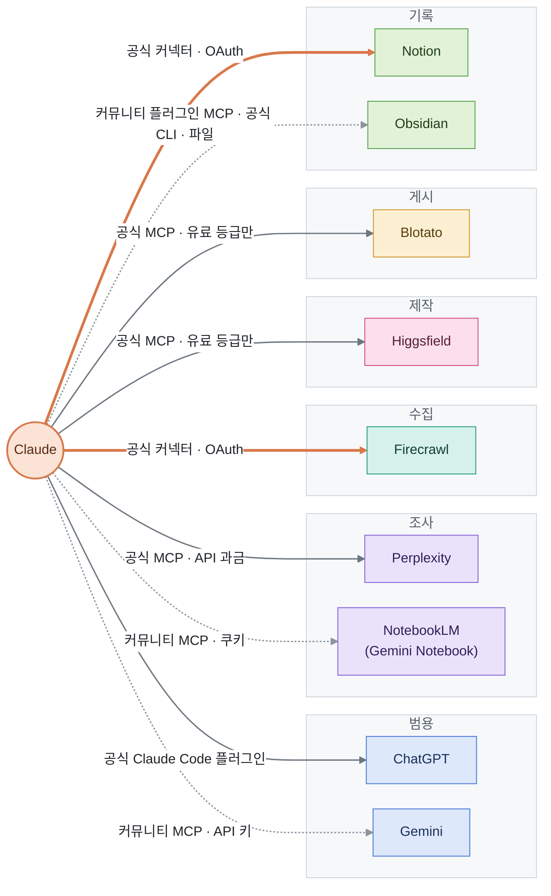
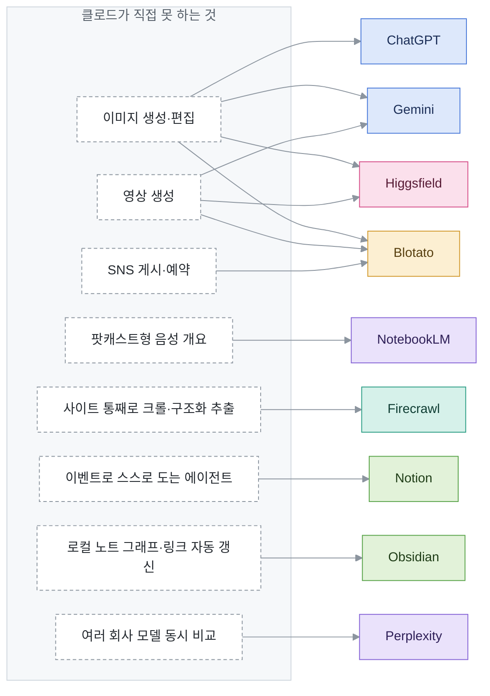
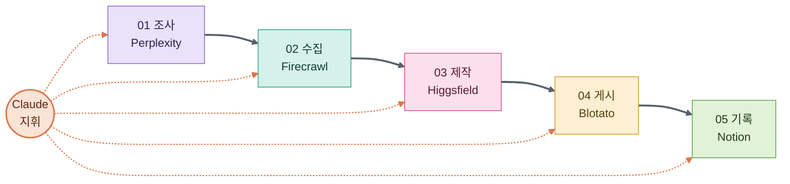

# AI · 도구 사전

클로드를 가운데 두고, 클로드가 직접 못 하는 일을 메워 주는 AI·도구를 모은 사전임. 도구마다 **무료·유료와 이용 조건(개인·상업)**, **등급별 요금과 권한**, **클로드로는 못 하는 것**, **라이선스**를 적음. 조사·갱신 규칙은 [`CLAUDE.md`](CLAUDE.md) 에 있음.

## 목차
- [읽는 법](#읽는-법)
- [관계도](#관계도) — [클로드와 어떻게 잇나](#클로드와-어떻게-잇나) · [빈자리를 누가 메우나](#클로드의-빈자리를-누가-메우나) · [조합 예: 마케팅팀](#조합-예-클로드--5개--마케팅팀)
- [한눈에 보기](#한눈에-보기)
- [도구](#도구)
  - 기준선: [Claude](#claude)
  - 범용: [ChatGPT](#chatgpt) · [Gemini](#gemini)
  - 조사: [Perplexity](#perplexity) · [NotebookLM](#notebooklm-2026-07-16-부터-gemini-notebook)
  - 수집: [Firecrawl](#firecrawl)
  - 제작: [Higgsfield](#higgsfield)
  - 게시: [Blotato](#blotato)
  - 기록: [Notion](#notion) · [Obsidian](#obsidian)
- [바뀐 것](CHANGELOG.md)

각 항목 제목 아래의 단추로 목차 · 한눈에 보기 · 앞뒤 도구로 넘어감. GitHub 파일 화면의 `Outline` 단추로 모든 제목을 펼쳐 볼 수도 있음.

## 읽는 법
[<kbd>↑ 목차</kbd>](#목차)

- **`확인 못 함 — <이유>`** 는 빈칸을 추측으로 메우지 않았다는 표시임. 요금이 비어 있으면 결제 전에 공식 가격표를 직접 볼 것
- **출처 등급**: `공식`(가격표·약관·도움말) · `자사 홍보`(회사 블로그·랜딩의 성능 주장) · `제3자`(리뷰·기사). `(원문 열어 봄)` 은 그 페이지를 직접 열어 값을 대조했다는 뜻이고, `(검색 요약)` 은 원문이 막혀 검색 결과 요약으로만 봤다는 뜻임. 2026-09-29 재조사 뒤에도 남은 `검색 요약` 은 대개 openai.com·perplexity.ai 처럼 봇 차단(403)으로 원문이 안 열리는 곳임
- 통화는 표시된 그대로(대개 USD)이고 환산하지 않음. 가격은 세금 별도임
- **확인한 날짜**는 값이 바뀐 날이 아니라 맞는지 본 날임. 90일이 넘은 항목은 요금부터 의심할 것

## 관계도
[<kbd>↑ 목차</kbd>](#목차)

### 클로드와 어떻게 잇나
굵은 주황 선은 claude.ai 커넥터 디렉터리의 공식 커넥터, 회색 실선은 도구 회사가 낸 공식 MCP·플러그인(대개 "사용자 지정 커넥터"로 URL 을 넣음), 점선은 커뮤니티 부품이나 파일 직접 편집임. 칸 색은 세 관계도 모두 역할을 뜻함 — 파랑 범용 · 보라 조사 · 청록 수집 · 분홍 제작 · 노랑 게시 · 초록 기록.

### 클로드의 빈자리를 누가 메우나
왼쪽은 `Claude` 항목의 기준선에서 뽑은 "클로드가 직접 못 하는 것"이고, 오른쪽은 그걸 하는 도구임. 실시간 웹 검색은 클로드도 하므로 여기 없음.

### 조합 예: 클로드 + 5개 = 마케팅팀
유튜브 영상([x-iEypjYD3w](https://www.youtube.com/watch?v=x-iEypjYD3w))이 보여 준 구성임. 영상 본문은 조사 환경에서 열지 못했고, 영상 속 도식의 캡처로만 확인함 — 각 단계에서 무엇을 주고받는지는 도식에 적힌 역할 이름까지만 옮김.

- 다섯 개를 다 붙이면 **돈이 드는 자리가 셋**임: Higgsfield·Blotato 는 유료 등급이어야 MCP 가 열리고, Perplexity MCP 는 구독이 아니라 API 사용량으로 과금됨. Firecrawl 은 무료 등급(월 1,000 크레딧)으로도 붙지만 클라우드 약관이 명시적 허락 없는 상업 이용을 막으므로 마케팅에 쓰면 아래 항목을 볼 것. Notion 커넥터는 모든 등급에서 붙되 연결 앱까지 찾는 AI 검색·회의록 조회는 Business 이상에서만 됨
- 가장 싸게 다 붙이는 값(월 결제 기준): Higgsfield Starter $19 + Blotato Starter $29 + Perplexity API 사용량 + 클로드 요금제. Higgsfield 는 보는 기기·지역·실험에 따라 요금 세트가 달라 휴대폰 화면에서는 Basic $5 가 뜨기도 함 — 한국에서 어느 세트가 보이는지는 확인 못 함이라 아래 항목을 볼 것

## 한눈에 보기
[<kbd>↑ 목차</kbd>](#목차)

| 도구 | 역할 | 무료·유료 | 최저 유료가 (월) | 클로드와 잇는 법 | 라이선스 | 확인한 날짜 |
|---|---|---|---|---|---|---|
| [Claude](#claude) | 범용 · 기준선 | 부분 무료 · 개인·업무 모두 무료 등급 가능 · 생성물 상업 이용 가능 | Pro $20 (연 결제 $17) | 해당 없음 | 독점 | 2026-09-29 |
| [ChatGPT](#chatgpt) | 범용 | 부분 무료 · 개인 무료 · 업무 이용은 개인용 약관 부록으로 받아들임(EU판 원문, ROW판 확인 못 함) · 생성물 상업 이용 가능(음성 출력 제외) | Go $8 | 공식 Claude Code 플러그인 | 독점 (Codex CLI·플러그인 Apache-2.0) | 2026-09-29 |
| [Gemini](#gemini) | 범용 | 부분 무료 · 개인 무료 · 무료 등급 업무 이용을 약관이 막지 않음 · 생성물 상업 이용 가능(Google 이 소유권 주장 안 함) | AI Plus $4.99 | 커뮤니티 MCP · API 키 | 독점 (Gemini CLI Apache-2.0) | 2026-09-29 |
| [Perplexity](#perplexity) | 조사 | 부분 무료 · **개인 무료 + 상업 유료** — Free·Pro·Max 이미지는 비상업 전용(공식 도움말), 약관 전체가 비상업 전용이라는 것은 제3자 서술(약관 원문 403), 업무는 Enterprise | Pro $20 (학생 $10) | 공식 MCP · API 과금 | 독점 (MCP 서버 MIT) | 2026-09-29 |
| [NotebookLM](#notebooklm-2026-07-16-부터-gemini-notebook) | 조사 | 부분 무료 · 개인 무료 · 업무 이용을 막는 약관 조항 없음 · 생성물 소유권 주장 안 함(상업 이용 명시 문구는 없음, 한국은 이미지·영상 워터마크 강제) | Google AI Plus $4.99 | 커뮤니티 MCP · 쿠키 | 독점 (커뮤니티 MCP MIT) | 2026-09-29 |
| [Firecrawl](#firecrawl) | 수집 | 부분 무료 + 자체 호스팅 무료 · 자체 호스팅은 AGPL-3.0 조건으로 상업 이용 가능 · 클라우드 약관은 등급 구분 없이 "명시적 허락 없는 상업 이용" 금지 · 출력 권리 조항 없음 | Hobby $19 (연 결제 $16) | 공식 커넥터 + 공식 MCP | 본체 AGPL-3.0 · 클라우드 독점 · MCP 서버 MIT | 2026-09-29 |
| [Higgsfield](#higgsfield) | 제작 | 부분 무료 · 가격표는 **Free 상업 이용 불포함**, 약관·도움말은 출력의 상업 이용을 제한 안 함(어긋남) · Free 는 워터마크 | Starter $19 (데스크톱·T1 지역 기준, 휴대폰 화면은 Basic $5) | 공식 MCP (Claude Code 는 CLI) · 유료 등급만 | 독점 (CLI·스킬 MIT) | 2026-09-29 |
| [Blotato](#blotato) | 게시 | 체험만 무료(7일) · 업무 이용은 유료 등급 · 생성물 권리 확인 못 함 | Starter $29 (연 결제 약 17% 할인, 금액 표기 없음) | 공식 MCP · OAuth/API 키 · 유료 등급만 | 독점 | 2026-09-29 |
| [Notion](#notion) | 기록 | 부분 무료 · 개인 무료 · 업무는 조직용 약관(MSA), Free 업무 이용을 막는 조항 없음 | Plus $12/멤버 (연 결제 $10) | 공식 커넥터 · OAuth | 독점 (로컬 MCP 서버 MIT) | 2026-09-29 |
| [Obsidian](#obsidian) | 기록 | 부분 무료 · 앱은 개인·업무 모두 무료(2025-02-20 부터) · Sync·Publish 만 유료 | Sync Standard $5 (연 결제 $4) — 앱은 무료 | 커뮤니티 플러그인 MCP · 공식 CLI · 파일 | 독점 소프트웨어 (플러그인 MIT) | 2026-09-29 |

## 도구
[<kbd>↑ 목차</kbd>](#목차)

### Claude
[<kbd>↑ 목차</kbd>](#목차) [<kbd>☰ 한눈에 보기</kbd>](#한눈에-보기) [<kbd>ChatGPT →</kbd>](#chatgpt)

- **역할**: 범용
- **한 줄**: Anthropic 의 대화형 AI. 웹·데스크톱·모바일 앱(claude.ai), 터미널·IDE 코딩 에이전트(Claude Code), 작업 위임(Cowork)을 한 구독으로 씀. 2026-09-16 부터 Pro·Max 에서 Cowork 가 따로 고르는 모드가 아니라 모든 대화 안으로 합쳐지는 중임
- **클로드와 잇는 법**: 해당 없음 — 기준선 항목임. 밖의 도구는 클로드 쪽에서 커넥터(원격 MCP, OAuth)와 Claude Code 의 MCP 서버·플러그인으로 붙임
- **확인한 날짜**: 2026-09-29

#### 무료·유료와 이용 조건

| 구분 | 조건 |
|---|---|
| 분류 | 부분 무료 |
| 개인 이용 | Free 로 가능함 |
| 상업·업무 이용 | 무료 등급으로도 가능함. 소비자 약관(2025-10-08 발효)에 업무 이용을 막는 조항이 없고, 소비자 약관 서문이 "For clarity, this does not include Claude.ai or Claude Pro use for individuals or entities" 라고 적어 개인·법인의 claude.ai 이용을 소비자 약관 쪽에 둠. 상업 약관(2025-06-17 발효) 서문도 "Our consumer offerings (e.g., Claude.ai) are governed by our Consumer Terms" 라고 씀. "personal, non-commercial" 문장은 **평가(evaluation) 목적 이용**에만 걸림. 조직 계약·관리가 필요하면 Team·Enterprise(상업 약관)로 감. 회사 메일로 가입하면 계정이 그 조직의 Enterprise 계정에 묶여 관리자가 보고 관리할 수 있음(약관 Business Domains 조항) |
| 생성물의 상업적 이용 | 가능함. 약관 원문: "Subject to your compliance with our Terms, we assign to you all of our right, title, and interest—if any—in Outputs." 등급으로 나누는 문구 없음. 단, 금지 조항이 서비스로 경쟁 제품을 만들거나 AI 모델을 학습시키거나 서비스를 재판매하는 것을 막음("To develop any products or services that compete with our Services, including to develop or train any artificial intelligence or machine learning algorithms or models or resell the Services") |

- 특이점: 소비자 약관과 상업 약관(Team·Enterprise·API·Education·Government)이 따로 있음. 2025-08-28 공지로 Free·Pro·Max 대화(그 계정으로 쓰는 Claude Code 포함)를 학습에 쓸지 사용자가 고르게 됐고, 가격표 비교표는 이 세 등급의 모델 학습을 "Opt-out" 으로 적음. 학습을 허용하면 보존 기간이 5년임(허용 안 하면 30일). 상업 약관 쪽 요금제에는 적용 안 됨
- 이 절의 출처: [Consumer Terms of Service](https://www.anthropic.com/legal/consumer-terms) — 공식 (원문 열어 봄) · [Commercial Terms of Service](https://www.anthropic.com/legal/commercial-terms) — 공식 (원문 열어 봄) · [Updates to Consumer Terms and Privacy Policy](https://www.anthropic.com/news/updates-to-our-consumer-terms) — 공식 (원문 열어 봄)

#### 요금과 등급별 권한
| 등급 | 월 요금 | 연 결제 시 | 할 수 있는 것 · 한도 |
|---|---|---|---|
| Free | $0 | – | 웹·데스크톱·모바일 채팅, 웹 검색, 파일 생성, 코드 실행, 대화 간 메모리, 커넥터(연결 도구 1개), Artifacts, Projects 5개까지. 모델은 Sonnet·Haiku 만(Opus·Fable 없음). Research 없음. 사용량 한도는 5시간마다 재설정. 음성 모드(베타) 됨. **Claude Code 는 포함 안 됨** |
| Pro | $20 | $17/월 ($200 선결제) | Free 전부 + 5시간 세션당 Free 의 5배 이상 사용량(가격표 FAQ: "at least 5x more usage per 5-hour session than Free"), 작업 위임·예약, Claude Design·Slides·Docs, Claude Science, Research, Projects, Opus 포함 더 많은 모델(Fable 은 사용량 크레딧으로만), Claude in Chrome·Microsoft 365·Outlook, **Claude Code 포함**. 5시간 세션 한도 + 모든 모델에 걸리는 주간 한도. API(Console) 사용은 포함 안 됨 |
| Max 5x | $100 | 없음 (월 결제만) | Pro 전부 + 5시간 세션당 Pro 의 5배 사용량, 더 높은 출력 한도, 새 기능 먼저, 혼잡 시간 우선 접근, Fable 은 주간 한도의 50% 까지. Claude Code 포함 |
| Max 20x | $200 | 없음 (월 결제만) | Max 5x 와 같고 사용량이 Pro 의 20배 |
| Team Standard 좌석 | $25/좌석 | $20/좌석/월 | 2–150명. Pro 보다 많은 사용량, Claude Code·Cowork, Claude Design·Slides·Docs, Claude Science, 조직 전체 검색, 중앙 결제·관리, SSO, 기본값으로 학습에 안 씀. 웹 검색·커넥터는 Owner 가 조직 단위로 켜야 함 |
| Team Premium 좌석 | $125/좌석 | $100/좌석/월 | Standard 좌석의 5배 사용량. 나머지는 Standard 와 같음. 좌석 종류를 섞어 살 수 있음 |
| Enterprise | $20/좌석/월 + 사용량 과금 | 연 결제만 | 가격표 문구: "US$20/seat/month, billed annually. Usage cost scales with model and task." 사용량은 API 요금으로 매김. Team 전부 + 사용자·조직 지출 한도, 역할 기반 권한, SCIM, 감사 로그, Compliance API, 데이터 보존 설정, 네트워크 접근 제어·IP 허용 목록, HIPAA 대응, Claude Security(베타) |

- 가격표는 세금 별도라고 적고("Prices shown don't include applicable tax"), Pro 도움말은 지역마다 표시 가격에 세금이 들어가기도 하고 결제 때 붙기도 한다고 씀. 웹 구독 기준이고 모바일 앱 결제가는 다를 수 있다고 Max 도움말에 적혀 있음
- Max 는 가격표에 "From $100" 로만 나오고 등급별 가격은 Max 도움말(5x $100 · 20x $200, "available as a monthly subscription only")에 있음. 두 출처가 서로 어긋나지는 않음
- 유료 등급은 한도를 넘으면 사용량 크레딧을 켜서 API 표준 요금으로 이어 쓸 수 있음. Anthropic 은 주간·월간 상한 같은 다른 제한을 재량으로 걸 수 있다고 적음
- 어긋나는 값: 혼잡 시간 우선 접근을 가격표 비교표는 Pro "No"·Max "Yes" 로 적고, Pro 도움말은 Pro 혜택에 "Priority access to Claude during high-traffic periods" 를 넣음. 가격표가 등급을 나란히 비교한 표라 그쪽을 기준으로 적었음

#### 기준선 — 클로드가 직접 못 하는 것
- **이미지 생성·편집 못 함.** 도움말 원문: "Claude doesn't generate photos or illustrations the way image-generation tools do." 대신 HTML·SVG 로 도표·차트·인터랙티브 시각물을 대화 안에 만들고(웹·데스크톱 베타), 올린 이미지를 읽고 분석함
- **영상·음악(오디오) 생성은 확인 못 함 — 기능이 있다는 공식 근거를 못 찾음.** 가격표 기능 비교표와 릴리스 노트 전체(2025-08-01–2026-09-28)에 영상·음악·오디오 생성 항목이 없음. "없다"고 적은 공식 문서를 찾은 것은 아니라서 부재를 근거로 한 추정임
- **실시간 웹 검색은 됨 — "실시간 검색을 못 한다"는 말은 지금 틀림.** 웹 검색은 Free 포함 모든 등급에서 됨(Team·Enterprise 는 Owner 가 켜야 함, 새 Claude 경험에서는 스위치 없이 필요할 때 검색함). 웹 검색을 켜면 사용자가 준 URL 의 본문을 직접 가져오는 web fetch 도 됨. Free 에서 긴 글을 통째로 가져오면 사용량 한도를 많이 먹는다고 도움말이 경고함
- **외부 게시·발송은 조건부로 됨 — 스스로는 못 하고 커넥터가 있어야 함.** Google Workspace 커넥터(모든 등급)로 Gmail 발송·답장·전달(기본은 사용자 승인 필요), Calendar 일정 생성·수정·삭제, Drive 업로드·공유가 됨. Microsoft 365 커넥터는 2026-07-07 에 쓰기 도구가 붙음(메일 발송, 일정, OneDrive·SharePoint 파일 생성·수정). SNS 게시처럼 커넥터가 없는 곳에는 직접 못 올림
- **Claude Code 는 Free 에서 못 씀** — Pro 이상 또는 Console 의 API 크레딧이 필요함
- **구독으로 API 를 쓰지 못함** — Pro 도움말: "The Pro plan does not include API usage through the Claude Console."

#### 라이선스
- 독점 서비스임. Claude Code 저장소(`anthropics/claude-code`)의 LICENSE.md 도 오픈소스가 아니고 "© Anthropic PBC. All rights reserved. Use is subject to Anthropic's Commercial Terms of Service." 임

#### 출처
- [Plans & Pricing | Claude](https://claude.com/pricing) — 공식 (원문 열어 봄)
- [What is the Max plan? | Claude Help Center](https://support.claude.com/en/articles/11049741-what-is-the-max-plan) — 공식 (원문 열어 봄)
- [What is the Pro plan? | Claude Help Center](https://support.claude.com/en/articles/8325606-what-is-the-pro-plan) — 공식 (원문 열어 봄)
- [Use Claude Code with your Pro or Max plan | Claude Help Center](https://support.claude.com/en/articles/11145838-use-claude-code-with-your-pro-or-max-plan) — 공식 (원문 열어 봄)
- [Enabling and using web search | Claude Help Center](https://support.claude.com/en/articles/10684626-enabling-and-using-web-search) — 공식 (원문 열어 봄)
- [Can Claude produce images? | Claude Help Center](https://support.claude.com/en/articles/9002504-can-claude-produce-images) — 공식 (원문 열어 봄)
- [Use voice mode | Claude Help Center](https://support.claude.com/en/articles/11101966-use-voice-mode) — 공식 (원문 열어 봄)
- [Use Google Workspace connectors | Claude Help Center](https://support.claude.com/en/articles/10166901-use-google-workspace-connectors) — 공식 (원문 열어 봄)
- [Release notes | Claude Help Center](https://support.claude.com/en/articles/12138966-release-notes) — 공식 (원문 열어 봄)
- [anthropics/claude-code LICENSE.md](https://github.com/anthropics/claude-code/blob/main/LICENSE.md) — 공식 (원문 열어 봄)

### ChatGPT
[<kbd>↑ 목차</kbd>](#목차) [<kbd>☰ 한눈에 보기</kbd>](#한눈에-보기) [<kbd>← Claude</kbd>](#claude) [<kbd>Gemini →</kbd>](#gemini)

- **역할**: 범용
- **한 줄**: OpenAI 의 대화형 AI. 채팅·이미지 생성(ChatGPT Images)·음성·딥 리서치·에이전트 모드·코딩 에이전트(Codex)를 한 구독으로 씀
- **클로드와 잇는 법**: 공식 Claude Code 플러그인 `openai/codex-plugin-cc` (설치: `/plugin marketplace add openai/codex-plugin-cc` → `/plugin install codex@openai-codex` → `/codex:setup`). `/codex:review`·`/codex:rescue` 등으로 Codex 에게 리뷰·작업을 넘김. 인증은 로컬 Codex CLI 로그인을 그대로 씀 — ChatGPT 계정(Free 포함) 또는 OpenAI API 키. 쓴 양은 Codex 사용 한도에서 빠짐. Codex CLI 를 MCP 서버로 띄우던 `codex mcp-server` 는 지금 `openai/codex` 소스에 없음(2026-09-29 main 에서 확인, 남은 것은 외부 MCP 서버를 관리하는 `codex mcp` 뿐). 없어진 버전·날짜는 2026-08-24 폐기 예고 후 Codex CLI 0.154.0(2026-09-09)이라는 제3자 서술임 — 그걸 쓰는 옛 글·커뮤니티 설정은 지금 안 돎. claude.ai 앱용 공식 커넥터는 확인 못 함 — 커넥터 디렉터리에서 찾아보지 않았음. API 키(`OPENAI_API_KEY`)로 모델을 부르는 커뮤니티 MCP 서버는 여럿 있음
- **확인한 날짜**: 2026-09-29

#### 무료·유료와 이용 조건

| 구분 | 조건 |
|---|---|
| 분류 | 부분 무료 |
| 개인 이용 | Free 로 가능함 |
| 상업·업무 이용 | 개인용 Terms of Use 와 기업용 Services Agreement(API·Business·Enterprise)가 나뉨. EU판 개인용 약관(2026-01-16판)은 "including personal, non-commercial use of our Services by consumers" 라고 적고, 끝에 **"Business use of the Services addendum"** 을 두어 "If you use our Services for commercial or business use, the following terms apply" 로 업무 이용을 받아들임(책임 한도·면책·준거법만 달라짐). 등급으로 가르는 문구는 없음 — 원문 열어 봄. 한국에 걸리는 ROW판(row-terms-of-use)에 같은 부록이 있는지는 확인 못 함 — openai.com 이 Cloudflare 봇 확인(403)으로 막혀 원문을 못 열었음 |
| 생성물의 상업적 이용 | 가능함. 개인용 약관(EU판) "you (a) retain your ownership rights in Input and (b) own the Output. We hereby assign to you all our right, title, and interest, if any, in and to Output." — 원문 열어 봄, 등급 구분 없음. Business·Enterprise 는 Services Agreement 4.1 "Customer … owns all Output" — 원문 열어 봄. 예외로 **음성 출력은 비상업 용도로만**: Service Terms(2026-09-21판) "ChatGPT Voice Output is for non-commercial use only and may not be distributed or repackaged as a standalone audio recording … Any rights in Output assigned to you do not include ChatGPT Voice Output." — 원문 열어 봄 |

- 특이점: 개인용 요금제는 끄지 않으면 대화가 학습에 쓰임 — 약관 "If you do not want us to use your Content to train our models, you have the option to opt out by updating your account settings". Business·Enterprise·API 는 Services Agreement 4.2 "will not use Customer Content to develop or improve the Services, unless Customer explicitly agrees" (둘 다 원문 열어 봄)
- 약관 원문은 openai.com 이 막혀서 Open Terms Archive 가 공식 페이지에서 받아 둔 사본(2026-09-29 기준 최신)으로 읽었음. 그 수집기는 EU판만 받으므로 ROW판 문장은 이 사본으로 확인되지 않음
- 이 절의 출처: [Europe Terms of Use + Service Terms (Open Terms Archive 사본)](https://github.com/OpenTermsArchive/genai-versions/blob/main/ChatGPT/Terms%20of%20Service.md) — 공식(원문 열어 봄) · [OpenAI Services Agreement (Open Terms Archive 사본)](https://github.com/OpenTermsArchive/genai-versions/blob/main/ChatGPT/Commercial%20Terms.md) — 공식(원문 열어 봄) · [Terms of Use (ROW)](https://openai.com/policies/row-terms-of-use/) — 공식(검색 요약, 원문 차단)

#### 요금과 등급별 권한
| 등급 | 월 요금 | 연 결제 시 | 할 수 있는 것 · 한도 |
|---|---|---|---|
| Free | $0 | – | 일상 텍스트 채팅 무제한(2026 변경). 이미지 생성(ChatGPT Images 2.0)·파일 업로드·음성·데이터 분석은 따로 좁은 한도. 음성은 GPT-Live-1 mini. 일부 국가에서 광고 붙음 (검색 요약). Codex 는 GPT-6 Luna 로 짧은 코딩 작업만(데스크톱 앱, 순차 배포 — 원문 열어 봄). 정확한 횟수 한도는 확인 못 함 — chatgpt.com·help.openai.com 이 Cloudflare 봇 확인으로 막힘 |
| Go | $8 (원문엔 지역 표기 없음) | 확인 못 함 — 가격표 원문이 막혀 있음. 검색 요약은 월 결제만이라고 함 | Free 대비 메시지·파일 업로드·이미지 생성 10배. 광고 붙음. 2025 년 인도에서 시작해 2026-01 에 전 세계로 풀림(제3자). Codex 는 GPT-6 Luna 로 가벼운 작업(원문 열어 봄) |
| Plus | $20 | 확인 못 함 — 가격표 원문이 막혀 있음. 검색 요약은 월 결제만이라고 함 | 광고 없음. 상위 모델·추론, Thinking 이미지 생성, 확장된 메모리, 딥 리서치(제한), 에이전트 모드, Projects, 커스텀 GPT. 음성은 GPT-Live-1 (검색 요약). Codex 는 웹·CLI·IDE·iOS, 자동 코드 리뷰·Slack 연동, GPT-6 Sol·Luna, 한도를 넘으면 ChatGPT 크레딧을 사서 이어 씀(원문 열어 봄) |
| Pro $100 (5x) | $100 | 확인 못 함 — 연 결제 언급을 못 찾음 | Plus 의 5배 Codex 사용량(원문 열어 봄 — "Choose 5x or 20x higher rate limits than Plus", "From $100/month"). 2026-09 신설 Codex 모델도 사용 한도 안에서 씀 |
| Pro $200 (20x) | $200 (검색 요약 — 원문은 "From $100" 까지만 보임) | 확인 못 함 | Plus 의 20배 Codex 사용량(원문 열어 봄). 최상위 Pro 모델, 딥 리서치·에이전트 모드 최대 한도, 신기능 우선 (검색 요약). **2026-09-10 부터 신규 가입·업그레이드 일시 중단** (기존 구독자는 영향 없음, 제3자) |
| Business Standard 좌석 | $25/좌석 | $20/좌석/월 | 2좌석 이상, $20 은 연 결제가(원문 열어 봄 — "*2+ users, billed annually. $25 per user per month when billed monthly."). SAML SSO·MFA·관리 기능, 업무 데이터는 기본으로 학습에 안 씀(원문 열어 봄). Codex 한도는 Plus 와 같은 5시간당 어림표이고 주간 한도가 더 붙을 수 있음(원문 열어 봄) |
| Business Premium 좌석 | 확인 못 함 — 검색 요약은 $125 | $100/좌석 로 적힌 것만 원문에 있음(연 결제가인지는 확인 못 함) | 2026-08 신설(검색 요약). 원문은 "Business ($100) uses the Pro 5x estimates" 한 줄뿐 — Codex 한도가 Pro 5x 와 같다는 것만 확인. 5시간 한도 없음·좌석 종류 섞어 배정은 검색 요약 |
| Enterprise / Edu | 견적 ("Contact sales" — 원문 열어 봄) | 확인 못 함 — 검색 요약은 연 결제 | 맞춤 가격, SCIM·EKM·RBAC·감사 로그·데이터 보존·거주지 통제, 우선 처리(원문 열어 봄). flexible pricing 이면 고정 한도 없이 크레딧만큼 쓰고, 아니면 대부분 기능이 Plus 와 같은 좌석당 한도(원문 열어 봄) |

- Codex 5시간당 로컬 메시지 어림(공식 Codex 가격 페이지, GPT-6 Sol 기준): Plus 15–150 · Pro 5x 70–700 · Pro 20x 300–3,000 · Business Standard 15–150. 고정 한도가 아니라 작업 크기에 따라 달라진다는 단서가 붙음. ChatGPT Work 는 Codex 와 같은 요금·크레딧·한도를 나눠 씀
- 등급별 모델: Codex 쪽만 원문으로 확인했음 — Free·Go 는 GPT-6 Luna, Plus 이상은 GPT-6 Sol·Luna 에 어림표상 GPT-6 Astra·GPT-5.6 Sol·Terra·Luna 도 씀. GPT-5.5 는 2026-10-14 에 ChatGPT·Codex 모든 등급에서 은퇴. 채팅 쪽 등급별 모델은 확인 못 함 — 가격표 원문이 막혀 있음
- Pro 등급은 제3자 글 중 "$200 하나"로 적은 2025 기준 글이 섞여 있음. 공식 Codex 가격 페이지가 "From $100", "5x or 20x" 두 단계라서 그쪽을 따름

**영상(Sora)**: 지금은 **어느 등급에서도 영상 생성이 안 됨.** Sora 앱·웹이 2026-04-26 에 닫혔고(검색 요약 — 공식 요약 "As of April 26, 2026, the Sora product is no longer available"), Videos API 와 `sora-2`·`sora-2-pro` 모델도 **2026-09-24 에 API 에서 제거됨**(2026-03-24 공지, 원문 열어 봄). ChatGPT 안의 영상 생성 버튼도 같이 빠졌다는 것은 제3자 글에서만 봤음. 예전 한도(Plus 480p 월 50개 등)는 Sora 1 시절 공식 글 기준이라 지금은 맞지 않음

#### 클로드로는 못 하는 것
- **이미지 생성·편집**: ChatGPT Images 2.0 으로 대화 안에서 이미지를 만들고 고침. Free 에서도 됨(좁은 한도). 클로드는 이미지를 만들지 못하고 SVG·HTML 도표만 그림
- 음성 대화·웹 검색·딥 리서치·에이전트·코딩 에이전트는 클로드에도 해당 기능이 있어서 이 칸에서 뺐음. 등급별 한도는 서로 다름
- 영상 생성은 2026-04-26 이후 ChatGPT 에서도 안 되므로 차이가 아님
- 그 밖에 ChatGPT 에만 있는 기능은 확인 못 함 — 공식 기능 비교 페이지(chatgpt.com/pricing)가 네트워크가 열린 뒤에도 Cloudflare 봇 확인(403)으로 막혀 있음

#### 라이선스
- ChatGPT 는 독점 서비스임
- Codex CLI(`openai/codex`)와 Claude Code 플러그인(`openai/codex-plugin-cc`)은 둘 다 Apache-2.0 오픈소스임

#### 출처
네트워크가 열린 뒤에도 openai.com·chatgpt.com·help.openai.com 은 Cloudflare 봇 확인(HTTP 403, `cf-mitigated: challenge`)으로 막혀 원문을 못 열었음. 원문을 연 것은 developers.openai.com(Codex 가격·API 폐기 안내), 약관의 Open Terms Archive 사본, GitHub 저장소임. 아래 `공식(검색 요약)` 은 공식 페이지지만 원문을 읽지 못했다는 뜻임.
- [Codex Pricing | OpenAI Developers](https://developers.openai.com/codex/pricing) — 공식(원문 열어 봄)
- [Deprecations | OpenAI API](https://developers.openai.com/api/docs/deprecations) — 공식(원문 열어 봄)
- [Europe Terms of Use + Service Terms (Open Terms Archive 사본)](https://github.com/OpenTermsArchive/genai-versions/blob/main/ChatGPT/Terms%20of%20Service.md) — 공식(원문 열어 봄)
- [OpenAI Services Agreement (Open Terms Archive 사본)](https://github.com/OpenTermsArchive/genai-versions/blob/main/ChatGPT/Commercial%20Terms.md) — 공식(원문 열어 봄)
- [Pricing | ChatGPT](https://chatgpt.com/pricing/) — 공식(검색 요약)
- [What is ChatGPT Go? | OpenAI Help Center](https://help.openai.com/en/articles/11989085-what-is-chatgpt-go) — 공식(검색 요약)
- [Introducing ChatGPT Go, now available worldwide | OpenAI](https://openai.com/index/introducing-chatgpt-go/) — 자사 홍보(검색 요약)
- [About ChatGPT Pro plans | OpenAI Help Center](https://help.openai.com/en/articles/9793128-about-chatgpt-pro-plans) — 공식(검색 요약)
- [ChatGPT Plan | Plus](https://chatgpt.com/plans/plus/) · [Pro](https://chatgpt.com/plans/pro/) — 공식(검색 요약)
- [ChatGPT Free Tier FAQ | OpenAI Help Center](https://help.openai.com/en/articles/9275245-chatgpt-free-tier-faq) — 공식(검색 요약)
- [Ads in ChatGPT | OpenAI Help Center](https://help.openai.com/en/articles/20001047-ads-in-chatgpt) — 공식(검색 요약)
- [Premium seats are coming to ChatGPT Business | OpenAI](https://openai.com/index/premium-seats-chatgpt-business/) — 공식(검색 요약)
- [ChatGPT Business - Overview | OpenAI Help Center](https://help.openai.com/en/articles/8792828-chatgpt-business-overview) — 공식(검색 요약)
- [Sora 2 is here | OpenAI](https://openai.com/index/sora-2/) — 자사 홍보(검색 요약, 2025 글)
- [Sora is here | OpenAI](https://openai.com/index/sora-is-here/) — 자사 홍보(검색 요약, 2024 글 — Plus 월 50개 한도의 출처라 지금은 무효)
- [OpenAI sets two-stage Sora shutdown… | The Decoder](https://the-decoder.com/openai-sets-two-stage-sora-shutdown-with-app-closing-april-2026-and-api-following-in-september/) — 제3자(검색 요약)
- [Why Sora Disappeared from ChatGPT | GlobalGPT](https://www.glbgpt.com/hub/why-sora-disappeared-from-chatgpt/) — 제3자(검색 요약)
- [OpenAI has paused its $200 ChatGPT sign-ups | Fortune](https://fortune.com/2026/09/11/openai-astra-chatgpt-pro-pause/) — 제3자(검색 요약)
- [ChatGPT Plans Compared (Sept 2026) | The AI Career Lab](https://theaicareerlab.com/blog/chatgpt-pricing-plans-explained) — 제3자(검색 요약)
- [openai/codex-plugin-cc](https://github.com/openai/codex-plugin-cc) — 공식
- [openai/codex](https://github.com/openai/codex) — 공식(main 소스를 받아 `mcp-server` 가 없음을 확인)
- [trailofbits/skills issue #301 — codex mcp-server removed in 0.154.0](https://github.com/trailofbits/skills/issues/301) — 제3자(Codex 릴리스 노트 인용)

### Gemini
[<kbd>↑ 목차</kbd>](#목차) [<kbd>☰ 한눈에 보기</kbd>](#한눈에-보기) [<kbd>← ChatGPT</kbd>](#chatgpt) [<kbd>Perplexity →</kbd>](#perplexity)

- **역할**: 범용
- **한 줄**: Google 의 대화형 AI. Gemini 앱과 Gmail·Docs·Sheets 안의 Gemini, 이미지(Nano Banana)·영상(Gemini Omni·Veo·Flow)·음악(Lyria) 생성, 딥 리서치, 상시 에이전트(Gemini Spark)를 Google AI 요금제(Google One)로 묶어 팜
- **클로드와 잇는 법**: 모델을 부르는 공식 MCP 서버·커넥터는 확인 못 함. 공식으로 있는 것은 **Gemini API Docs MCP** (`https://gemini-api-docs-mcp.dev`, 원격 HTTP, `npx add-mcp "https://gemini-api-docs-mcp.dev"` 로 붙임)와 공식 Gemini API 스킬(`google-gemini/gemini-skills`)인데 **둘 다 Gemini 문서·SDK 사용법을 알려 주는 것뿐이고 Gemini 모델을 부르지는 않음**. 공식 문서는 이 MCP 를 "public MCP server" 라고만 하고 인증 절차는 적지 않음(원문 열어 봄). 모델을 부르려면 커뮤니티 MCP 서버(`GEMINI_API_KEY` API 키 인증)나 커뮤니티 Claude Code 플러그인(`gemini-plugin-cc` 류, Google 과 무관하다고 스스로 밝힘)을 씀. 주의: Gemini CLI 는 **2026-06-18 에 AI Pro·Ultra 구독과 무료 Code Assist 개인용 요청을 끊었고**, 그 뒤로는 **유료** Gemini API 키나 Code Assist Standard·Enterprise 라이선스로만 돎. 구독자는 Antigravity CLI(Google 계정 로그인)로 옮겨 감 — Gemini CLI 를 감싼 옛 플러그인은 유료 API 키가 있어야 돎(원문 열어 봄). 참고로 클로드의 Google Workspace 커넥터(Gmail·Calendar·Drive, OAuth)는 Google 앱에 붙는 것이지 Gemini 에 붙는 것이 아님
- **확인한 날짜**: 2026-09-29

#### 무료·유료와 이용 조건

| 구분 | 조건 |
|---|---|
| 분류 | 부분 무료 |
| 개인 이용 | 무료 등급으로 가능함 |
| 상업·업무 이용 | 개인 계정도 됨. Gemini 앱에는 Google 서비스 약관(2026-07-30 시행)과 생성형 AI 금지 정책만 적용되고, 약관은 업무 이용자(business user)를 따로 정의해 배상 책임 조항을 더할 뿐 업무 이용을 막지 않음. 조직 명의로 쓰려면 조직의 권한 있는 대리인이 약관에 동의해야 함 (원문 열어 봄). 회사 계정은 Workspace·Gemini Enterprise 로 따로 감 |
| 생성물의 상업적 이용 | 가능함. Google 서비스 약관 본문에 "Google won't claim ownership over that content" 가 있음 — 첫 조사 때 근거로 삼은 생성형 AI 추가 약관은 **2024-05-22 부터 적용 안 되고** 그 내용이 본 약관으로 옮겨 갔음. 금지되는 것은 생성물로 AI 모델을 만드는 것, 생성물을 사람이 만든 것처럼 속이는 것 (원문 열어 봄). 보이지 않는 워터마크 SynthID 는 Google AI 생성물에 들어감 (원문 열어 봄). 이미지의 **보이는 워터마크**가 무료·Pro 에만 붙는다는 것은 제3자 서술뿐이고 공식 도움말에는 등급 구분이 없음 — 확인 못 함 |

- 특이점: 소비자 등급은 대화 일부를 사람이 검토하고 모델 개선에 씀. Keep Activity 를 끄거나 임시 채팅을 쓰면 앞으로의 대화는 검토에 안 쓰임. 검토된 대화는 활동을 지워도 최대 3년 보관, 기본 자동 삭제는 18개월 (원문 열어 봄). Gemini API 는 결제 계정이 붙은 Cloud 프로젝트로 부를 때만 유료 서비스라 프롬프트·응답을 개선에 안 쓰고, 무료 할당량·AI Studio 는 개선에 쓰고 사람이 읽을 수 있음(EEA·스위스·영국은 무료도 유료 규칙). API 약관은 "업무·전문 목적 개발자용, 소비자용 아님" 이라고 함 (원문 열어 봄, 2026-03-23 시행)
- 이 절의 출처: [Google Terms of Service](https://policies.google.com/terms?hl=en) — 공식(원문 열어 봄) · [Generative AI Additional Terms of Service](https://policies.google.com/terms/generative-ai?hl=en) — 공식(원문 열어 봄, 2024-05-22 부터 적용 안 됨) · [Gemini API Additional Terms of Service](https://ai.google.dev/gemini-api/terms) — 공식(원문 열어 봄) · [Gemini Apps Privacy Hub](https://support.google.com/gemini/answer/13594961?hl=en) — 공식(원문 열어 봄) · [Verify AI-generated images, videos, and audio](https://support.google.com/gemini/answer/16722517?hl=en) — 공식(원문 열어 봄) · [Gemini Watermark Policy by tier](https://www.removegeminiwatermarkai.com/blogs/gemini-watermark-policy-free-pro-ultra-api) — 제3자(원문 열어 봄, 워터마크 제거 도구 업체 글이고 Ultra 를 $34.99 로 적는 등 요금이 틀려 믿기 어려움)

#### 요금과 등급별 권한
| 등급 | 월 요금 | 연 결제 시 | 할 수 있는 것 · 한도 |
|---|---|---|---|
| 무료 | $0 | – | 연산량 기준 한도가 5시간마다 차오르고 주간 상한이 있음(2026-05-17 부터). 3.6 Flash, 3.1 Pro 는 들쭉날쭉한 접근. 컨텍스트 32k 토큰. 딥 리서치 되지만 붐비면 무료 사용자가 먼저 막힐 수 있음. 이미지는 Nano Banana 2(내려받기 1K), Gemini 앱 안 영상 생성은 안 됨. Flow 는 구독과 상관없이 하루 50크레딧, Nano Banana Pro 제한 접근, 붐비는 시간(UTC 14–17시)엔 영상 생성이 막힐 수 있음. 저장공간 15GB |
| AI Plus | $4.99 (2026-06-08 인하, 다음 갱신부터) — 전에는 $7.99 | 확인 못 함 — 공식 가격표에 연 결제가가 없음 | 무료의 2배 한도, 컨텍스트 128k 토큰, 영상 생성(Gemini Omni)·Daily Brief(미국)·예약 작업, Nano Banana Pro 로 다시 그리기, Gmail 교정 등 Gmail·Vids 안의 Gemini, Flow 월 200크레딧 추가, 400GB 저장공간(전 200GB, 가족 5명 공유). 한도를 넘으면 AI 크레딧을 사서 늘릴 수 있음 |
| AI Pro | $19.99 | 확인 못 함 — 공식 가격표에 연 결제가가 없음. 2025 제3자 글은 옛 2TB 요금제가 $199.99/년이라고 했음 | 무료의 4배 한도, 컨텍스트 100만 토큰, Gemini 3.1 Pro·딥 리서치 확장, **Gmail·Docs·Sheets 안의 Gemini**, Gemini Spark, Gemini Notebook(옛 NotebookLM) 상향 한도, Veo 3.1 Lite 제한 체험, Flow 월 1,000크레딧 추가, Antigravity 입문 한도, Google Cloud 크레딧 월 $10, 저장공간 5TB(가입 요금제에 따라 10TB), YouTube Premium Lite 포함(일부 국가, 체험 중엔 안 켜지고 가족 공유 안 됨). Workspace 안 Google Pics(포스터·SNS 이미지)도 됨 |
| AI Ultra (5x) | $99.99 | 확인 못 함 — 공식 가격표에 연 결제가가 없음. 2025 제3자 글은 Ultra 가 월 결제만 된다고 했음 | 2026-05 I/O 신설. AI Pro 의 5배 Gemini·Antigravity 한도, Deep Think(Ultra 전용), Flow 월 10,000크레딧 추가, 20TB 저장공간, YouTube Premium(40여 개국), Google Cloud 크레딧 월 $40 |
| AI Ultra (20x) | $199.99 (2026-05-19 I/O 에 $249.99 에서 인하) | 확인 못 함 — 공식 가격표에 연 결제가가 없음 | AI Pro 의 20배 한도, Deep Think, 신기능 먼저, Antigravity 에이전트 최고 한도, Veo 3.1 최고 접근, Project Genie(I/O 블로그는 $200 등급 전용이라 하고 Google One 가격표는 "Ultra 전용"이라고만 함), Flow 월 25,000크레딧 추가, 30TB 저장공간, Google Cloud 크레딧 월 $100 |

- 이 표의 값은 따로 적지 않은 것은 모두 공식 가격표·도움말 원문으로 확인함. 연 결제가만 못 찾았음 — gemini.google 가격표는 월 요금만 싣고, one.google.com 은 가격이 스크립트로 그려져 원문 HTML 에 값이 없음
- **Gemini Spark 는 AI Pro·Ultra, 18세 이상** (기능 표·Spark 페이지·Google One 가격표가 같음). 국가는 공식 원문 둘이 갈림: Gemini 도움말은 "Gemini 앱이 되는 곳 전부, EEA·나이지리아·스위스·영국 제외", Google One 의 AI Pro 혜택 도움말은 "미국만·영어만". 첫 조사의 "Ultra 전용·미국 베타"는 I/O 당시(2026-05) 계획이었음
- **Workspace(회사 계정)**: Workspace 가격표는 Gemini 앱을 모든 Business 요금제에 넣어 둠(Starter 는 기본 접근, Standard 부터 확장 접근). 다만 Google One FAQ 는 아직 "Workspace 고객은 Gemini 애드온을 산다" 고 적어 공식 두 곳이 갈림. 요금제 금액은 확인 못 함 — 가격이 스크립트로 그려져 원문 HTML 에 값이 없음(연 약정 16% 할인 문구만 있음). 회사용 Gemini 앱인 **Gemini Enterprise** 는 Business 판 $21/좌석/월부터(300좌석까지), Standard·Plus 판 $30/좌석/월부터이고 회사 데이터로 학습하지 않음
- **2026 가을 업데이트(2026-09-09)**: 음성으로 초안 쓰기(Gmail·Keep 은 Plus 부터, Docs 는 Pro 부터), Sheets canvas(스프레드시트를 작은 앱으로, Pro·Ultra), Spark 가 Chrome·Google Photos 와 연결됨(Pro·Ultra, 미국)

#### 클로드로는 못 하는 것
- **이미지 생성·편집**: Nano Banana 2·Nano Banana Pro 로 대화 안에서 이미지를 만들고 고침(무료 포함, Pro 모델로 다시 그리기는 Plus 부터). Workspace 의 Google Pics 로 포스터·SNS 이미지 디자인(AI Pro 이상). 클로드는 이미지를 만들지 못함
- **영상 생성**: Gemini Omni(AI Plus 이상), Veo 3.1 Lite(AI Pro 제한 체험)·Veo 3.1(Ultra), Flow 영상 제작 도구. 클로드는 영상을 만들지 못함
- **음악 생성**: Lyria 3.5 로 반주·보컬·가사가 든 곡을 만듦(무료 포함, 등급별 한도 차이). 클로드는 소리를 만들지 못함
- **Gmail·Docs·Sheets 화면 안에 내장된 AI**: 문서·메일을 쓰는 그 자리에서 교정·초안·음성 입력. 클로드는 Google 앱 안에 들어가지 않고 커넥터로 밖에서 읽고 씀(Gmail 발송·Drive 업로드 등)
- 딥 리서치·음성·장시간 에이전트는 클로드에도 비슷한 기능(Research·음성 모드·Cowork 예약 작업)이 있어 이 칸에서 뺐음

#### 라이선스
- Gemini 앱과 Google AI 요금제는 독점 서비스임
- Gemini CLI(`google-gemini/gemini-cli`)는 Apache-2.0 이지만 위에 적은 대로 구독 계정 로그인은 2026-06-18 에 끊겼음. 공식 Gemini API 스킬(`google-gemini/gemini-skills`)도 Apache-2.0 임
- Antigravity CLI 는 오픈소스 라이선스가 없음 — 배포 저장소(`google-antigravity/antigravity-cli`)에 LICENSE 파일이 없고, README 가 Google 서비스 약관과 Antigravity 추가 약관을 따른다고 함

#### 출처
2026-09-29 재조사에서 아래 공식 원문을 모두 직접 열어 대조했음. 연 결제가와 Workspace 요금제 금액은 가격표가 스크립트로 그려져 원문에서도 값을 못 찾았음.
- [Everything new in our Google AI subscriptions, fresh from I/O 2026](https://blog.google/products-and-platforms/products/google-one/google-ai-subscriptions/) — 공식(원문 열어 봄, 2026-05-19)
- [Get more done with the latest Google AI plan updates (fall 2026)](https://blog.google/products-and-platforms/products/google-one/fall-2026-ai-plan-updates/) — 자사 홍보(원문 열어 봄, 2026-09-09)
- [Google AI Plus is now available … including the U.S.](https://blog.google/products-and-platforms/products/google-one/google-ai-plus-availability/) — 공식(원문 열어 봄, 2026-01-27, $7.99·200GB 시절 글)
- [Google AI Pro & Ultra | gemini.google](https://gemini.google/subscriptions/) — 공식(원문 열어 봄)
- [Google AI plans | Google One](https://one.google.com/about/google-ai-plans/) — 공식(원문 열어 봄, 가격은 스크립트로 그려져 없음)
- [Gemini Apps limits & upgrades for Google AI subscribers](https://support.google.com/gemini/answer/16275805?hl=en) — 공식(원문 열어 봄)
- [Generate & edit images with Gemini Apps](https://support.google.com/gemini/answer/14286560?hl=en) — 공식(원문 열어 봄)
- [Manage your Google Flow credits](https://support.google.com/flow/answer/16526234?hl=en) — 공식(원문 열어 봄)
- [Use Google AI Pro benefits - Google One Help](https://support.google.com/googleone/answer/14534406?hl=en) — 공식(원문 열어 봄)
- [Use Gemini Spark to manage your tasks & workflows](https://support.google.com/gemini/answer/17094507?hl=en) — 공식(원문 열어 봄)
- [Gemini Spark](https://gemini.google/overview/agent/spark/) — 자사 홍보(원문 열어 봄)
- [An important update: Transitioning Gemini CLI to Antigravity CLI](https://developers.googleblog.com/an-important-update-transitioning-gemini-cli-to-antigravity-cli/) — 공식(원문 열어 봄, 2026-05-19)
- [Set up your coding assistant with Gemini MCP and Skills](https://ai.google.dev/gemini-api/docs/coding-agents) — 공식(원문 열어 봄)
- [Compare Flexible Pricing Plan Options | Google Workspace](https://workspace.google.com/pricing) — 공식(원문 열어 봄, 금액은 스크립트로 그려져 없음)
- [Google AI Plus gets price drop to $4.99 | 9to5Google](https://9to5google.com/2026/06/08/google-ai-plus-price-drop/) — 제3자(원문 열어 봄, 2026-06-08)
- [Google AI Pro annual billing | Android Authority](https://www.androidauthority.com/google-ai-pro-annual-billing-3571224/) — 제3자(원문 열어 봄, 2025 글)
- [google-gemini/gemini-cli](https://github.com/google-gemini/gemini-cli) — 공식
- [google-gemini/gemini-skills](https://github.com/google-gemini/gemini-skills) — 공식
- [google-antigravity/antigravity-cli](https://github.com/google-antigravity/antigravity-cli) — 공식(README 원문 열어 봄)
- [Google Antigravity Terms of Service](https://antigravity.google/terms) — 공식(원문 열어 봄)

### Perplexity
[<kbd>↑ 목차</kbd>](#목차) [<kbd>☰ 한눈에 보기</kbd>](#한눈에-보기) [<kbd>← Gemini</kbd>](#gemini) [<kbd>NotebookLM →</kbd>](#notebooklm-2026-07-16-부터-gemini-notebook)

- **역할**: 조사
- **한 줄**: 질문마다 웹을 검색해 출처 번호가 달린 답을 내는 검색형 AI 서비스. 웹·앱·Comet 브라우저로 쓰고, 개발자용으로 Agent API·Search API·Embeddings API·Router API 를 팜(Sonar Chat Completions 는 2026-09-27 지원 종료)
- **클로드와 잇는 법**: 공식 MCP 서버 — 원격 `https://api.perplexity.ai/mcp`(Streamable HTTP) 또는 로컬 npm `@perplexity-ai/mcp-server`(v1.3.0, 저장소 `perplexityai/modelcontextprotocol`). 인증은 API 키(`Authorization: Bearer` 헤더 또는 `PERPLEXITY_API_KEY`) 또는 원격 서버의 OAuth 로그인(OAuth 2.1 + PKCE). claude.ai 에는 공식 디렉터리 커넥터가 아니라 "사용자 지정 커넥터"로 URL 을 넣어 붙임(공식 MCP 문서, 원문 열어 봄. `claude.com/connectors` 목록 861개에 Perplexity 커넥터가 없고 `claude.com/connectors/perplexity` 는 404). 별도로 Perplexity Computer 용 MCP 서버도 있음(OAuth, 계정 크레딧 차감)
- **확인한 날짜**: 2026-09-29

#### 무료·유료와 이용 조건

| 구분 | 조건 |
|---|---|
| 분류 | 부분 무료 |
| 개인 이용 | Free 로 가능함 |
| 상업·업무 이용 | **개인 무료 + 상업 유료(Enterprise) 구조**임. 공식 도움말이 Free·개인 Pro·Max 로 만든 이미지를 "personal, non-commercial use only" 로 묶고 Enterprise Pro·Max 만 상업 이용을 허용함(원문 열어 봄). 소비자 약관 전체가 "personal, non-commercial use only" 로 제한하고 **유료 Pro·Education Pro 에도 적용**되며 2026-01-23 개정으로 그렇게 바뀌었다는 것은 제3자·SNS 서술임. 약관 원문은 확인 못 함 — perplexity.ai 가 Cloudflare 403 을 내고 웹 아카이브·리더 프록시도 막힘 |
| 생성물의 상업적 이용 | 이미지: Free·개인 Pro·Max 는 비상업 전용, Enterprise Pro·Enterprise Max 는 상업 이용 가능(공식 도움말, 원문 열어 봄). 글 답변: 소비자 등급은 상업적 이용 불가라는 서술임(제3자, 검색 요약). Enterprise·API 는 "Customer ... owns all Output" (공식, 검색 요약 — 약관 원문은 403) |

- 특이점: 같은 개정에서 자동화·봇·스크래퍼 이용을 금지하고 공개 공유 시 출처 표기를 요구한다는 서술이 있음 (제3자, 검색 요약). MCP 서버는 API 약관(`perplexity-api-terms-of-service`) 쪽이라 이 제한과 별개인지는 확인 못 함 — API 약관도 perplexity.ai 에 있어 403
- 이 절의 출처: [Generating images with Perplexity — 도움말](https://intercom.help/perplexity-ai/en/articles/10354781-generating-images-with-perplexity) — 공식 (원문 열어 봄) · [Terms of Service](https://www.perplexity.ai/hub/legal/terms-of-service) — 공식 (Cloudflare 403, 검색 요약) · [Enterprise Terms](https://www.perplexity.ai/hub/legal/enterprise-terms-of-service) — 공식 (Cloudflare 403, 검색 요약) · [Perplexity Just Nuked Alot of Goodwill — Jaglion Press, 2026-02-19](https://jaglionpress.com/2026/02/19/perplexity-just-nuked-alot-of-goodwill/) — 제3자(검색 요약) · [Perplexity Automation Ban — Geeky Gadgets](https://www.geeky-gadgets.com/perplexity-bot-scraper-ban/) — 제3자(검색 요약)

#### 요금과 등급별 권한
소비자 요금제 (`perplexity.ai/pricing` 은 Cloudflare 403 이라 못 열었음. 값은 공식 도움말 — `perplexity.ai/help-center` 가 403 이라 같은 글을 원본 도메인 `intercom.help/perplexity-ai` 에서 열었음 — 과 미국 App Store 인앱 목록으로 확인함)

| 등급 | 월 요금 | 연 결제 시 | 할 수 있는 것 · 한도 |
|---|---|---|---|
| Free | $0 | — | 기본 검색 사실상 무제한, Pro Search 하루 3회, Research 월 1회, 파일 업로드 기본(제한), 고급 모델·이미지 생성 없음(도움말, 원문 열어 봄). Comet 브라우저 무료(제3자) |
| Education Pro | $10 | 확인 못 함 — 도움말이 월 요금만 적고 웹 가격표는 403 | SheerID 로 대학 이상 학생·교직원 인증. Pro 전부 + Learn Mode·Perplexity Academic·Research 확장. Pro 의 50% 할인이라고 적힘 (도움말, 원문 열어 봄) |
| Pro | $20 | $200/년 | Pro Search 는 주간 한도, Research 는 월간 한도 — 정확한 숫자는 확인 못 함, 도움말이 "average use" 라고만 적음. GPT-5.4·Claude Sonnet 4.6·Gemini 3.1 Pro 등 외부 모델 선택(사용량 많은 주에는 고급 모델이 제한될 수 있음), 이미지·영상 생성(영상은 제한), 파일 업로드, Space 당 파일 50개, 파일·앱 만들기는 30일마다 제한된 수. Perplexity Computer 씀 — 월 크레딧 할당 없음, 가입 때 1회 보너스 4,000 크레딧(30일 뒤 만료), 그 뒤는 구매(100 크레딧 = $1). 2026-03-13 에 Computer 를 Pro 에도 엶(공식 changelog 제목). 요금은 App Store 인앱 목록 $20.00·$200.00 과 도움말의 "12개월 Pro = $200 value" 로 확인 |
| Max | $200 | $2,000/년 (웹에서만) | Pro 전부 + 최고 수준 모델 접근, 파일·앱 만들기 한도 확장, Model Council, Comet Max Assistant(브라우저 에이전트 주간 한도 최고), Brain(연구 미리보기), 신기능 선공개, 우선 지원. Computer 크레딧 월 10,000 + 1회 보너스 35,000(30일 뒤 만료), 자동 충전은 잔액 2,500 에서 걸림(도움말, 원문 열어 봄). 크레딧 지출 한도 기본 $200, 최대 $2,000 까지 조정(제3자 — 도움말은 한도를 정할 수 있다고만 적음) |
| Enterprise Pro | $40/석 | $400/석/년 | Pro 전부 + Pro Search 주 400회, Research 월 80회, 좌석 관리·관리자 청구, 팀 Spaces·사내 지식 검색, Trust center, 데이터를 학습에 안 씀, Computer 월 500 크레딧. API 사용량은 포함 안 됨. 250석 이상·학교·비영리·정부 할인은 문의(도움말에 숫자 없음). 제3자는 교육기관·비영리 $30/석/월($300/년)이라 함 |
| Enterprise Max | $325/석 | $3,250/석/년 | Enterprise Pro 전부 + Pro Search 주 4,000회, Research 월 800회, 영상 월 15개(8초·16:9·소리 포함), 개인 파일 10,000개·Space 당 5,000개, Model Council, SCIM·감사 로그·보존 기간 설정·Insights(조직에 Enterprise Max 가 한 명만 있어도 조직 전체에 열림), Computer 월 15,000 크레딧 |

부가 상품
- **Comet 브라우저**: 무료. 2025-07 에 Max 전용($200/월)으로 나왔다가 2025-10-02 무료 전환(TechCrunch). "2026-03-18 에 유료벽을 내렸다"는 글도 있음 — 날짜가 기사와 안 맞아 TechCrunch 쪽이 더 믿을 만함. 공식 Comet 도움말(`comet-help.perplexity.ai`)은 403 이라 원문 확인 못 함
- **Comet Plus**: $5/월, 언론사 기사 묶음, Pro·Max 에 포함(제3자). 확인 못 함 — 공식 도움말에 글이 없고 Comet 도움말은 403
- **Pro 구독자 API 크레딧 월 $5**: 확인 못 함 — 공식 도움말 어디에도 없음. Pro 혜택 목록에 없고, API 결제 글은 구독 없이 API 를 쓸 수 있으며 API 크레딧은 Computer 크레딧과 별개라고만 적고, 요금제 비교는 API 칸에 "No complimentary API credits" 라고 적음. 없어진 쪽으로 보이지만(추정) 없앴다는 공지는 못 찾음

API (docs.perplexity.ai 원문 열어 봄)
- **Sonar Chat Completions 는 2026-09-27 지원 종료.** 동기·스트리밍 요청은 계속 되지만 Agent API 요청으로 바꿔 처리됨(모델별로 차례로 적용), 비동기 Sonar 요청은 중단돼 background mode 로 옮겨야 함. 가격표에서 Sonar 표가 빠졌음(문서 안 요금 계산기 데이터에만 옛 단가가 남아 있음). 대응 프리셋: Sonar·Sonar Pro → `fast`, Sonar Reasoning Pro → `low`, Sonar Deep Research → `high`

| 상품 | 입력 / 출력 (1M 토큰) | 요청·호출 요금 | 비고 |
|---|---|---|---|
| Agent API 모델 | 제공사 공개 단가 그대로(OpenAI·Anthropic·Google·xAI·Z.AI·Moonshot AI·NVIDIA). 자사 `perplexity/sonar` 는 $0.25 / $2.50 | — | 모델별 단가는 Agent API Models 문서에 있음 |
| Agent API 도구 | — | `web_search` $0.0025/회(Fast Search $0.001) · `fetch_url` $0.0005 · `people_search`·`finance_search` $0.005 · `sandbox` $0.03/세션 | 도구 요금은 모델 토큰과 따로. sandbox 는 20분 과금 창 |
| Agent API 프리셋 | 프리셋이 고른 모델의 단가 | 쓴 도구만큼 | 지금 `fast`·`low`·`medium` 은 `openai/gpt-6-luna`($0.10 / $0.50, 272k 이하), `high` 는 `openai/gpt-6-sol`($2 / $10), `xhigh` 는 `anthropic/claude-opus-5-5`($4 / $20). 이름으로 부르면 프리셋 갱신을 따라 바뀜. 문서 예시로 `low` 대표 실행 1회 $0.007 |
| Search API | 토큰 요금 없음 | $5/1,000건 (Fast Search $1/1,000건) | 성공한 `POST /search` 1건 = 쿼리 최대 5개. 잘못된 요청·속도 제한·업스트림 실패는 과금 안 함 |
| Embeddings API | `pplx-embed-v1` 0.6b $0.004 · 4b $0.03, `pplx-embed-context-v1` 0.6b $0.008 · 4b $0.05 | — | |
| Router API | 모델별 토큰 단가 | 요청 요금 없음 | 오픈 웨이트 모델을 OpenAI·Anthropic 형식 API 로 부름 |

MCP 서버가 무엇으로 과금되는지
- **API 키로 붙이면 API 사용량으로 과금됨.** v1.3.0 의 네 도구 중 `perplexity_search` 는 Search API, `perplexity_ask`·`perplexity_reason`·`perplexity_research` 는 Agent API 의 `fast`·`medium`·`high` 프리셋을 부름(공식 MCP 문서·README, 원문 열어 봄). 즉 MCP 비용은 위 Search API·Agent API 요금임
- **OAuth 로 붙여도 구독이 아니라 API 조직으로 과금됨.** 첫 연결 때 브라우저에서 Perplexity 계정으로 로그인하고 "청구할 API 조직"을 고름. 결제 가능한 API 조직의 관리자여야 하고, 없으면 콘솔에서 만들라는 링크가 뜸. 이 연결은 API 호출만 하고 키 생성·잔액 보기는 못 함. 조직의 속도 제한이 걸림(공식 MCP 문서, 원문 열어 봄). Pro/Max 구독 한도에서 빠지는 것이 아님
- API 크레딧은 콘솔에서 선불로 사고, 잔액이 $2 아래로 내려가면 채우는 자동 충전을 켤 수 있음. Enterprise Pro·Max 에도 API 사용량은 포함 안 됨(도움말, 원문 열어 봄)
- 예외: **Perplexity Computer MCP 서버**는 OAuth 2.0 으로 Perplexity 계정에 붙고 계정의 크레딧 잔액에서 차감됨. 잔액이 모자라면 `insufficient_credits` 를 돌려줌(공식 문서, 원문 열어 봄)

#### 클로드로는 못 하는 것
- **Comet 브라우저의 에이전트 조작**: 사용자의 실제 브라우저(로그인된 탭) 안에서 페이지를 읽고 클릭·입력·쇼핑 등을 대신 함. 클로드 앱의 웹 검색은 서버에서 페이지를 가져올 뿐 사용자의 로그인 세션을 쓰지 않음 (Claude in Chrome 확장은 별도 제품이라 여기서는 비교 안 함)
- **Model Council**: 한 질문을 최상위 모델 셋(예: Claude Opus 4.7·GPT-5.2·Gemini 3.1 Pro)에 동시에 돌리고, 합성 모델이 어디서 일치하고 어디서 갈리는지 보여 주는 한 답으로 합침(Max·Enterprise Max, 웹에서만. 공식 도움말). 클로드는 자기 모델만 씀
- **Perplexity Computer**: 웹·파일·커넥터를 오가며 여러 단계 작업을 이어 가는 에이전트. 400개 넘는 외부 서비스에 OAuth 로 붙고 크레딧으로 과금됨(공식 문서). 19개 모델을 하위 에이전트로 부린다는 설명은 제3자임
- **검색 전용 색인과 요청 단위 필터**: Search API 가 순위 매긴 결과를 건당 $0.005(Fast Search $0.001)로 돌려주고 `search_recency_filter`·`search_after_date_filter`·`search_before_date_filter`·`search_domain_filter`·`search_language_filter` 로 기간·도메인·언어를 걸 수 있음(공식 문서). MCP 로 붙이면 클로드가 이 색인을 쓰게 되는 것이지, 클로드 자체 검색에는 이런 도메인·기간 필터 인자가 사용자에게 노출되지 않음
- **Spaces·Discover·금융·인물 검색**: 파일을 모아 둔 공간 위에서 검색하는 Spaces, 뉴스 피드 Discover, Agent API 의 `people_search`·`finance_search` 도구(각 $0.005/회, 공식 가격표)

#### 라이선스
- 서비스(검색·앱·Comet·API)는 독점 SaaS
- MCP 서버 `perplexityai/modelcontextprotocol` / npm `@perplexity-ai/mcp-server` 는 MIT (npm 레지스트리 `license` 필드와 README 로 확인)

#### 출처
- [perplexityai/modelcontextprotocol README](https://github.com/perplexityai/modelcontextprotocol) — 공식 (원문 열어 봄)
- [npm @perplexity-ai/mcp-server](https://www.npmjs.com/package/@perplexity-ai/mcp-server) — 공식 (레지스트리 API 로 버전·라이선스 확인, v1.3.0 은 2026-09-25 게시)
- [Perplexity API MCP Server 문서](https://docs.perplexity.ai/docs/getting-started/integrations/mcp-server) — 공식 (원문 열어 봄)
- [Perplexity Computer MCP Server 문서](https://docs.perplexity.ai/docs/getting-started/integrations/computer-mcp-server) — 공식 (원문 열어 봄)
- [Pricing — Perplexity API 문서](https://docs.perplexity.ai/docs/getting-started/pricing) — 공식 (원문 열어 봄)
- [Migrate from Sonar — Perplexity API 문서](https://docs.perplexity.ai/docs/sonar/models/sonar) — 공식 (원문 열어 봄)
- [Agent API Models](https://docs.perplexity.ai/docs/agent-api/models) · [Presets](https://docs.perplexity.ai/docs/agent-api/presets) · [Search Filters](https://docs.perplexity.ai/docs/search/filters) · [FAQ](https://docs.perplexity.ai/docs/resources/faq) — 공식 (원문 열어 봄)
- [How Credits Work on Perplexity — 도움말](https://intercom.help/perplexity-ai/en/articles/13838041-how-credits-work-on-perplexity) — 공식 (원문 열어 봄)
- [Which Perplexity subscription plan is right for you? — 도움말](https://intercom.help/perplexity-ai/en/articles/11187416-which-perplexity-subscription-plan-is-right-for-you) — 공식 (원문 열어 봄)
- [What is Perplexity Pro? — 도움말](https://intercom.help/perplexity-ai/en/articles/10352901-what-is-perplexity-pro) · [Perplexity Max — 도움말](https://intercom.help/perplexity-ai/en/articles/11680686-perplexity-max) · [What is Education Pro? — 도움말](https://intercom.help/perplexity-ai/en/articles/12590157-what-is-education-pro) — 공식 (원문 열어 봄)
- [Enterprise Pricing and Billing FAQ — 도움말](https://intercom.help/perplexity-ai/en/articles/10352986-enterprise-pricing-and-billing-frequently-asked-questions) — 공식 (원문 열어 봄)
- [API Payment and billing — 도움말](https://intercom.help/perplexity-ai/en/articles/10354847-api-payment-and-billing) — 공식 (원문 열어 봄)
- [What is Model Council? — 도움말](https://intercom.help/perplexity-ai/en/articles/13641704-what-is-model-council) · [What is Computer? — 도움말](https://intercom.help/perplexity-ai/en/articles/13837784-what-is-computer) — 공식 (원문 열어 봄)
- [Samsung Galaxy: Perplexity Pro 12 months free — 도움말](https://intercom.help/perplexity-ai/en/articles/11825615-samsung-galaxy-perplexity-pro-12-months-free-for-u-s-galaxy-owners) — 공식 (원문 열어 봄, Pro 연 요금 대조용)
- [Perplexity — 미국 App Store](https://apps.apple.com/us/app/perplexity-ai-search-chat/id1668000334) — 공식 (원문 열어 봄, 인앱 구매 목록. 월·연 구분 표시는 없음)
- [What we shipped — March 13, 2026 (Computer for Pro subscribers)](https://www.perplexity.ai/changelog/what-we-shipped---march-13-2026) — 공식 (제목만 봄, 본문은 Cloudflare 403)
- [Perplexity launches a $200 monthly subscription plan — TechCrunch, 2025-07-02](https://techcrunch.com/2025/07/02/perplexity-launches-a-200-monthly-subscription-plan/) — 제3자 (2025년 글)
- [Perplexity's Comet AI browser now free — TechCrunch, 2025-10-02](https://techcrunch.com/2025/10/02/perplexitys-comet-ai-browser-now-free-max-users-get-new-background-assistant/) — 제3자 (2025년 글)
- [Perplexity Pricing in 2026 — Finout](https://www.finout.io/blog/perplexity-pricing-in-2026) — 제3자
- [Perplexity pricing in 2026 — eesel AI](https://www.eesel.ai/blog/perplexity-pricing) — 제3자
- [Perplexity Pricing 2026: Pro, Max, Comet & Sonar API — Suprmind](https://suprmind.ai/hub/perplexity/pricing/) — 제3자
- [Perplexity Enterprise Pro and Max Price (2026) — GlobalGPT](https://www.glbgpt.com/hub/perplexity-enterprise-pro-and-max-price-plans-costs-and-value-2026-guide/) — 제3자
- [Perplexity Comet pricing in 2026 — eesel AI](https://www.eesel.ai/blog/perplexity-comet-pricing) — 제3자

### NotebookLM (2026-07-16 부터 Gemini Notebook)
[<kbd>↑ 목차</kbd>](#목차) [<kbd>☰ 한눈에 보기</kbd>](#한눈에-보기) [<kbd>← Perplexity</kbd>](#perplexity) [<kbd>Firecrawl →</kbd>](#firecrawl)

- **역할**: 조사
- **한 줄**: 사용자가 넣은 자료(PDF·웹페이지·유튜브·구글 문서 등)만 근거로 답하고, 그 자료로 오디오·비디오 개요·마인드맵·슬라이드·퀴즈 등을 만들어 주는 구글의 노트북형 AI 서비스
- **이름**: 2026-07-16 Google 공식 블로그 "NotebookLM is now Gemini Notebook" 으로 이름이 바뀜. 같은 단독 제품이고 공유 노트북·링크는 자동 리디렉트됨(Workspace Updates). 개인 계정·Workspace 모두 해당. 도움말 주소도 `support.google.com/gemininotebook` 으로 옮겨졌고, 기업판도 "Gemini Notebook Enterprise" 로 바뀌었으나 API 엔드포인트는 그대로임(Google Cloud 문서). 이름 변경과 함께 노트북마다 코드를 쓰고 돌리는 "secure cloud computer" 가 붙기 시작함 — 개명 당일에는 AI Ultra 와 Workspace 의 AI Ultra Access·AI Expanded Access 에만 있고, Pro 웹은 몇 주 안에 풀린다고 적음 (원문 열어 봄)
- **클로드와 잇는 법**: 공식 커넥터 없음(`claude.com/connectors/notebooklm`·`/gemini-notebook` 둘 다 404), 공식 MCP 서버 없음(`google/mcp` 저장소에 "Official NotebookLM MCP Server" 요청 이슈 #19 가 열려 있다는 검색 결과까지만 봄 — 이슈 페이지는 확인 못 함). 커뮤니티 MCP 가 여럿 있음 — `PleasePrompto/notebooklm-mcp`(npm `notebooklm-mcp`, MIT): Patchright 로 실제 Chrome 을 띄워 구글 계정에 한 번 로그인하고 쿠키를 로컬 Chrome 프로필에 저장함. `jacob-bd/notebooklm-mcp-cli`(PyPI `notebooklm-mcp-cli`, MIT, `nlm login`): 브라우저 쿠키를 뽑아 **문서화 안 된 내부 API** 를 부름 — README 가 "언제든 바뀔 수 있으니 개인·실험용으로만"이라고 적음. 인증은 둘 다 구글 계정 쿠키이고 API 키·OAuth 가 아님. 공식 프로그램 접근은 Google Cloud 의 **Gemini Notebook Enterprise API**(`discoveryengine.googleapis.com` v1alpha, `notebooks.create`·`audioOverviews.create` 등, Google Cloud 인증)뿐임 (원문 열어 봄)
- **확인한 날짜**: 2026-09-29

#### 무료·유료와 이용 조건

| 구분 | 조건 |
|---|---|
| 분류 | 부분 무료 — 무료 등급에 기한 없음. 상위 한도는 Google AI 구독이나 Workspace 에 묶여 팔리고 단독 판매 없음(기업용 Gemini Notebook Enterprise 만 라이선스로 따로 팜) |
| 개인 이용 | 무료로 가능함 (Google 계정만 있으면 가입, 동의 연령 이상) |
| 상업·업무 이용 | 개인 계정은 Google 서비스 약관(2026-07-30 시행)을 따르고, 이 약관에 업무 이용을 막는 조항은 없음 — 조직을 대신해 쓰려면 조직의 권한 있는 대표가 약관에 동의해야 한다는 조건과, 사업자 이용자에게만 붙는 면책(indemnify) 조항이 있음. 자격 있는 업무 계정은 Google Cloud(Workspace) 약관, 학교 계정은 Workspace for Education 약관, Google Cloud 로 쓰면 GCP/SecOps 약관을 따름 (원문 열어 봄) |
| 생성물의 상업적 이용 | Gemini Notebook 도움말과 Google 서비스 약관 모두 "Google 은 생성한 원작 콘텐츠의 소유권을 주장하지 않음"이라고 적음. 상업적 이용을 따로 허락하거나 금지하는 문구는 없음. 약관이 금지하는 것: 생성물로 ML 모델 개발, AI 생성물을 사람이 만든 것처럼 속이기. 올린 소스의 저작권 책임은 이용자에게 있음 (원문 열어 봄) |

- 워터마크: Veo·Omni·Nano Banana 로 만든 출력에는 보이지 않는 SynthID 가 늘 들어가고, 이미지·영상에는 보이는 워터마크가 붙음. Pro·Ultra 는 끌 수 있으나 **한국**·인도·베트남 거주자는 등급과 상관없이 자동으로 붙음 (원문 열어 봄)
- 특이점: 개인 계정의 내용은 기초 모델 학습에 직접 쓰이지 않지만, 👍/👎 피드백을 주면 그 대화(프롬프트·소스·출력, 노트북에 딸린 Gemini 채팅 포함)가 계정과 끊긴 채 사람 검토로 가고 최대 3년 보존됨. Workspace·Education·Google Cloud 계정은 사람 검토·학습 없음 (원문 열어 봄)
- 옛 "생성형 AI 추가 약관"은 2024-05-22 부터 일반 Google 서비스 약관에 흡수돼 더는 적용되지 않음 (원문 열어 봄)
- 이 절의 출처: [Privacy and Terms of Use in Gemini Notebook](https://support.google.com/gemininotebook/answer/17004255?hl=en) · [Google 서비스 약관](https://policies.google.com/terms?hl=en-US) · [Upgrade Gemini Notebook](https://support.google.com/gemininotebook/answer/16213268?hl=en) — 공식 (원문 열어 봄)

#### 요금과 등급별 권한
NotebookLM 은 따로 파는 요금제가 없고 Google AI 구독(Google One)에 딸려 옴. 요금은 미국 공식 가격표(gemini.google·one.google.com), 한도는 도움말 "Upgrade Gemini Notebook" 표 기준 (원문 열어 봄).

| 등급 | 월 요금 | 연 결제 시 | 할 수 있는 것 · 한도 |
|---|---|---|---|
| 무료 (Standard) | $0 | — | 노트북 100개, 노트북당 소스 50개. 소스 하나당 500,000 단어 또는 업로드 200MB(쪽수 제한 없음). 오디오·비디오 개요·Deep Research·슬라이드 등 Studio 기능은 무료에도 한도를 두고 있음 |
| Google AI Plus | $4.99 (400GB. 2026-06-08 인하, 그 전 $7.99·200GB — 기사) | 확인 못 함 — 가격표 원문에 월 요금만 있고, Google One 비교표 값은 스크립트로 채워져 HTML 에 없음 | 노트북 200개, 노트북당 소스 100개 |
| Google AI Pro | $19.99 (5TB) | $199.99/년 | 노트북 500개, 노트북당 소스 300개. 보이는 워터마크를 끌 수 있음(한국 제외) |
| Google AI Ultra (5×) | $99.99 (20TB. I/O 2026 신설) | 없음 — "Ultra 는 월 결제만" | 노트북 500개, 노트북당 소스 500개 (도움말의 "Ultra (20 TB Plan)" 칸) |
| Google AI Ultra (20×) | $199.99 (30TB. I/O 2026 에 $250 에서 인하) | 없음 — "Ultra 는 월 결제만" | 노트북 500개, 노트북당 소스 600개 (도움말의 "Ultra (30 TB Plan)" 칸) |
| Gemini Notebook Enterprise | $9/라이선스 (최소 15개) | 1년 구독 가능, 금액은 확인 못 함 — 제품 페이지는 월 요금만 적음 | Google Cloud 콘솔로 구입, 구독당 15–5,000 라이선스. 무료 체험은 제품 페이지 "30일", 라이선스 문서 "14일 · 5,000 라이선스"로 공식끼리 어긋남. 산출물 한도 "5배 이상"(무엇 대비인지 안 적음), VPC-SC·IAM, 사람 검토·학습 없음. 공식 API 는 이 판에만 있음. Gemini Enterprise Standard·Plus·Frontline 에도 들어 있음 |
| Workspace 포함분 | Workspace 요금에 포함, 따로 없음 | — | Business Starter·Enterprise Essentials·Frontline·Nonprofits·Education Fundamentals/Standard 는 핵심 서비스로 표준 한도, Education Plus 는 한 단계 위, Business Standard/Plus·Enterprise Standard/Plus·Google AI Pro for Education 은 그 위, AI Expanded Access·AI Ultra Access 애드온이 맨 위. 모두 사람 검토·학습 없음 |

사용량 한도 (2026-09-02 부터 바뀜)
- **2026-09-02 이전**: 하루 고정 한도(24시간마다 초기화). 무료·Plus·Pro·Ultra 5×·Ultra 20× 순으로 채팅 50·200·500·2.5K·5K, 오디오 개요 3·6·20·100·200, 비디오 개요도 같은 수(시네마틱은 Pro 2·Ultra 10·20), 보고서·플래시카드·퀴즈·마인드맵 10·20·100·500·1K, Deep Research 무료 월 10·Plus 3·Pro 20·Ultra 75·200. 도움말 "Upgrade" 표는 9-02 공지를 달고도 이 숫자를 그대로 두고 있음 (원문 열어 봄)
- **2026-09-02 이후**: 개인 계정(웹·모바일)은 계산량 기준 한도로 바뀜. 질문 난이도·모델·기능·대화 길이·소스 수에 따라 깎이고, **5시간마다 차오르되 주간 상한**이 있음. 한도에 닿으면 비디오 개요·슬라이드 등을 "나중에 생성"으로 미뤄 둘 수 있음(웹만) (원문 열어 봄)
- 등급별 배수는 도움말에 있음: 무료 standard · Plus 2배 · Pro 4배 · Ultra 는 **Pro 의** 5배 또는 20배(구독에 따라). 새 체계에서 오디오·비디오 개요를 하루 몇 개 만들 수 있는지는 확인 못 함 — 공식이 숫자를 안 냄

#### 클로드로는 못 하는 것
- **오디오 개요**: 넣은 자료를 두 진행자가 대화하는 팟캐스트 형식 음성으로 만들고, 중간에 끼어들어 질문하는 대화형 모드가 있음. 클로드는 음성 파일을 만들지 않음
- **비디오 개요**: 자료로 내레이션이 붙은 슬라이드 영상(시네마틱 비디오 개요 포함)을 만들어 줌. 클로드는 영상을 만들지 않음
- **노트북 단위 공유와 동기화**: 노트북을 링크로 남과 공유하고, Gemini 앱의 노트북과 양방향 동기화함(Google 검색 AI 모드는 "곧"이라고 적음). 구글 문서·슬라이드 소스를 넣으면 원본과 다시 맞출 수 있음
- **유튜브 영상을 소스로 바로 넣기**: 링크만 주면 영상 내용을 근거로 답함. 클로드는 유튜브 링크의 영상 내용을 직접 읽지 못함
- **노트북당 최대 300–600개 소스를 한꺼번에 근거로 삼기**: 소스 하나 500,000 단어까지. 클로드 프로젝트는 컨텍스트 창에 들어가는 만큼(넘으면 검색 방식) 다룸
- 참고: 마인드맵·퀴즈·플래시카드·보고서는 클로드도 글이나 아티팩트로 만들 수 있으므로 "못 하는 것"이 아니라 "버튼 하나로 되는 것" 차이임

#### 라이선스
- 서비스는 Google 의 독점 SaaS
- 공식 오픈소스 부분 없음. 커뮤니티 MCP `PleasePrompto/notebooklm-mcp`·`jacob-bd/notebooklm-mcp-cli` 는 MIT(LICENSE 원문 확인). 이들은 내부 API·브라우저 자동화를 씀 — Google 서비스 약관은 "robots.txt 등 기계가 읽는 지시를 어기는 자동 접근"과 리버스 엔지니어링을 금지하지만, 이 두 도구가 그에 걸리는지는 확인 못 함

#### 출처
- [NotebookLM is now Gemini Notebook — Google 블로그, 2026-07-16](https://blog.google/innovation-and-ai/products/gemini-notebook/notebooklm-gemini-notebook/) — 공식 (원문 열어 봄)
- [Google Workspace Updates: NotebookLM is now Gemini Notebook (2026-07)](https://workspaceupdates.googleblog.com/2026/07/notebooklm-now-gemini-notebook.html) — 공식 (원문 열어 봄)
- [We're introducing flexible usage limits for Gemini Notebook — Google 블로그, 2026-08-28](https://blog.google/innovation-and-ai/products/gemini-notebook/new-flexible-usage-limits/) — 공식 (원문 열어 봄)
- [Manage your Gemini Notebook usage limits — 도움말](https://support.google.com/gemininotebook/answer/17670842?hl=en) — 공식 (원문 열어 봄)
- [Upgrade Gemini Notebook — 도움말](https://support.google.com/gemininotebook/answer/16213268?hl=en) — 공식 (원문 열어 봄)
- [Use Gemini Notebook with a work or school Google account — 도움말](https://support.google.com/gemininotebook/answer/16337734?hl=en) — 공식 (원문 열어 봄)
- [Frequently asked questions — Gemini Notebook 도움말](https://support.google.com/gemininotebook/answer/16269187?hl=en) — 공식 (원문 열어 봄)
- [Privacy and Terms of Use in Gemini Notebook — 도움말](https://support.google.com/gemininotebook/answer/17004255?hl=en) — 공식 (원문 열어 봄)
- [Google 서비스 약관 (2026-07-30 시행)](https://policies.google.com/terms?hl=en-US) — 공식 (원문 열어 봄)
- [Generative AI Additional Terms of Service (2024-05-22 부터 적용 안 됨)](https://policies.google.com/terms/generative-ai?hl=en-US) — 공식 (원문 열어 봄)
- [Google AI Plans — Gemini 가격표 (미국)](https://gemini.google/us/subscriptions/?hl=en) — 공식 (원문 열어 봄)
- [Google AI plans — Google One](https://one.google.com/about/google-ai-plans/?hl=en&gl=US) — 공식 (원문 열어 봄. 비교표 값 일부는 스크립트로 그려져 HTML 에 없음)
- [Everything new in our Google AI subscriptions, fresh from I/O 2026 — Google 블로그, 2026-05-19](https://blog.google/products-and-platforms/products/google-one/google-ai-subscriptions/) — 공식 (원문 열어 봄)
- [Gemini Notebook for enterprise — Google Cloud](https://cloud.google.com/gemini-enterprise/gemini-notebook) — 공식 (원문 열어 봄)
- [Get licenses for Gemini Notebook Enterprise — Google Cloud 문서](https://docs.cloud.google.com/gemini/enterprise/notebooklm-enterprise/docs/set-up-licensing) — 공식 (원문 열어 봄)
- [Create and manage notebooks (API) — Gemini Notebook Enterprise](https://docs.cloud.google.com/gemini/enterprise/notebooklm-enterprise/docs/api-notebooks) — 공식 (원문 열어 봄)
- [Official NotebookLM MCP Server · Issue #19 · google/mcp](https://github.com/google/mcp/issues/19) — 제3자 (요청 이슈, 검색 결과의 제목만 봄. 페이지는 확인 못 함 — 프록시가 403)
- [PleasePrompto/notebooklm-mcp](https://github.com/PleasePrompto/notebooklm-mcp) — 제3자 (README·LICENSE 원문 봄)
- [jacob-bd/notebooklm-mcp-cli](https://github.com/jacob-bd/notebooklm-mcp-cli) — 제3자 (README·LICENSE 원문 봄)
- [Google AI Plus gets price drop to $4.99 — 9to5Google, 2026-06-08](https://9to5google.com/2026/06/08/google-ai-plus-price-drop/) — 제3자 (원문 열어 봄. 인하 전 $7.99·200GB 의 출처)

### Firecrawl
[<kbd>↑ 목차</kbd>](#목차) [<kbd>☰ 한눈에 보기</kbd>](#한눈에-보기) [<kbd>← NotebookLM</kbd>](#notebooklm-2026-07-16-부터-gemini-notebook) [<kbd>Higgsfield →</kbd>](#higgsfield)

- **역할**: 수집
- **한 줄**: 웹페이지·사이트 전체를 긁어 LLM 이 읽기 좋은 마크다운이나 스키마에 맞춘 JSON 으로 돌려주는 웹 데이터 API. 검색·크롤·사이트맵·브라우저 조작·변경 감시까지 한 API 로 함
- **클로드와 잇는 법**: 두 갈래 다 공식임
  - **claude.ai 공식 커넥터** — Anthropic 디렉터리 등재(페이지에 "Anthropic verified", 2026-07 추가). 로그인(OAuth)으로 붙이고 팀을 골라 승인함. 도구는 8개로 고정: `firecrawl_search`·`firecrawl_developer_search`·`firecrawl_research_*` 4개(논문 검색·읽기·인용 추적)·`firecrawl_find_tools`·`firecrawl_scrape`. 검색 전용 엔드포인트 `https://mcp.firecrawl.dev/v2/mcp-search` 가 이 목록을 받침(README). 크롤·맵·에이전트 도구는 이 커넥터에 없음
  - **공식 MCP 서버** `firecrawl/firecrawl-mcp-server`(npm `firecrawl-mcp` v3.25.5). 원격 `https://mcp.firecrawl.dev/v2/mcp` — 키 없이도 `scrape`·`search`·`parse` 3개는 속도 제한을 걸고 무료로 됨. 전체 도구(기본 26개)는 `https://mcp.firecrawl.dev/v2/mcp-oauth` 로 OAuth 로그인(`fco_…` 액세스 토큰)하거나 `Authorization: Bearer <FIRECRAWL_API_KEY>` 헤더로 붙임. 로컬은 `env FIRECRAWL_API_KEY=… npx -y firecrawl-mcp`, 자체 호스팅 본체를 쓰면 `FIRECRAWL_API_URL` 을 주고 키는 생략 가능
  - Claude Code 용 공식 플러그인 `firecrawl/firecrawl-claude-plugin` 도 있음. 2026-02-13 발표, `claude plugin install firecrawl@claude-plugins-official` 로 깔고 `/firecrawl:setup` 에서 API 키를 넣음. 명령은 `/firecrawl:scrape`·`crawl`·`search`·`map`·`agent` (자사 홍보 블로그, 원문 열어 봄)
- **확인한 날짜**: 2026-09-29

#### 무료·유료와 이용 조건

| 구분 | 조건 |
|---|---|
| 분류 | 부분 무료 + 자체 호스팅 무료 |
| 개인 이용 | 클라우드 Free(매달 1,000 크레딧, 카드 불필요) 또는 자체 호스팅으로 가능함. API 키 없이도 Scrape·Search·Interact 는 IP 당 하루 요청 수·크레딧 상한 안에서 무료로 됨 (공식, 원문 열어 봄) |
| 상업·업무 이용 | 자체 호스팅은 AGPL-3.0 이라 상업 이용이 되지만, **고쳐서 네트워크 서비스로 내놓으면 수정본 소스를 공개할 의무**가 있음 (공식, LICENSE 원문 확인). 클라우드 약관(2024-11-05 개정)은 등급을 가르지 않고 금지 행위에 "Firecrawl 이 명시적으로 허락한 경우 말고는 상업 목적 이용"을 둠 — 무엇이 명시적 허락인지는 약관에 정의가 없음. 무료 등급만 따로 막는 조항은 없음. 가격표상 DPA(데이터 처리 계약)는 Standard 이상만 표준 DPA 에 서명해 줌(Free·Hobby 는 없음) (공식, 원문 열어 봄) |
| 생성물의 상업적 이용 | 약관에 긁어 온 출력의 권리를 정한 조항은 없음. "사용자가 올린 콘텐츠는 사용자 것"이라고만 하고, 제3자 콘텐츠의 정확성·적법성은 보증하지 않으며 법 준수와 제3자 청구 배상은 사용자 몫으로 둠 (공식, 원문 열어 봄). 출력은 긁어 온 웹 데이터라 권리는 원 사이트의 저작권·약관에 달림 |

- 특이점: 클라우드판이 오픈소스판보다 기능이 많고, 스텔스 프록시 같은 봇 우회 계층은 오픈소스에 없음 (README, 공식)
- 약관은 환불이 없다고 적음 — 해지하면 그 결제 주기 끝까지 쓰고 끝남
- 이 절의 출처: [firecrawl/firecrawl LICENSE · README](https://github.com/firecrawl/firecrawl) — 공식 (원문 확인) · [Terms of Service — Firecrawl](https://www.firecrawl.dev/terms-of-service) — 공식 (원문 열어 봄) · [Pricing — Firecrawl](https://www.firecrawl.dev/pricing) — 공식 (원문 열어 봄) · [Rate Limits — Firecrawl Docs](https://docs.firecrawl.dev/rate-limits) — 공식 (원문 열어 봄)

#### 요금과 등급별 권한
가격표 원문(시행일 2026-09-04, USD)과 billing·rate-limits 문서 원문으로 확인함. 연 결제 할인은 Hobby·Standard·Growth 16.7%, Scale 20%.

| 등급 | 월 요금 | 연 결제 시 | 할 수 있는 것 · 한도 |
|---|---|---|---|
| Free | $0 | — | **매달 1,000 크레딧**(카드 불필요, 안 넘어감). 동시 브라우저 2. 분당 요청 /scrape·/map·/search 10, /crawl·/agent·/interact 2. 종량 충전 없음 — 다 쓰면 다음 달까지 HTTP 402. 지원은 커뮤니티 |
| Hobby | $19 | $16/월 ($190/년) | 5,000 크레딧/월. 동시 브라우저 5. 분당 100 / 20 |
| Standard | $99 | $83/월 ($990/년) | 100,000 크레딧/월. 동시 브라우저 25. 분당 500 / 100 |
| Growth | $399 | $333/월 ($3,990/년) | 500,000 크레딧/월. 동시 브라우저 50. 분당 5,000 / 1,000. Slack 지원 |
| Scale | $749 | $599/월 ($7,190/년) | 1,000,000 크레딧/월. 동시 브라우저 100. 분당 10,000 / 2,000. 안 쓴 크레딧 1개월 이월 |
| Enterprise | 협의 | 협의 | 크레딧·동시 실행 맞춤, 전담 지원·SLA, 대량 할인, 데이터 무보존(ZDR), SSO·SCIM |

- 분당 요청의 앞 숫자는 /scrape·/map·/search, 뒤 숫자는 /crawl·/agent (batch scrape 는 crawl 한도, extract 는 agent 한도를 같이 씀). 한도는 팀 단위라 키가 여럿이어도 같이 셈
- 크레딧 이월: 가격표는 "Scale 1개월 · Enterprise 맞춤"이라 하고, billing 문서는 "**연 결제** Scale 1개월 · 연 결제 Enterprise 2개월"이라 함. 월 결제 Scale 도 이월되는지는 두 원문이 다르게 읽힘
- 종량 충전(pay-as-you-go)은 유료 등급만. $5 단위로 Hobby 1,000 · Standard 2,000 · Growth 2,500 · Scale 5,000 크레딧. 월 상한을 정할 수 있고 0 이면 꺼짐. 산 크레딧은 해지하면 사라짐

크레딧 단가 (공식 가격표·billing 문서, 원문 열어 봄 — 모든 등급 같음)
- Scrape·Crawl: 페이지당 1. Monitor: 페이지·검사당 1(결정적 추출 엔진은 7 고정)
- Map: 호출당 1 — billing 문서와 가격표 표는 "per call", 가격표 요약 칸은 "1 / page" 라고 적어 원문끼리 어긋남
- Search: 결과 10개당 2 (11개면 4)
- 추가 옵션은 겹쳐 붙음: JSON 형식 +4, question·highlights·audio·video 형식 +4, PII 가리기 +4, 프롬프트 주입 검사 +4, 데이터 무보존(ZDR) +1, PDF 페이지당 +1. 예: JSON + ZDR = 6, JSON + PII = 9
- Enhanced(스텔스) 프록시: 추가 0 — 기본 요청과 같은 1. 2025-05-08 부터 5 였다가 2026-08-17 부터 다시 1 이 됨 (changelog)
- Browser·Interact: 브라우저 1분당 2(코드로만 조작) 또는 7(프롬프트로 조작), 최소 1분
- Agent(미리보기): 하루 5회 무료, 그 뒤 작업량에 따라 크레딧("dynamic"). `maxCredits` 로 상한을 걸 수 있음. 정확한 단가는 원문에도 없음. 문서에 남은 "Spark-1 Fast 병렬 칸당 10"은 Spark 1 이 폐기돼 모든 실행이 spark-2 로 가므로 지금도 맞는지 모름
- Research Index 논문 엔드포인트(`search_papers`·`read_paper` 등): 무료
- x.com 주소: Grok API 를 거쳐 요청당 30 (기본 1 + 29)
- 대상 사이트가 403·404 를 내도 문서를 돌려받으면 1 크레딧이 빠짐. 문서가 안 오면 0

Extract 별도 과금 여부
- **2025-11-14(v2.6.0) 부터 Extract 도 같은 크레딧에서 빠짐**, 1 크레딧 = 15 토큰 (공식 Token Usage 문서·changelog, 원문 열어 봄). 그 전의 별도 토큰 구독(Starter $89/월 등)을 적은 2026년 글은 옛 요금임

MCP·커넥터가 무엇으로 과금되는지
- API 키든 OAuth 든 Firecrawl 계정(OAuth 는 승인 때 고른 팀)의 크레딧에서 빠짐. 키 없는 원격 MCP 엔드포인트는 Search·Scrape·Parse 3개만 열고 IP 당 하루 요청 수·크레딧 상한으로 막음 (rate-limits 문서, 원문 열어 봄). 커넥터의 논문 도구가 쓰는 Research Index 는 무료. claude.ai 커넥터 페이지는 가격을 안 적음

#### 클로드로는 못 하는 것
- **사이트 통째로 크롤**: 시작 URL 하나로 하위 페이지 수백–수천 개를 비동기 작업으로 긁어 마크다운으로 모아 줌. 클로드의 웹 가져오기는 한 번에 URL 하나씩이고 대화 컨텍스트에 쌓임
- **Map**: 사이트의 URL 목록을 한 번에 뽑음
- **스키마 기반 구조화 추출(JSON 형식·Extract)**: 여러 페이지에서 정해 둔 JSON 스키마대로 값을 뽑아 API 응답으로 돌려줌 — 결과가 파이프라인에 바로 들어감
- **봇 차단 우회용 프록시**: Enhanced/스텔스 프록시와 회전 프록시로 막힌 사이트를 긁음(자사 홍보 문구 "We handle the hard stuff: Rotating proxies… JS-blocked content")
- **Browser·Interact**: 원격 브라우저 세션에서 클릭·입력·스크롤 뒤의 페이지를 가져옴. Playwright 코드로도 조작 가능
- **Monitor**: 페이지 변경을 주기적으로 감시함
- **자체 호스팅**: 본체가 오픈소스라 자기 서버에 띄워 크레딧 없이 돌릴 수 있음(클라우드 전용 기능은 빠짐)
- **논문·코드 저장소 전용 색인**: 커넥터가 논문을 의미 검색하고 인용을 따라가며, 연구 저장소의 이슈·PR·README 를 검색함. "SimpleQA 94.7%"는 자사 홍보 수치임

#### 라이선스
- 본체 `firecrawl/firecrawl`: **AGPL-3.0**(LICENSE 원문 확인). README 는 "주로 AGPL-3.0 이고 SDK 와 일부 UI 구성요소는 MIT"라고 적음. 클라우드판(firecrawl.dev)은 오픈소스판에 없는 기능이 더 있는 독점 SaaS
- 공식 MCP 서버 `firecrawl/firecrawl-mcp-server` / npm `firecrawl-mcp`: **MIT**(LICENSE 원문과 npm 레지스트리 `license` 필드로 확인. 저작권자 표기는 `vrknetha`)
- 둘은 라이선스가 다름 — MCP 서버를 가져다 써도 AGPL 의무가 따라오지 않음. 본체를 고쳐 네트워크 서비스로 내놓을 때만 AGPL 의 소스 공개 의무가 걸림

#### 출처
- [Firecrawl connector — Claude 디렉터리](https://claude.com/connectors/firecrawl) — 공식 (원문 열어 봄)
- [Firecrawl 플러그인 — Claude 디렉터리](https://claude.com/plugins/firecrawl) — 공식 (페이지 존재만 확인)
- [firecrawl/firecrawl-mcp-server README](https://github.com/firecrawl/firecrawl-mcp-server) — 공식 (원문 열어 봄)
- [npm firecrawl-mcp](https://www.npmjs.com/package/firecrawl-mcp) — 공식 (레지스트리 API 로 버전·라이선스 확인)
- [firecrawl/firecrawl README · LICENSE](https://github.com/firecrawl/firecrawl) — 공식 (원문 열어 봄)
- [Pricing — Firecrawl](https://www.firecrawl.dev/pricing) — 공식 (원문 열어 봄 — 시행일 2026-09-04, `pricing.md` 판도 대조)
- [Billing — Firecrawl Docs](https://docs.firecrawl.dev/billing) — 공식 (원문 열어 봄)
- [Token Usage — Firecrawl Docs](https://docs.firecrawl.dev/api-reference/endpoint/token-usage) — 공식 (원문 열어 봄)
- [Rate Limits — Firecrawl Docs](https://docs.firecrawl.dev/rate-limits) — 공식 (원문 열어 봄)
- [Agent — Firecrawl Docs](https://docs.firecrawl.dev/features/agent) — 공식 (원문 열어 봄)
- [Terms of Service — Firecrawl](https://www.firecrawl.dev/terms-of-service) — 공식 (원문 열어 봄, 2024-11-05 개정판)
- [Changelog — Firecrawl](https://www.firecrawl.dev/changelog) — 공식 (원문 열어 봄)
- [Firecrawl is Now an Official Claude Plugin — Firecrawl 블로그](https://www.firecrawl.dev/blog/firecrawl-official-claude-plugin) — 자사 홍보 (원문 열어 봄)
- [Firecrawl launches official Claude connector — AlternativeTo, 2026-08](https://alternativeto.net/news/2026/8/firecrawl-launches-official-claude-connector-for-advanced-web-search/) — 제3자
- [Firecrawl Pricing Explained (2026): the Hidden Extract Bill — fastCRW](https://fastcrw.com/blog/firecrawl-pricing-explained) — 제3자 (경쟁사 글, 옛 Extract 요금)

### Higgsfield
[<kbd>↑ 목차</kbd>](#목차) [<kbd>☰ 한눈에 보기</kbd>](#한눈에-보기) [<kbd>← Firecrawl</kbd>](#firecrawl) [<kbd>Blotato →</kbd>](#blotato)

- **역할**: 제작
- **한 줄**: Kling·Veo·Sora·Seedance·Nano Banana 등 여러 회사의 영상·이미지 생성 모델을 크레딧 하나로 묶어 쓰게 하는 모음형 생성 플랫폼임. 자체 모델(Soul 등)과 캐릭터 학습 기능도 있음
- **클로드와 잇는 법**: 공식 MCP 서버 `https://mcp.higgsfield.ai/mcp` — claude.ai·데스크톱에서 설정 › 커넥터 › 사용자 지정 커넥터로 URL 을 넣고 Higgsfield 계정으로 OAuth 승인함(API 키 불필요). Claude Code 는 MCP 주소 대신 에이전트가 **Higgsfield CLI**(`npm i -g @higgsfield/cli` → `higgsfield auth login`)와 스킬(`npx skills add higgsfield-ai/skills`)을 깔아 붙는 방식으로 안내됨(공식 도움말, 원문 열어 봄). **활성 유료 구독이 있어야 함**(공식 도움말, 원문 열어 봄). 신규 사용자는 카드 인증으로 MCP 3일 체험(MCP 전용 100크레딧)을 받을 수 있고, 해지하지 않으면 월 결제 Plus 로 갱신됨(공식 변경 기록 2026-08-22, 원문 열어 봄). 커넥터 디렉터리 등록 여부는 확인 못 함 — 도움말은 사용자 지정 커넥터로만 안내함
- **확인한 날짜**: 2026-09-29

#### 무료·유료와 이용 조건

| 구분 | 조건 |
|---|---|
| 분류 | 부분 무료 — 다만 가격표 비교표의 Free 크레딧은 **0**, 카드 문구는 "Limited daily credits"로 하루 한도만 있다고 적고 양은 안 밝힘(원문 열어 봄). 실제로 무료로 몇 번 생성되는지는 확인 못 함 — 가격표·도움말 어디에도 숫자가 없음 |
| 개인 이용 | Free 로 제한적으로 가능함 — "Limited use", 일부 모델만, 모든 생성물에 워터마크 (가격표·도움말, 원문 열어 봄) |
| 상업·업무 이용 | **문서끼리 어긋남.** 가격표 비교표는 Commercial use 를 Free "Not included" · Starter·Plus·Ultra "Included"로 표시함. 반면 약관 4.4조와 도움말은 출력의 상업적 이용을 요금제와 묶지 않음 (모두 공식, 원문 열어 봄) |
| 생성물의 상업적 이용 | 약관 4.4조: 입력·출력의 소유권을 주장하지 않고 출력의 상업적 이용을 제한하지 않음. 도움말 "Who owns my generations": 모든 이용자에 적용되고 따로 사는 상업 라이선스는 없음. 다만 **무료 계정은 모든 생성물에 보이는 워터마크**가 붙고 유료는 안 붙음(도움말). 가격표는 Free 를 상업 이용 불포함으로 표시하므로 **상업용이면 유료 등급으로 쓰는 쪽이 안전함** — 약관이 법적 효력이 있는 쪽이나 가격표와 어긋남이 남아 있음 |

- 특이점: 해지·계정 삭제 뒤에도 이미 뽑아 내려받은 출력의 권리는 남고 고객에게 넘기거나 재허락할 수 있음. 출력은 이용자마다 유일하지 않을 수 있음. 이용자의 입력·출력은 Higgsfield 모델 학습에 쓰임(Enterprise 계약만 제외). **출력으로 다른 AI 모델을 학습·미세조정·증류하는 것은 금지**(약관 5.1(iii)·5.2(iv)). 제3자 IP 청구에 대한 면책은 Enterprise 만 (약관·도움말, 원문 열어 봄)
- 약관은 2026-07-26 개정판임. 그 전에 가입한 사용자는 2026-08-27 부터 적용
- 이 절의 출처: [Terms of Use Agreement](https://higgsfield.ai/terms-of-use-agreement) — 공식(원문 열어 봄) · [Who Owns Your Higgsfield Generations](https://higgsfield.ai/creator-hub/help-center/account/who-owns-my-generations-and-can-i-use-them-commercially) — 공식(원문 열어 봄) · [Why Is There a Watermark on Higgsfield](https://higgsfield.ai/creator-hub/help-center/credits/watermark-and-how-to-remove) — 공식(원문 열어 봄) · [Pricing plans — Higgsfield](https://higgsfield.ai/pricing) — 공식(원문 열어 봄, 비교표)

#### 요금과 등급별 권한
> 주의: **가격표는 보는 사람마다 다른 요금 세트를 보여 줌.** 가격표 페이지는 스크립트로 그려지고, 서버가 준 `hf-tier` 쿠키(T1·T2·T3)·기기(데스크톱/휴대폰)·A/B 실험에 따라 요금 세트를 골라 API 에서 받아 옴(페이지 스크립트와 API 원문을 열어 봄). 아래 값은 이 조사 컨테이너(API 가 국가를 US 로 보고 서버가 `hf-tier=T1` 을 줌)에서 헤드리스 브라우저로 그려 본 것임. 한국에서 어느 세트가 보이는지는 확인 못 함 — 국가별 등급 배정표가 공개돼 있지 않고, 쿠키를 바꿔도 서버가 다시 덮어씀.
> 등급 이름: 데스크톱 기본 화면과 약관(2026-07-26, "Starter, Plus, Ultra")·MCP 체험 전환 등급(Plus)이 모두 **Starter/Plus/Ultra** 를 씀. **Basic/Pro/Max** 는 휴대폰 화면과 A/B 실험 쪽 세트에 남아 있음 — 제3자 글이 "8월에 Basic/Pro/Max 로 바뀌었다"고 적은 것은 이 세트를 본 것으로 보임(추정).

**데스크톱 가격표 (T1 · 2026-09-29 그려 봄, 원문 열어 봄)**

| 등급 | 월 요금 | 연 결제 시 | 할 수 있는 것 · 한도 |
|---|---|---|---|
| Free | $0 | — | 크레딧 0("Limited daily credits"), 일부 모델만, 워터마크, 가격표상 상업 이용 불포함. MCP 불가 |
| Starter | $19 | $19/월 (월 결제와 차이 없음) | 월 270크레딧. 영상 2·이미지 4개 동시 생성, 일부 모델·기능만(Seedance 는 2.0 Fast·2.0 Mini), Supercomputer 이용 가능. Unlimited 모델 없음 |
| Plus | $59 | $47/월 ($564/년) | 월 1,200크레딧. 모든 모델·기능, 유료 동시 생성 제한 없음("Unlimited paid parallel generations"), 신기능 조기 이용, Unlimited 마켓플레이스. 카드에 Nano Banana 2·Kling 3.0 7일 Unlimited |
| Ultra | $129 | $99/월 ($1,188/년) | 월 3,000크레딧(6,000 $250 · 9,000 $375 선택지, 연 결제 월 $193.50 · $270). Plus 권한 + 크레딧당 단가 가장 낮음. 카드에 Nano Banana Pro·Nano Banana 2·Kling 3.0 7일 Unlimited |
| Team (좌석제) | $79/좌석 | $65/좌석/월 | 좌석당 1,000크레딧이 공용 잔액으로 합쳐짐, 2–9명, 공유 작업 공간, 표준 대기열. Unlimited 모델 없음 |
| Scale (좌석제) | $215/좌석 | $150/좌석/월 | 좌석당 2,500크레딧 공용, 5–15명, 우선 대기열, SSO, 멤버별 사용 한도. 2026-09-03 부터 새 구독에 7일 Unlimited 모델(Nano Banana Pro·Seedream 5.0 Pro, 연 결제는 Kling 3.0 도) |
| Enterprise | 영업 문의 | 영업 문의 | 좌석·크레딧 맞춤, 전용 용량(SLA), 입력·출력을 학습에 안 씀, IP 면책 |

- 2026-09-30 까지 행사: Plus·Ultra 에 보너스 크레딧(Plus 월 결제 +400 · 연 결제 +600, Ultra 월 결제 +1,000 · 연 결제 +2,000)이 붙고 그날 23:59 UTC 에 사라짐. 요금 API 에는 월 결제 Team 첫 달 $69, Scale $169.01 할인가도 들어 있음 — 행사가라 표에는 정가를 적음
- 가격에 부가세·지역 세금은 빠져 있고 결제 때 붙음(가격표)

**휴대폰 화면·실험 세트 (같은 날 원문 열어 봄)** — 휴대폰으로 열면 T1 이어도 다른 세트가 뜸

| 등급 | 월 요금 | 연 결제 시 | 할 수 있는 것 · 한도 |
|---|---|---|---|
| Basic | $5 | $5/월 | 월 70크레딧. 영상 2·이미지 2개 동시 생성, Unlimited 모델 없음 |
| Pro | $29 | $23/월 | 월 600크레딧. 영상 3·이미지 4개 동시 생성, Nano Banana 2·Kling 3.0 7일 Unlimited |
| Max | $79 | $59/월 | 월 1,800크레딧(3,600 $158 · 5,400 $237 선택지). 요금 API 값이고 휴대폰 첫 화면에는 Basic·Pro 만 보임 |
| 일회성 | $3 (한 번) | — | 40크레딧 + Soul 2.0 2일 Unlimited |

- A/B 실험 세트(요금 API `max_v1`·`max_v3`)는 Basic 이 **$9 / 120크레딧**이고 Pro·Max 는 위와 같음. 앞 조사의 "Basic $9" 는 이 세트 값임. 이 컨테이너가 받은 화면에는 안 나옴
- T2 지역 세트(요금 API `default`)는 Starter $15/200 · Plus $49/1,000(연 결제 $39/월) · Ultra $129/3,000 임. 어느 나라가 T2 인지는 확인 못 함
- 공식 도움말: 등급마다 **쓸 수 있는 모델 · 월 크레딧 · 동시 생성 수**가 다름. 구독 크레딧은 이월되지 않고 갱신 때 사라짐(연 결제는 30일마다 채워짐). 자동 갱신되고 언제든 해지할 수 있으며 해지해도 그 기간 끝까지 씀
- 크레딧 팩: 고정 100·200·500·1,000·2,000·4,000 또는 5,000–25,000(1,000 단위). **값은 결제 화면에만 표시돼 확인 못 함.** 활성 구독이 있어야 사고, 90일 유효, 해지해도 남음, 쓰지 않았으면 7일 안에 환불(공식 도움말)
- "Unlimited 모델"(특정 모델을 기간 동안 크레딧 차감 없이 쓰는 혜택)은 중간 이상 등급에 붙고 등급 카드에 모델과 기간이 적힘. **웹(higgsfield.ai)에서 손으로 만들 때만 적용되고 MCP·CLI·Canvas·Supercomputer 로 만든 것은 항상 정가로 크레딧이 빠짐**(가격표·공식 도움말, 원문 열어 봄). Unlimited 생성은 표준 대기열, 크레딧 생성은 우선 대기열. 2026년 7월의 "Unlimited MCP" 는 신규 사용자 24시간 체험으로 7월 31일에 끝난 행사였음(자사 블로그)

**크레딧당 생성량 대표 예시** (가격표 비교표, 원문 열어 봄 — 실제 값은 생성 버튼에 표시됨)

| 모델 | 크레딧 | 비고 |
|---|---|---|
| Nano Banana Pro (이미지) | 1장 2 / 4K 4 | Nano Banana 2 도 2 |
| Seedance 2.0 (영상) | 5초 720p 약 22 · 1080p 약 45 · 4K 약 110 | 2.0 Fast 720p 5초 약 12 |
| Kling 3.0 (영상) | 5초 720p 약 7 · 1080p 약 8 · 4K 약 30 | 가격표 추천 도구는 8초 720p 약 14 로 계산함 |
| Sora 2 (영상) | 4초 720p 약 10 | Sora 2 Pro 4초 720p 약 30 · 1080p 약 50 |
| Veo 3.1 (영상) | 4초 720p·1080p 약 40 | Veo 3.1 Fast 4초 약 16 |

- 제3자 추정: 한 번에 쓸 만한 결과가 안 나와 3–5번 다시 뽑는 것을 치면 Kling 3.0 쓸 만한 영상 1개 $0.82–$1.38, Veo 3.1·Sora 2 Pro 1개 $3–$8 — 옛 요금 기준이라 지금 값과 다를 수 있음

#### 클로드로는 못 하는 것
- 영상 생성 자체. 클로드는 영상을 만들지 못함 — Higgsfield 는 Veo·Kling·Sora·Seedance 등으로 텍스트·이미지에서 영상을 만듦(가격표에 4K 단가가 있음)
- 사진 수준 이미지 생성(Nano Banana·Soul 등). 클로드는 이미지를 그려 내지 않고 SVG·코드로 그리는 것까지만 됨
- 캐릭터(인물) 학습으로 여러 컷에 같은 인물을 유지하는 것
- 음성·오디오 생성(공식 도움말: MCP 로 Higgsfield Audio 를 부를 수 있음)
- 이 기능들은 MCP·CLI 로 붙이면 클로드 대화 안에서 부를 수 있지만, 생성은 Higgsfield 서버가 하고 크레딧이 빠짐

#### 라이선스
- 독점 SaaS 서비스임
- 클로드에 붙이는 부품: 원격 MCP 서버는 Higgsfield 가 운영하는 호스팅 서비스이고 소스 공개 여부는 확인 못 함. Claude Code 용 **Higgsfield CLI(`@higgsfield/cli`)는 MIT**(npm 1.1.26), **스킬 저장소 `higgsfield-ai/skills` 도 MIT**(원문 열어 봄)
- 생성물 권리: 약관 4.4조가 입력·출력의 소유권을 주장하지 않고 출력의 상업적 이용을 제한하지 않음(원문 열어 봄). 가격표 비교표는 Free 를 "Commercial use: Not included"로 표시해 어긋남. 유료 등급은 상업 이용 포함·워터마크 없음으로 가격표·도움말이 일치함
- 생성에 쓰는 개별 모델: 약관 8절이 제3자 모델을 쓰면 **그 제공사의 이용 정책도 지켜야 하고 더 엄격한 쪽이 이긴다**고 적음(원문 열어 봄)

#### 출처
- [Pricing plans — Higgsfield](https://higgsfield.ai/pricing) — 공식 (원문 열어 봄 — 스크립트로 그려져 헤드리스 브라우저로 데스크톱·휴대폰 화면을 그려 봄)
- [Higgsfield 요금 API](https://fnf-api-gw.higgsfield.ai/fnf/subscriptions/v2/plans) — 공식 (원문 열어 봄 — 가격표가 부르는 API, `plan_set_key` 별 세트)
- [How Do Higgsfield Plans Work?](https://higgsfield.ai/creator-hub/help-center/plans/how-do-higgsfield-plans-work) — 공식 (원문 열어 봄, 값은 가격표로 넘김)
- [What team and business plans does Higgsfield offer?](https://higgsfield.ai/creator-hub/help-center/business/team-and-business-higgsfield) — 공식 (원문 열어 봄)
- [How Do Higgsfield Credits Work](https://higgsfield.ai/creator-hub/help-center/credits/how-credits-work) — 공식 (원문 열어 봄)
- [How Do Credit Packs Work](https://higgsfield.ai/creator-hub/help-center/credits/how-credit-packs-work) — 공식 (원문 열어 봄)
- [What Is Higgsfield MCP and How It Differs](https://higgsfield.ai/creator-hub/help-center/integrations/what-is-higgsfield-mcp) — 공식 (원문 열어 봄)
- [How to Connect Higgsfield to Claude or ChatGPT](https://higgsfield.ai/creator-hub/help-center/integrations/how-do-i-connect-higgsfield-to-ai-agent) — 공식 (원문 열어 봄)
- [What are Unlimited models and which plans include them?](https://higgsfield.ai/creator-hub/help-center/credits/what-are-unlimited-models-and-which-plans-include-them) — 공식 (원문 열어 봄)
- [Who Owns Your Higgsfield Generations](https://higgsfield.ai/creator-hub/help-center/account/who-owns-my-generations-and-can-i-use-them-commercially) — 공식 (원문 열어 봄)
- [Why Is There a Watermark on Higgsfield](https://higgsfield.ai/creator-hub/help-center/credits/watermark-and-how-to-remove) — 공식 (원문 열어 봄)
- [Terms of Use Agreement](https://higgsfield.ai/terms-of-use-agreement) — 공식 (원문 열어 봄, 2026-07-26 개정판)
- [Changelog — Higgsfield](https://higgsfield.ai/creator-hub/changelog) — 공식 (원문 열어 봄, MCP 3일 체험·Scale 개편)
- [@higgsfield/cli — npm](https://www.npmjs.com/package/@higgsfield/cli) — 공식 (레지스트리 원문 열어 봄, MIT)
- [higgsfield-ai/skills LICENSE](https://raw.githubusercontent.com/higgsfield-ai/skills/main/LICENSE) — 공식 (원문 열어 봄, MIT)
- [Higgsfield MCP](https://higgsfield.ai/mcp) — 자사 홍보
- [Meet Higgsfield Unlimited MCP](https://higgsfield.ai/blog/unlimited-mcp) — 자사 홍보 (원문 열어 봄, 2026-07-28, 7월 31일까지 행사)
- [Higgsfield AI Pricing in 2026: Plans, Credits, and What Changed | VdoBloom](https://vdobloom.com/blog/higgsfield-pricing/) — 제3자 (검색 요약, Basic/Pro/Max·개편 이력 — 지금은 휴대폰·실험 세트에만 해당)
- [Higgsfield Pricing 2026 | PromptsRush](https://promptsrush.com/blog/higgsfield-pricing) — 제3자 (검색 요약, 재생성 횟수를 친 영상 1개 단가 추정)

### Blotato
[<kbd>↑ 목차</kbd>](#목차) [<kbd>☰ 한눈에 보기</kbd>](#한눈에-보기) [<kbd>← Higgsfield</kbd>](#higgsfield) [<kbd>Notion →</kbd>](#notion)

- **역할**: 게시
- **한 줄**: 글·이미지·영상을 AI 로 만들고 9개 SNS 에 예약·게시하는 소셜 미디어 자동화 도구임. API·MCP 로 AI 에이전트가 직접 게시하게 하는 쪽을 앞세움
- **클로드와 잇는 법**: 공식 MCP 서버 `https://mcp.blotato.com/mcp`(원격 호스팅, Streamable HTTP, 로컬 프로세스 없음) — claude.ai·Claude 데스크톱·Cowork 는 "사용자 지정 커넥터 추가"로 URL 을 넣고 **OAuth** 로 인증(브라우저에 Blotato 로그인 상태여야 함). Claude Code 는 연결 설정 도움말이 `claude mcp add --transport http blotato https://mcp.blotato.com/mcp` 뒤 `/mcp` 에서 브라우저 OAuth 를 먼저 안내하고, **API 키**를 `blotato-api-key` 헤더로 넣는 방법을 대안으로 둠. API keys·MCP FAQ 도움말은 "Claude.ai·데스크톱·Cowork 만 OAuth, 나머지는 API 키"라고 적어 도움말끼리 어긋남. Codex·Cursor·VS Code 등은 API 키 헤더(키는 Settings › API 에서 복사, 끝의 `=` 까지 포함, 계정당 키 하나)(공식 도움말, 원문 열어 봄). 클로드 커넥터 디렉터리에는 없고 URL 로 추가하는 방식임(자사 블로그, 원문 열어 봄). **유료 구독이 있어야 API·MCP 를 쓸 수 있음** — 무료 체험 중에는 API 가 막히고, API 키를 만드는 순간 체험이 끝나고 Starter 유료 구독이 시작됨(공식 도움말, 원문 열어 봄). 호출 한도는 REST 라우트별 분당 한도이고 MCP 도구도 같은 라우트를 씀 — 게시 생성 30회/분, 게시 목록·상태 조회 60회/분, URL 로 미디어 올리기 30회/분 등(공식 도움말, 원문 열어 봄)
- **확인한 날짜**: 2026-09-29

#### 무료·유료와 이용 조건

| 구분 | 조건 |
|---|---|
| 분류 | 체험만 무료 — 7일 체험 뒤 유료, 무료 등급 없음 |
| 개인 이용 | 체험 7일만 무료임 |
| 상업·업무 이용 | 유료 등급에서 됨. 약관(2026-05-18 개정)에 상업 이용을 막거나 등급별로 나누는 조항이 없고, 2조가 회사·단체 명의로 약관을 받아들이는 경우를 전제함. 가격표도 Agency 를 "여러 브랜드를 운영하는 에이전시·팀용"으로 둠 (공식, 원문 열어 봄) |
| 생성물의 상업적 이용 | 확인 못 함 — 약관 원문을 열었으나 AI 생성물의 권리를 정한 조항이 없음. 8.1조가 "User Content 는 이용자 소유, Blotato 에 전 세계·영구·취소 불가·재허락 가능한 이용권 부여"만 정함. 도움말 전체에도 상업 이용·저작권 문구가 없음 |

- 이 절의 출처: [Terms of Service](https://www.blotato.com/terms-of-service) — 공식 (원문 열어 봄, 2026-05-18 개정판) · [Blotato Pricing](https://www.blotato.com/pricing) — 공식 (원문 열어 봄)

#### 요금과 등급별 권한
> 공식 가격표와 Billing & Credits 도움말 원문을 열어 맞춰 봄. 세 등급의 월 요금·크레딧·연결 계정 수는 둘이 같음(Agency 의 계정 100개는 도움말 표에만 있음).

| 등급 | 월 요금 | 연 결제 시 | 할 수 있는 것 · 한도 |
|---|---|---|---|
| 무료 체험 | $0 (7일) | — | 모든 등급에 7일 체험. API·MCP 를 뺀 모든 기능, AI 크레딧 60. 카드 없이 시작하는지는 확인 못 함 — 공식 원문에 그런 문장이 없고, 가격표 FAQ 는 "체험 뒤 가입한 요금제로 카드 청구"라고만 함 |
| Starter | $29 | 약 17% 할인 — "10개월 값으로 12개월"(공식 도움말). 연간 금액 숫자는 원문에 없음 | 연결 계정 20개, AI 크레딧 월 1,250, AI 글쓰기 무제한, ElevenLabs 음성, 활성 연락처(DM·댓글 답장) 월 1,000, 예약 대기 게시 200개, 업로드 파일 400 MB, TikTok 월 900게시까지·24시간에 서로 다른 TikTok 계정 3개까지, API·MCP 포함 |
| Creator | $97 | 같음 | 연결 계정 40개, AI 크레딧 월 5,000, 활성 연락처 월 6,000, 예약 대기 게시 1,000개, 업로드 파일 1 GB, 빠른 영상 처리, 바이럴 게시물 DB 무제한 |
| Agency | $499 | 같음 | 연결 계정 100개, AI 크레딧 월 28,000, 활성 연락처 월 15,000, 예약 대기 게시 3,000개, 업로드 파일 1 GB, 전용 영상 처리, 전용 지원 채널. 100개를 넘으면 앱 채팅으로 맞춤 계약 |

- **연 결제**: 모든 등급에서 월 결제 대비 약 17%, "10개월 값을 내고 12개월"(공식 도움말). 가격표 페이지는 월 결제만 팔고, 연 결제는 가입 뒤 Billing Portal 의 Update subscription 에서 바꿈. 등급별 연간 금액은 원문에 숫자로 적혀 있지 않음
- **예약·게시 한도**: 예약 범위는 모든 등급 9개월 앞까지. 게시 수 자체의 월 한도는 가격표에 없고 "게시당 요금 없음"만 적힘. Blotato 가 SNS 보다 엄격한 자체 상한을 둔다고 함 — Instagram 24시간 50개, Facebook 페이지당 24시간 25개, LinkedIn 프로필·회사 페이지당 50개, Pinterest 하루 10핀(자사 AI Info 페이지)
- **AI 크레딧**: 이미지·영상 생성에만 쓰임. 게시·예약, API 호출, AI 음성(ElevenLabs), Viral AI Coach 에는 안 빠짐(모든 등급, 공식 도움말). 크레딧은 매달 이월됨(환불하면 이월 안 됨), 해지하면 그 결제 달이 끝날 때 사라짐. 추가 크레딧은 1,000개 $6.00. 실패한 생성에는 안 빠짐
- **모델별 차감**(공식 도움말): 이미지 1장 flux schnell 1 · flux dev 10 · nano-banana 15 · gpt-image-1/2 25 · ideogram v2 30 · nano-banana-pro 50. 영상 클립 framepack 55 · runway gen3 85 · luma dream machine·minimax 170 · kling v1.5/1.6 210 · veo2 835 · veo3 1,250, veo3.1 fast 는 초당 50(소리 있음)·35(소리 없음). 가장 싼 설정의 30초 영상이 7크레딧이라 Starter 로 178개라는 예시가 있음
- **Replicate 키**: Creator·Agency 는 자기 Replicate API 키를 넣으면 AI 이미지를 무제한 생성함 — 비용은 Replicate 쪽 사용량 과금(공식 도움말)
- **행사**: 가격표 FAQ 는 "지금 연 결제 시 AI 크레딧 +5,000($30 상당)과 무료 Claude Skills 5개"라고 적음. Current Promo 도움말은 "진행 중인 할인 코드 없음, BIRTHDAY2026 은 2026-09-01 종료"라 하고, 무료 Claude Skills 는 연 결제와 상관없는 7개 묶음으로 적음 — 두 공식 페이지가 어긋나므로 결제 전에 앱에서 확인할 것
- **지원 플랫폼 9곳**: Instagram · TikTok · LinkedIn · Facebook · X(Twitter) · Threads · Bluesky · Pinterest · YouTube (공식, 원문 열어 봄). 분석은 LinkedIn 을 뺀 8곳, 댓글·DM 은 Instagram·Facebook 만(자사 AI Info)
- MCP 도구 수는 자사 MCP 페이지·AI Info 가 36개, MCP FAQ 도움말이 35개라 어긋남

#### 클로드로는 못 하는 것
- SNS 계정에 실제로 게시·예약하는 것. 클로드는 글을 써 줄 수만 있고 Instagram·TikTok 등에 올리지 못함 — Blotato 가 9개 플랫폼의 공식 게시 API 를 대신 들고 있음
- 여러 계정(최대 20·40·100개)을 한곳에 연결해 두고 예약 일정(9개월 앞까지)으로 돌리는 것. 클로드에는 예약 게시 큐가 없음
- Instagram·Facebook 댓글과 DM 에 답하고, 트리거로 DM 을 자동 발송하는 것(DM 자동화). 등급별 활성 연락처 한도 안에서 돔
- AI 이미지·영상 생성(flux·recraft·ideogram·luma·gpt-image·nano-banana·seedream 이미지, framepack·kling·luma·runway·minimax·veo2·veo3·veo3.1 영상 — 공식 차감표 기준)과 ElevenLabs 음성을 붙인 얼굴 없는 영상(대본·보이스오버·자막) 만들기
- 영상·글을 받아 플랫폼마다 형식에 맞게 다시 가공(리퍼포징)하는 것
- 위 기능은 MCP 로 붙이면 클로드 대화 안에서 부를 수 있지만, 실제 게시·생성은 Blotato 가 함

#### 라이선스
- 독점 SaaS 서비스임. 자체 서버에서 돌릴 라이선스는 없음(자사 AI Info, 원문 열어 봄)
- 이용 약관(2026-05-18 개정, 원문 열어 봄): 사용자 콘텐츠의 소유권은 사용자에게 남지만, 올린 순간 Blotato 에 전 세계·비독점·무상·영구·취소 불가·완전 재허락 가능한 이용 허락을 주는 구조임. 서비스 운영 목적 한정("in connection with the Service")으로 적혀 있음. 분쟁은 개별 중재(30일 안에 거부 가능), 준거법은 미국 유타주
- AI 생성물의 상업적 이용 권리를 등급별로 다르게 두는지는 확인 못 함 — 약관 원문에 AI 생성물 조항 자체가 없음. 생성에 쓰는 외부 모델(Kling·Runway·Veo 등) 제공사 약관이 따로 걸리는지도 확인 못 함 — Blotato 약관·도움말 어디에도 적혀 있지 않음

#### 출처
- [Blotato Pricing: Plans, Credits & Free Trial](https://www.blotato.com/pricing) — 공식 (원문 열어 봄)
- [Billing & Credits | Blotato Help](https://help.blotato.com/settings/billing-and-credits) — 공식 (원문 열어 봄)
- [AI Video Credits | Blotato Help](https://help.blotato.com/web-app-features/videos/ai-video-credits) — 공식 (원문 열어 봄)
- [Current Promo | Blotato Help](https://help.blotato.com/settings/current-promo) — 공식 (원문 열어 봄)
- [Connect your client (MCP) | Blotato Help](https://help.blotato.com/start-with-an-ai-agent/mcp/setup) — 공식 (원문 열어 봄)
- [MCP FAQs | Blotato Help](https://help.blotato.com/start-with-an-ai-agent/mcp/faqs) — 공식 (원문 열어 봄)
- [API keys | Blotato Help](https://help.blotato.com/settings/api-keys) — 공식 (원문 열어 봄)
- [Rate limits | Blotato Help](https://help.blotato.com/api-and-mcp-concepts/rate-limits) — 공식 (원문 열어 봄)
- [Terms of Service - Blotato](https://www.blotato.com/terms-of-service) — 공식 (원문 열어 봄)
- [Social Media MCP Server | Blotato](https://www.blotato.com/mcp) — 자사 홍보 (원문 열어 봄)
- [AI Info: Blotato Facts for AI Assistants](https://www.blotato.com/ai-info) — 자사 홍보 (원문 열어 봄)
- [How to Post to Social Media with Claude - Blotato](https://www.blotato.com/blog/post-to-social-media-with-claude) — 자사 홍보 (원문 열어 봄)

### Notion
[<kbd>↑ 목차</kbd>](#목차) [<kbd>☰ 한눈에 보기</kbd>](#한눈에-보기) [<kbd>← Blotato</kbd>](#blotato) [<kbd>Obsidian →</kbd>](#obsidian)

- **역할**: 기록
- **한 줄**: 문서·위키·데이터베이스·프로젝트 관리를 한 워크스페이스에 담는 협업 SaaS. Business 등급부터 Notion AI(Notion Agent, AI Meeting Notes, Enterprise Search)와 트리거로 스스로 도는 Custom Agents 가 붙음
- **클로드와 잇는 법**: **공식 커넥터** — claude.ai 커넥터 디렉터리의 Notion(Notion 이 직접 냄, "Anthropic verified", 2025-11 등록). 실체는 Notion 이 호스팅하는 **공식 원격 MCP 서버** `https://mcp.notion.com/mcp`. 인증은 **OAuth**(브라우저에서 Notion 로그인, 사용자의 기존 Notion 권한을 그대로 따름). Notion 공식 연결 문서는 이 주소 하나만 안내함(따로 SSE 주소는 없음). 커넥터 도구는 모든 등급에 노출되지만 연결 앱까지 찾는 AI 검색·회의록 조회·여러 데이터 소스에 걸친 SQL 무제한·일부 검색 필터는 **Business·Enterprise(Notion AI 포함)** 에서만 되고, 그 밖 등급은 키워드 검색으로 물러서거나 단일 데이터 소스 SQL 이 워크스페이스 사용량 한도에 묶임(Notion 개발자 문서 원문). 따로 자체 호스팅용 공식 로컬 서버 `@notionhq/notion-mcp-server`(v2.5.2, MIT)가 있으나 Notion 이 README 와 개발자 문서 양쪽에 "더 이상 적극 유지하지 않음, 원격 MCP 를 쓰라"고 적음 — 이쪽은 Notion 통합 토큰(`NOTION_TOKEN`)과 페이지마다 연결 추가가 필요함. 반대 방향으로 Notion 3.6(2026-07-01)의 **External Agents** 로 Claude 를 Notion 안의 에이전트로 부를 수 있음 — Claude·Cursor 가 첫 둘이고, **Claude agents in Notion** 은 베타·Business·Enterprise 전용, Notion credits 로 과금, 자기 Anthropic 계정은 못 씀, Enterprise·HIPAA 워크스페이스는 기본 꺼짐(Notion 릴리스 노트·도움말 원문)
- **확인한 날짜**: 2026-09-29

#### 무료·유료와 이용 조건

| 구분 | 조건 |
|---|---|
| 분류 | 부분 무료 |
| 개인 이용 | Free 로 가능함 |
| 상업·업무 이용 | 개인용 약관(Personal Use Terms)은 개인 이용에만 걸리고, **조직·회사를 대신해 쓰거나 Plus·Business·Enterprise 구독이면 Master Subscription Agreement(MSA)** 만 걸림. MSA 에 Free 등급을 업무에 못 쓴다는 문장은 없음 — 업무에 Free 를 써도 약관 위반은 아님. 다만 가격표는 Free 를 "개인용"으로 소개하고, 멤버가 둘 이상인 Free 워크스페이스는 1,000 블록에서 막힘. MSA 는 2026-08-17 개정본 |
| 생성물의 상업적 이용 | Notion AI 의 입력·출력은 고객의 Customer Data 이고(Notion AI 보충 약관), Customer Data 의 소유권은 고객에게 있음(MSA 3.1). 개인 약관도 출력을 User Content 에 넣고 소유권을 주장하지 않음. 출력이 유일하지 않아 다른 사람과 같거나 비슷할 수 있다는 단서가 붙음. Notion AI 전체는 Business 이상에만 있음 |

- 이 절의 출처: [Personal Use Terms of Service](https://www.notion.so/Personal-Use-Terms-of-Service-00e4e5d0f2b9411cbee6493f15779500) — 공식(원문 열어 봄) · [Master Subscription Agreement](https://www.notion.so/Master-Subscription-Agreement-4e1c5dd3e3de45dfa4a8ed60f1a43da0) — 공식(원문 열어 봄) · [Notion AI and Notion Credit Supplementary Terms](https://www.notion.so/fa9034c8b5a04818a6baf3eac2adddbb) — 공식(원문 열어 봄)

#### 요금과 등급별 권한
| 등급 | 월 요금 | 연 결제 시 | 할 수 있는 것 · 한도 |
|---|---|---|---|
| Free | $0 | — | 페이지 무제한(혼자 쓸 때). 멤버가 둘 이상인 워크스페이스는 1,000 블록까지(지워도 안 줄고, 넘으면 3일 유예 뒤 새 블록 못 만듦). 파일당 업로드 5 MB. 페이지 기록 7일. 외부 게스트 10명. 차트 1개. **Notion AI 는 제한된 체험(Limited Trial)만** |
| Plus | $12 / 멤버 | $10 / 멤버 / 월 (연 $120) | 블록·업로드 무제한(파일당 약 5 GB), 페이지 기록 30일, 게스트 무제한, 차트 무제한, 기본 연결(Slack·Google Drive). **Notion AI 는 Free 와 같은 제한된 체험** |
| Business | $24 / 멤버 | $20 / 멤버 / 월 (연 $240) | **Notion AI 포함** — Notion Agent, AI Meeting Notes, Enterprise Search(연결 앱 검색, 베타), Research mode. 일부 AI 기능에는 사용량 허용치가 있어 넘으면 잠시 멈추거나 관리자가 credits 로 이어 쓰게 할 수 있음. 페이지 기록 90일. 비공개 팀스페이스, SAML SSO, 프리미엄 연결(GitHub·Asana 등). **Custom Agents** 는 2026-05-04 부터 Notion credits 로 과금 — 1,000 크레딧당 $10, 워크스페이스 관리자가 추가 구매, 쓰지 않은 credits 는 기간이 끝나면 만료되고 이월 안 됨. Custom Agents 의 MCP 연결은 Business·Enterprise 만 |
| Enterprise | 문의 | 문의 | Business 전부 + 페이지 기록 무제한, Notion AI 를 쓸 때 LLM 공급자 쪽 데이터 무보존(ZDR — 다른 등급은 30일 보존), SCIM 사용자 관리, 감사 로그, 외부 공유·게스트를 막는 고급 보안 통제, DLP·SIEM 연결, 도메인 관리, Notion MCP 로 붙일 수 있는 AI 앱을 관리자가 허용 목록으로 제한 |

- **Notion AI 가 어디에 들어 있는지**: 따로 사는 애드온이 아니라 **Business·Enterprise 에 포함**되고, Free·Plus 는 "제한된 수의 무료 AI 응답"만 받음 (공식 도움말·가격표 원문). Custom Agents 와 프리미엄 모델만 등급 요금과 별도로 credits 를 씀
- **월 결제가와 연 결제가**: 가격표 화면의 기본 토글이 연 결제라 $10 · $20 이 먼저 보임. 월 결제 $12 · $24 는 가격표 HTML 에 든 요금 데이터(`plus_monthly_usd_202407` · `business_monthly_usd_202505`)로 확인함. Enterprise 는 화면에 "Custom pricing" 만 나옴 — HTML 데이터에 Enterprise 값도 들어 있으나 공개 가격이 아니라 채택 안 함
- **2025–2026 사이 바뀐 점**:
  - 2025-05-13 Notion 2.51 에서 "Business·Enterprise 에 Notion AI 포함"으로 요금제를 바꿈(그때 문구는 "무제한", 지금 도움말은 사용량 허용치를 둠). 같은 때 별도 AI 애드온(멤버당 월 $8, 연 결제 기준) 신규 판매를 멈추고 Business 가 $15 → $20(연 결제)으로 올랐다는 것은 제3자 값임 — 릴리스 노트에 그 문장은 없고, 가격표 HTML 에는 옛 AI 애드온 상품(월 $10 · 연 $96)이 아직 남아 있음
  - 2026-02-24 Notion 3.3 에서 Custom Agents 정식 출시, 2026-05-03 까지 무료 체험, 2026-05-04 부터 Business·Enterprise 의 애드온인 Notion credits 로 과금 (공식 릴리스 노트 원문)
  - 2026-07-01 Notion 3.6 에서 External Agents(Claude·Cursor), AI Meeting Notes 화자 구분·오디오 파일 업로드, Custom Agents 의 MCP 연결 5개 추가(Mercury·Mixpanel·Miro·Box·ClickHouse), Notion CLI 의 Windows 설치 발표. "Notion MCP 사용량이 한 달에 10배" 는 자사 홍보 (공식 릴리스 노트 원문)
- **Notion AI 에이전트 기능**: 개인용 **Notion Agent** 는 사용자가 부를 때만 움직이고 그 사용자가 볼 수 있는 것 전체에 접근함. **Custom Agents** 는 일정·Slack 메시지·메일·캘린더 이벤트·데이터베이스 변경 같은 트리거로 스스로 돌고, 허락한 범위만 보고, 팀과 공유됨. Slack·Notion Mail·Notion Calendar 와 MCP 연결(Linear·Figma·HubSpot 등)에 붙음. credits 는 워크스페이스 전체가 한 잔고를 같이 쓰고, 모자라면 에이전트가 자동으로 멈춤. 요금제를 Free·Plus 로 내리면 기존 Custom Agents 는 꺼지되 지워지지 않음 (공식 릴리스 노트·도움말 원문)

#### 클로드로는 못 하는 것
- Notion 안에서 이벤트를 받아 스스로 도는 Custom Agents — 데이터베이스 항목이 바뀌거나 Slack·메일·캘린더 이벤트가 오면 깨어나 일하는 것. Notion MCP 에 Custom Agent 세션을 시작·메시지·중지하는 도구가 있어 Claude 가 이미 만든 에이전트를 부를 수는 있지만, 트리거를 받아 깨어나는 것은 Notion 쪽 기능이고 MCP 에 Notion 이벤트를 구독하는 도구는 없음
- AI Meeting Notes — Notion 이 회의를 받아 적고 화자를 나눠 요약하는 기능. MCP 의 회의록 조회 도구(Business 이상 + Notion AI)로 **이미 만들어진 회의록을 읽을 수는** 있지만, Claude 커넥터로 회의를 녹음·받아 적지는 못함
- Notion 개발자 문서의 MCP 도구 목록(2026-09-29 기준 37개)에 **페이지 삭제, 페이지 기록 되돌리기, 공유·권한 설정, Notion Sites 게시가 없음** — 이것들은 Notion 앱에서 해야 함. 파일 업로드(파일당 20 MiB)와 데이터베이스 뷰 만들기·고치기(표·보드·타임라인·캘린더·차트 등 10종)는 MCP 로 됨. claude.com 커넥터 페이지는 아직 옛 목록 13개(search · fetch · create-pages 등)만 보여 줌
- 여러 사람이 같은 페이지를 실시간으로 같이 편집하는 화면, 알림·멘션 흐름은 Notion 앱의 것임

#### 라이선스
- **독점 SaaS** 임 (Notion Labs, Inc.). 이용 조건은 Notion 약관을 따름
- 로컬 공식 MCP 서버 `@notionhq/notion-mcp-server` 만 MIT(© 2025 Notion Labs, Inc. — 저장소 LICENSE 원문으로 확인). 원격 MCP(`mcp.notion.com`)는 호스팅 서비스라 코드 라이선스 해당 없음

#### 출처
- [Notion connector — Claude](https://claude.com/connectors/notion) — 공식 (원문 열어 봄: 도구 목록, 등록일, URL)
- [makenotion/notion-mcp-server README · LICENSE · package.json](https://github.com/makenotion/notion-mcp-server) — 공식 (원문 열어 봄)
- [Notion Pricing Plans](https://www.notion.com/pricing) — 공식 (원문 열어 봄: 등급별 한도, 연 결제가, HTML 요금 데이터의 월 결제가)
- [Notion credits & pricing for Custom Agents — Notion Help](https://www.notion.com/help/buy-and-track-notion-credits-for-custom-agents) — 공식 (원문 열어 봄)
- [MCP connections for Notion Custom Agents — Notion Help](https://www.notion.com/help/mcp-connections-for-custom-agents) — 공식 (원문 열어 봄: Business·Enterprise 만)
- [What is Notion AI? FAQs](https://www.notion.com/help/notion-ai-faqs) — 공식 (원문 열어 봄: Business·Enterprise 포함, 사용량 허용치, Free·Plus 제한된 무료 응답)
- [Images, files & media — Notion Help](https://www.notion.com/help/images-files-and-media) · [Understanding block usage](https://www.notion.com/help/understanding-block-usage) — 공식 (원문 열어 봄: Free 5 MB, 유료 5 GB, 1,000 블록)
- [Connect AI tools with Notion MCP — Notion Help](https://www.notion.com/help/notion-mcp) · [Notion MCP — Notion Docs](https://developers.notion.com/guides/mcp/overview) · [Connect to Notion MCP](https://developers.notion.com/guides/mcp/get-started-with-mcp) · [Supported tools](https://developers.notion.com/guides/mcp/mcp-supported-tools) · [Hosting Notion MCP locally](https://developers.notion.com/guides/mcp/hosting-open-source-mcp) — 공식 (원문 열어 봄)
- [Use Claude agents in Notion — Notion Help](https://www.notion.com/help/use-claude-agents-in-notion) — 공식 (원문 열어 봄)
- [May 13, 2025 – Notion 2.51](https://www.notion.com/releases/2025-05-13) · [February 24, 2026 – Notion 3.3: Custom Agents](https://www.notion.com/releases/2026-02-24) · [July 1, 2026 – Notion 3.6: External Agents](https://www.notion.com/releases/2026-07-01) — 공식 (원문 열어 봄. 고객 인용·"사용량 10배" 같은 수치는 자사 홍보)
- [What Happened to the Notion AI Add-On? — usecarly](https://www.usecarly.com/blog/notion-ai-pricing-change/) · [Notion AI Pricing 2026 — felloai](https://felloai.com/notion-ai-pricing/) — 제3자 (검색 요약: 2025-05-13 애드온 판매 중단, 기존 가입자 유지, Business $15 → $20)

### Obsidian
[<kbd>↑ 목차</kbd>](#목차) [<kbd>☰ 한눈에 보기</kbd>](#한눈에-보기) [<kbd>← Notion</kbd>](#notion)

- **역할**: 기록
- **한 줄**: 내 컴퓨터 폴더(볼트)에 든 마크다운 파일을 링크·그래프·플러그인으로 엮어 쓰는 로컬 우선 노트 앱. 동기화(Sync)와 웹 게시(Publish)는 유료 부가 서비스임
- **클로드와 잇는 법**: 공식 커넥터 없음(`claude.com/connectors/obsidian` 이 404 — 원문 열어 봄), Obsidian 이 내는 MCP 서버 없음(공식 도움말에 MCP 언급 없음) — 경로는 셋임 (공식 도구를 CLI·Headless 로 나눠 아래 `클로드와 잇는 경로` 표에 네 줄로 적음)
  1. 커뮤니티 플러그인 **Local REST API with MCP**(coddingtonbear, MIT, v5.3.1, 데스크톱 전용) — 플러그인이 MCP 서버를 내장함. `https://127.0.0.1:27124/mcp/`(자체 발급 인증서) 또는 `http://127.0.0.1:27123/mcp/`(설정에서 켜야 함). 인증은 플러그인 설정의 API 키를 `Authorization: Bearer` 헤더로 보냄. 별도 파이썬 서버 `mcp-obsidian`(MarkusPfundstein, MIT, `uvx mcp-obsidian`, 환경 변수 `OBSIDIAN_API_KEY`)도 같은 플러그인에 붙음
  2. 공식 **Obsidian CLI**(`obsidian`, 앱 1.12 설치본 이상 · 1.12.7+ 권장) — 인증 없음, 대신 데스크톱 앱이 떠 있어야 함. 공식 **Obsidian Headless**(`npm install -g obsidian-headless`, 명령 `ob`, 오픈 베타, Node.js 22+) — Obsidian 계정 로그인(`ob login`, 2FA 지원)과 Sync/Publish 구독이 필요함
  3. Claude Code 가 볼트 폴더의 `.md` 파일을 직접 읽고 고침 — 인증 없음(파일 시스템 권한만)
- **확인한 날짜**: 2026-09-29

#### 무료·유료와 이용 조건

| 구분 | 조건 |
|---|---|
| 분류 | 부분 무료 — 앱 본체는 모든 기능·용도가 무료이고 Sync·Publish 만 유료 부가 서비스임. 앱만 쓰면 `무료` 와 같음 |
| 개인 이용 | 무료로 가능함 |
| 상업·업무 이용 | 무료로 가능함. **2025-02-20 부터 Commercial license 가 선택 사항**이 됨. 그 전에는 직원 2명 이상 회사에서 업무용으로 쓰면 Commercial license($50/사용자/년) 구입이 필수였음 — **옛 글의 "업무용은 유료"는 지금 틀림**. 지금 도움말: 직원 수만큼 사야 하느냐는 물음에 "No. Obsidian is 100% free to use". 약관(2025-02-20 개정)도 영리 조직·정부의 상업 이용을 무료로 허용함. 단 약관 제한 조항에 "다른 사람에게 서비스를 제공하는 데 소프트웨어를 쓰지 않음"이 있음 |
| 생성물의 상업적 이용 | 해당 없음 — 생성 기능이 없음. 노트의 소유권은 사용자에게 있고 Obsidian 은 권리를 주장하지 않는다고 License overview 에 적혀 있음 |

- 이 절의 출처: [Commercial license — Obsidian Help 원문](https://github.com/obsidianmd/obsidian-help/blob/master/en/Teams/Commercial%20license.md) — 공식 (원문 열어 봄) · [Obsidian is now free for work](https://obsidian.md/blog/free-for-work/) — 자사 홍보(원문 열어 봄) · [License overview](https://obsidian.md/license) · [Terms of service](https://obsidian.md/terms) — 공식 (원문 열어 봄)

#### 요금과 등급별 권한
| 등급 | 월 요금 | 연 결제 시 | 할 수 있는 것 · 한도 |
|---|---|---|---|
| 앱 (개인·업무) | $0 | — | 개인·업무·비영리 모두 무료. 계정 없이 설치해 씀. 2025-02-20 부터 업무용 Commercial license 가 선택 사항이 됨 (공식 도움말) |
| Commercial license (선택) | 월 결제 없음 | $50 / 사용자 / 년 | 앱 기능 차이 없음(공식 도움말: "does not provide any functional benefits"). 좌석 단위, 기기 수 무관. 25석 이상이면 Enterprise 페이지에 후원 조직으로 실림. Sync·Publish·Catalyst 는 포함 안 됨. 환불 불가 (가격표 원문) |
| Catalyst (개인 후원, 선택) | 일회 결제 | $25 / $50 / $100 (Insider / Supporter / VIP) | 조기 접근 버전, 내부 채널, 배지. 기능 차이는 조기 접근뿐 (공식 도움말) |
| Sync Standard | $5 | $4 / 월 | 볼트 1개, 총 1 GB, 파일당 5 MB, 버전 기록 1개월, 기기 무제한, 공유 볼트 됨, 종단간 암호화 |
| Sync Plus | $10 | $8 / 월 | 볼트 10개, 10 GB (계정 대시보드에서 100 GB 까지 증설, 100 GB 는 연 결제 시 월 $16), 파일당 200 MB, 버전 기록 12개월, 기기 무제한 |
| Publish | $10 / 사이트 | $8 / 사이트 / 월 | 사이트당 4 GB, 파일당 50 MB. `publish.obsidian.md/<이름>` 또는 커스텀 도메인. 코드블록으로 그리는 커뮤니티 플러그인(Dataview 등)은 게시본에서 안 그려짐. 검색은 기본 수준 |

- Sync·Publish 는 교육·비영리 40% 할인이 있음. Sync·Publish 는 7일 안 전액 환불, Catalyst·Commercial 은 환불 불가 (가격표 FAQ 원문)
- 달러 가격과 Sync 용량 표는 전부 원문 열어 봄 — Sync 가격·용량은 [Sync 페이지](https://obsidian.md/sync), Publish·Commercial 은 [가격표](https://obsidian.md/pricing)·[Publish 페이지](https://obsidian.md/publish), 100 GB 연 결제 월 $16 은 2024-03-20 Standard 요금제 공지
- 일부 제3자 글의 "2026년에 Sync 가 한 요금제로 합쳐졌다"는 틀림 — Sync 페이지 원문에 Standard·Plus 두 등급이 그대로 있음. `/pricing` 요약 카드에는 Sync 가 $4/$5 한 칸으로만 보여 그것을 잘못 읽은 것으로 보임(추정)
- Sync Plus 100 GB 증설의 월 결제가, 10–100 GB 사이 단계별 가격은 확인 못 함 — Sync 페이지·가격표·도움말 원문에 "100 GB 까지 올릴 수 있음"만 있고 값은 계정 대시보드 안에서만 보임(추정)

#### 클로드와 잇는 경로
| 경로 | 되는 것 | 안 되는 것 · 조건 |
|---|---|---|
| Local REST API with MCP 플러그인 (+ 내장 MCP 또는 mcp-obsidian) | 노트 읽기·만들기·고치기·지우기(바이너리 포함), 제목·블록 참조·프런트매터 키 단위로 부분 패치, 전문 검색과 JsonLogic 메타데이터 질의, 태그 목록, 지금 열린 노트 읽기·쓰기, 명령 팔레트 명령 실행, 노트를 앱에서 열기, 볼트 이벤트 구독(SSE). Claude Code 는 `claude mcp add --transport http` 로 바로 붙음 | **Obsidian 데스크톱 앱이 떠 있어야 함**(플러그인이 앱 안에서 돔, `isDesktopOnly: true` 라 모바일 불가). 로컬 루프백이라 claude.ai 웹·모바일 앱에서는 그대로 못 씀. Claude Desktop 은 원격 HTTP MCP 를 직접 못 붙여 `mcp-remote` 다리가 필요함(플러그인 README). 커뮤니티 플러그인이라 Obsidian 이 보증하지 않음 |
| 공식 Obsidian CLI | 앱에서 하는 거의 모든 것 — 노트 만들기·읽기·검색, 데일리 노트, 작업·태그·속성, Bases 질의(`base:query`), 링크·백링크, 이동·이름 바꾸기 때 **내부 링크 자동 갱신**(볼트 설정이 켜져 있으면), 파일 기록 비교, Sync·Publish 명령, 플러그인 재로드·스크린샷·`eval` 같은 개발자 명령. 공식 문서가 "agentic coding tools" 를 쓰는 쪽으로 직접 언급함 | **앱이 떠 있어야 함**(안 떠 있으면 첫 명령이 앱을 띄움). Claude Code 처럼 셸을 쓰는 클라이언트에서만 부름 — claude.ai 앱에서는 못 씀. MCP 서버가 아니라 셸 명령임 |
| 공식 Obsidian Headless (`ob`) | 데스크톱 앱 없이 서버·CI 에서 Sync 로 볼트를 받고 올림(일회·연속, pull-only·mirror 모드, 종단간 암호화 유지), Publish 로 게시(`ob publish`, dry-run 가능). 공식 문서가 "에이전트에게 컴퓨터 전체가 아니라 볼트만 주는 용도"를 이유로 듦 | 오픈 베타. **Sync 또는 Publish 유료 구독이 있어야 함**. 같은 기기에서 앱 Sync 와 같이 쓰면 충돌 날 수 있다고 공식 문서가 경고함. 노트 편집 기능은 없음 — 받은 파일을 Claude Code 가 고치고 다시 sync 하는 식으로 조합함 |
| Claude Code 가 볼트 파일 직접 편집 | 볼트는 그냥 폴더의 마크다운이라 앱 없이 읽기·쓰기·검색·일괄 수정이 다 됨. 추가 설치·인증 없음 | 이름 바꾸기·이동 시 다른 노트의 `[[링크]]` 가 **자동으로 안 고쳐짐**(자동 갱신은 앱이 하는 일 — 공식 도움말). Bases·Dataview 같은 질의 결과, 그래프, 백링크 색인은 앱이 계산하는 것이라 파일만 봐서는 안 나옴. `.obsidian/` 설정을 잘못 건드리면 앱 설정이 깨질 수 있음(추정) |

#### 클로드로는 못 하는 것
- 그래프 뷰, Canvas, 라이브 프리뷰 편집 화면처럼 앱이 그려 주는 화면 — Claude 는 파일 내용만 다룸
- 이름을 바꿀 때 볼트 전체의 내부 링크를 자동으로 고치는 것 — 파일 직접 편집으로는 안 되고, CLI 나 REST API 플러그인으로 앱을 거쳐야 됨
- Bases·Dataview 질의 결과 계산, 커뮤니티 플러그인(수천 개)이 앱 안에서 하는 일 — 앱이 떠 있어야 하고, Claude 는 CLI·플러그인 명령 실행으로만 간접적으로 부름
- 기기 간 종단간 암호화 동기화와 12개월 버전 기록(Sync), 웹 사이트 호스팅(Publish) — Obsidian 서버 쪽 서비스라 Claude 가 대신하지 못하고, Headless 로 부를 때도 구독이 필요함
- 모바일(iOS·Android)에서 오프라인으로 볼트를 편집하는 것 — REST API 플러그인은 데스크톱 전용이라 모바일 볼트에는 Claude 가 못 붙음

#### 라이선스
- 앱은 **독점 소프트웨어**임 — 무료지만 오픈소스가 아님. 약관 원문: 소프트웨어는 "licensed and not sold", 회사가 권리를 모두 가짐, 역설계·수정·파생물 금지(비상업 서드파티 플러그인 개발 목적은 예외). 2025-02-20 부터 업무용도 무료이고 Commercial license 는 후원용 선택 사항임 (공식 도움말·License overview 원문)
- Sync·Publish 는 독점 유료 서비스임
- 경로별 부품: Local REST API 플러그인 MIT(© 2023 Adam Coddington), mcp-obsidian MIT(© 2024 Markus Pfundstein) — 두 저장소의 LICENSE 원문으로 확인. Obsidian CLI 는 앱에 든 공식 도구라 앱 약관을 따름. Obsidian Headless 는 **독점** — npm `obsidian-headless`(0.0.14) 의 `license` 가 `UNLICENSED` 이고 패키지 안에 LICENSE 파일이 없음, 소스 저장소도 공개돼 있지 않음 (npm 레지스트리 원문)

#### 출처
- [Commercial license — Obsidian Help (원문: obsidianmd/obsidian-help, en/Teams/Commercial license.md)](https://github.com/obsidianmd/obsidian-help/blob/master/en/Teams/Commercial%20license.md) — 공식
- [Plans and storage limits — Obsidian Help (원문: en/Obsidian Sync/Plans and storage limits.md)](https://github.com/obsidianmd/obsidian-help/blob/master/en/Obsidian%20Sync/Plans%20and%20storage%20limits.md) — 공식 (표 내용 최종 변경 2025-02-24)
- [Publish limitations · Media files — Obsidian Help (원문)](https://github.com/obsidianmd/obsidian-help/blob/master/en/Obsidian%20Publish/Publish%20limitations.md) — 공식
- [Catalyst license · Education and non-profit discount — Obsidian Help (원문)](https://github.com/obsidianmd/obsidian-help/blob/master/en/Licenses%20and%20payment/Catalyst%20license.md) — 공식
- [Obsidian CLI — Obsidian Help (원문, 2026-09-08 수정)](https://github.com/obsidianmd/obsidian-help/blob/master/en/Extending%20Obsidian/Obsidian%20CLI.md) — 공식
- [Obsidian Headless · Headless Sync · Headless Publish — Obsidian Help (원문, 2026-03 작성)](https://github.com/obsidianmd/obsidian-help/blob/master/en/Extending%20Obsidian/Obsidian%20Headless.md) — 공식
- [Pricing — Obsidian](https://obsidian.md/pricing) — 공식 (원문 열어 봄 — Sync $4/$5 · Publish $8/$10 · Catalyst $25 부터 · Commercial $50, 환불·할인 FAQ)
- [Sync — Obsidian](https://obsidian.md/sync) — 공식 (원문 열어 봄 — Standard $4/$5 · Plus $8/$10, 등급별 볼트·용량·파일 크기·버전 기록)
- [Publish — Obsidian](https://obsidian.md/publish) — 공식 (원문 열어 봄 — $8/$10 사이트당, 4 GB)
- [Obsidian is now free for work — Obsidian Blog](https://obsidian.md/blog/free-for-work/) — 공식 (회사 공지, 원문 열어 봄, 2025-02-20)
- [Obsidian Sync now starts at $4 per month with the new Standard plan — Obsidian Blog](https://obsidian.md/blog/standard-plan/) — 공식 (회사 공지, 원문 열어 봄, 2024-03-20 — 100 GB 연 결제 월 $16)
- [License overview — Obsidian](https://obsidian.md/license) — 공식 (원문 열어 봄, 2025-02-20 개정)
- [Terms of service — Obsidian](https://obsidian.md/terms) — 공식 (원문 열어 봄, 2025-02-20 개정)
- [obsidian-headless — npm 레지스트리](https://registry.npmjs.org/obsidian-headless) — 공식 (원문 열어 봄 — 0.0.14, `UNLICENSED`, Node.js 22+)
- [coddingtonbear/obsidian-local-rest-api README · manifest.json · LICENSE](https://github.com/coddingtonbear/obsidian-local-rest-api) — 제3자 (커뮤니티 플러그인 원문)
- [MarkusPfundstein/mcp-obsidian README · LICENSE](https://github.com/MarkusPfundstein/mcp-obsidian) — 제3자 (커뮤니티 원문)
